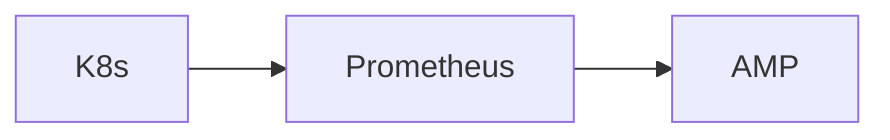
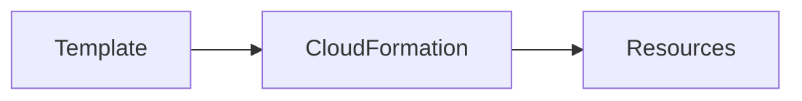
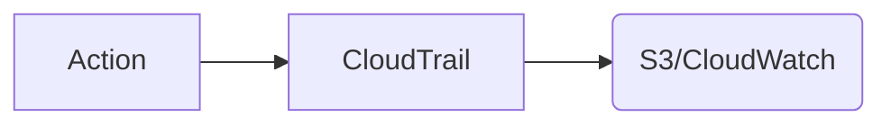
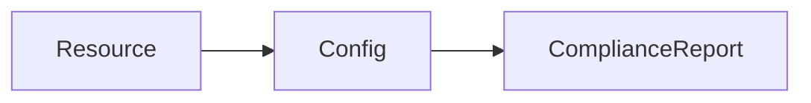
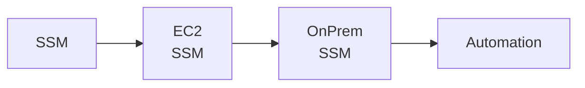
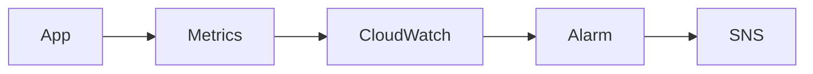

#Mangement/Governance

|카테고리|주요 서비스|목적|
|---|---|---|
|실행 & 관리|Console / CLI / Mobile App|리소스 운영 및 제어|
|인프라 자동화|CloudFormation / Proton / Launch Wizard|환경 표준화 + 자동 구축|
|보안/감사/규정|CloudTrail / Config / Control Tower / Organizations|계정·변경·정책·감사 관리|
|운영 자동화|Systems Manager / Managed Services|서버/운영 통합 자동화|
|비용 & 최적화|Trusted Advisor / Compute Optimizer|비용 절감 + 스펙 튜닝|
|관측 & 모니터링|CloudWatch / Managed Grafana / AMP / ADOT|로그·메트릭·트레이스 통합 관측|
|신뢰성 & 재해 복구|Resilience Hub|가용성/복구 설계 점검|
|기타 거버넌스|License Manager / User Notifications|라이선스 및 알림 관리|

---

# AWS Command Line Interface (CLI)

> _터미널에서 AWS 자원 관리하는 통합 명령줄 도구_  

`CI/CD 파이프라인, 자동화 스크립트, 대량 리소스 조작 시 사용`

---

# AWS Management Console Mobile App

> _모바일에서 리소스 상태 확인 및 재시작 가능_  

 `서버 상태 모니터링 + 긴급 대응`

---

# Amazon Managed Service for Prometheus

> _Prometheus 메트릭 수집/저장/쿼리의 완전관리형 서비스_  

`EKS/ECS/Kubernetes 마이크로서비스 모니터링`

---

# AWS Service Catalog

> _기업 내부 표준 인프라/애플리케이션 카탈로그 제공_  

`표준화된 환경 + 승인 프로세스 필요할 때`

---

# AWS CloudFormation

> _인프라를 코드(IaC)로 정의하고 자동 프로비저닝_  

`운영/스테이징 환경 일관성 유지`

---

# AWS Launch Wizard

> _SAP / SQL Server / HANA / Active Directory 등의 배포 자동화 도움_  

`복잡한 서드파티 애플리케이션을 쉽게 설치`

---

# AWS CloudTrail

> _API 호출, 사용자 활동, 보안/감사 기록 저장_  

`누가 무엇을 했는지 추적할 때`

---

# AWS Management Console

> _웹 기반 AWS GUI_  

`초기 설정, 리소스 탐색, 운영 관리`

---

# AWS Config

> _리소스 구성 변경 추적 + 규정 준수 검사_  

`보안/운영 규정 위반 감지`

---

# AWS Distro for OpenTelemetry

> _OpenTelemetry 기반 로그/메트릭/트레이스 수집 표준화 패키지_  

`Observability 통합 표준 수집기`

---

# AWS Trusted Advisor

> _비용/보안/성능/신뢰성 최적화 권장사항 제공_  

`“어디서 비용 아껴야 해?” 확인할 때`

---

# AWS User Notifications

> _AWS 이벤트 알림을 중앙에서 구성 & 구독_  

`SNS/Slack/Email로 서비스 상태 알림`

---

# AWS Organizations

> _여러 AWS 계정을 중앙에서 정책/보안/비용 통합 관리_  

`대규모 멀티 계정 환경`

---

# AWS Control Tower Data Residency Guardrails

> _데이터가 특정 리전에만 저장되도록 보안 규칙 적용_  

`국가/기업 규정 준수 필요할 때`

---

# AWS Resilience Hub

> _워크로드 복원력 평가 및 개선 지침 제공_  

`재해 복구/가용성 점검 자동화`

---

# AWS Control Tower

> _멀티 계정 환경을 안전한 베스트 프랙티스로 자동 구축_  

`기업 AWS 환경 기본 골격 셋업`

---

# AWS Proton

> _컨테이너/서버리스 아키텍처 템플릿 자동 관리_  

`DevOps 플랫폼 팀이 서비스 템플릿 제공할 때`

---

# AWS Systems Manager (SSM)

> _운영 자동화, 패치, 파라미터 저장, SSH 없는 세션 접속_  

`EC2/온프레 서버 통합 관리`

---

# AWS Managed Services

> _AWS 인프라 운영을 대신 수행해주는 매니지드 서비스_  

`운영 조직이 부족한 기업`

---

# AWS Health

> _사용 중인 리소스에 영향을 주는 AWS 이벤트 알림 제공_  

`장애 영향 분석`

---

# AWS Personal Health Dashboard

> _내 계정에 영향을 주는 AWS 서비스 상태 개인화 뷰 제공_  

`리전 장애 시 영향 빠르게 파악`

---

# Amazon Managed Grafana

> _Grafana 대시보드를 관리형 SaaS 형태로 제공_  

`메트릭/로그 시각화 대시보드`

---

# AWS Service Management Connector

> _ServiceNow / Jira 등 ITSM 도구와 AWS 운영 연동_  

`기업 내 IT 워크플로우와 AWS 프로비저닝 연결`

---

# AWS Compute Optimizer

> _EC2 / RDS / Lambda / EBS 비용 대비 적정 스펙 추천_  

`인스턴스 크기 조정 근거 필요 시`

---

# Amazon CloudWatch

> _로그/메트릭/알람 기반 모니터링 플랫폼_  

`서비스 상태 모니터링 + 알람`

---

# AWS Well-Architected Tool

> _보안/운영/비용/성능/탄력성 기준으로 워크로드 점검_  

`아키텍처 리뷰/개선 가이드 필요 시`

---

# AWS License Manager

> _소프트웨어 라이선스 사용량 추적 및 정책 적용_  

`Windows/SAP 등 라이선스 비용 통제`

---
