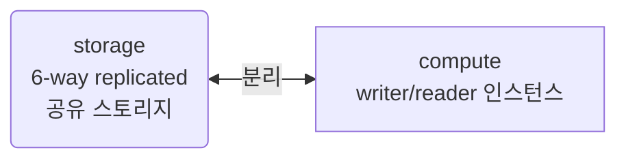
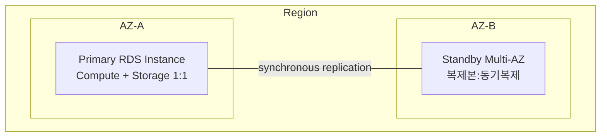
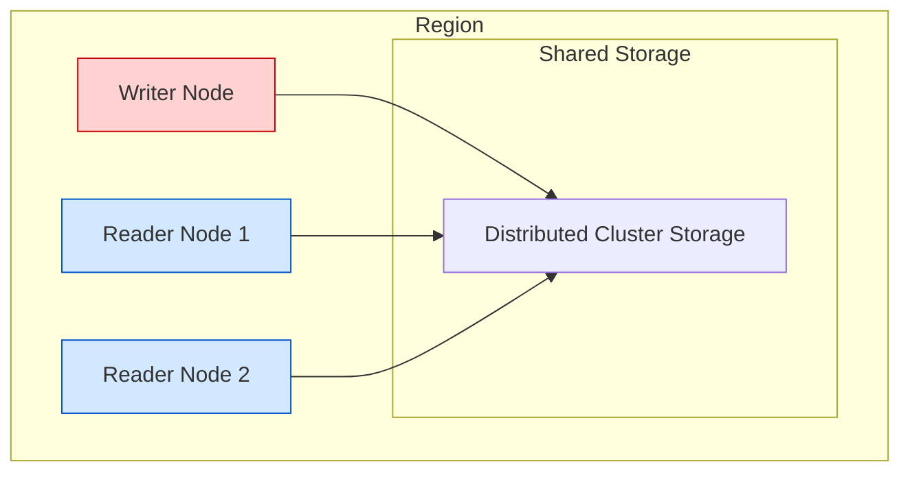
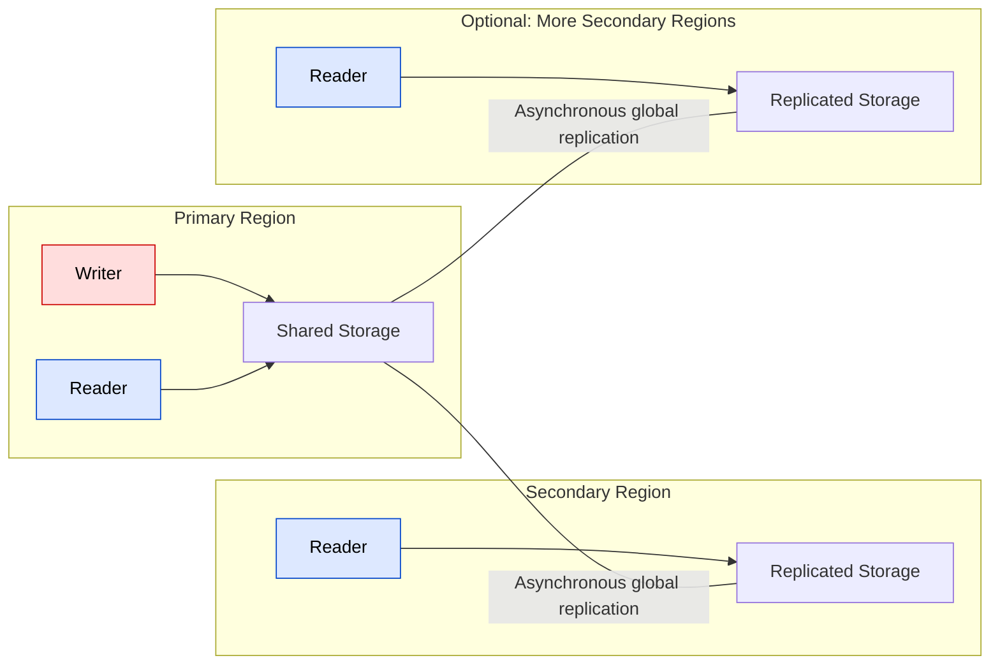

#Aurora

## **Storage vs Compute 분리 개념**

기존 RDBMS(MySQL, PostgreSQL 등)는 `서버(Compute)가 디스크(Storage)를 직접 소유`하는 구조.

반면 **Aurora는 다름.**



- Writer/Reader는 **쿼리 처리 (CPU/RAM) 역할**
- 데이터 저장은 **스토리지 계층이 따로 담당**

---

## **고가용성(HA) vs 장애복구(DR) 차이**

|개념|단위|목적|
|---|---|---|
|**HA (High Availability)**|**한 리전 내부**|서버 일부가 죽어도 서비스 지속|
|**DR (Disaster Recovery)**|**리전 전체 장애 대응**|지진, 정전, 네트워크 단절 같은 지역 대형 사고 대비|
`Aurora Cluster` : **HA 문제를 해결**  
`Aurora Global Database` : **DR + 글로벌 지연 문제를 해결**

```
클러스터는 리전 내부의 장애 대응
글로벌DB는 리전 전체 장애 대비 + 글로벌 사용자 지연 개선
```

## **복제(Replication) 방식 이해: 동기 vs 비동기**

| 방식         | 어디서 쓰임             | 특징                            |
| ---------- | ------------------ | ----------------------------- |
| **동기 복제**  | **AZ 간 (클러스터 내부)** | 데이터 100% 일치 보장, 지연 약간 증가      |
| **비동기 복제** | **리전 간 (글로벌 DB)**  | 빠름, 대신 미세한 데이터 지연 가능 (<1초 수준) |

이 차이를 이해해야  
“왜 Cluster는 한 리전이고 Global은 멀티리전인가?”가 설명됨.

---

## **Read/Write 아키텍처 이해**

Aurora는 기본적으로:

`쓰기(Write)는 1개 Writer만 담당 → 일관성 유지 읽기(Read)는 여러 Reader가 분산 처리 → 성능 확장`

즉,

- **Writer 1개**는 트랜잭션 일관성을 책임지고,
- **Reader 여러 개**는 읽기 TPS 확장을 책임진다.

글로벌로 확장하면?

- Primary 리전이 **쓰기**
- Secondary 리전들은 **읽기 전용**

---
# RDS 뭐가 다름?

## **일반적인 RDS**


- 각 인스턴스는 **자기 스토리지를 가짐**
- Multi-AZ는 **HA 목적** (장애 대비)
- 읽기 부하 분산하려면 **Read Replica 별도 생성**
- 리전 넘어가면 **Cross-region Read Replica (비동기)**

## **Aurora Cluster(단일 리전)



- 모든 노드는 단일 리전 내부에서 동일한 스토리지를 공유
- Writer는 쓰기 담당, Reader는 읽기 확장
- 복제는 AZ 간 동기 (HA 보장)

## **Aurora Global Databse(멀티 리전)



- Primary Region만 쓰기 가능
- Secondary Region들은 읽기 전용
- 리전 간 복제는 비동기 (지연 최소하지만 완전 즉시는 아님)
- 글로벌 사용자 지연 최적화 + 재해복구 목적
---

# Aurora 스토리지의 핵심 구조: **6중 복제 (6-Way Replication)**

Aurora는 **Compute(Writer/Reader)** 와 **Storage** 가 분리되어 있고,  
스토리지는 **3개의 AZ(가용영역)** 에 **총 6개의 복제본** 으로 저장됨.

`AZ1 : 2개 복사본 AZ2 : 2개 복사본 AZ3 : 2개 복사본  총 6개의 스토리지 블록 복사본 유지`

## 🎯 왜 6개나 유지하나?

**고가용성 (HA) + 내결함성 (Fault Tolerance)** 때문.

Aurora 스토리지는:

- **AZ 1개 전체가 날아가도 정상 동작**
- **디스크 2개까지 동시에 장애 나도 정상 운영 가능**
- **스토리지 계층에서 자동 자가 복구**

>**노드가 아니라 스토리지 레벨에서 복제를 하고, 복제를 관리한다. → 인스턴스 장애 시 스토리지는 그대로 남아 있으므로 Failover가 매우 빠름**


## 🧠 일반 RDS와 비교해서 감 잡기

|항목|일반 RDS|Aurora|
|---|---|---|
|스토리지 위치|인스턴스 내부|**분산 스토리지 계층 (네트워크 기반)**|
|복제 개수|주/대기 1:1 정도|**총 6개 복사본 + AZ 단위 분산 저장**|
|Failover 속도|분 단위|**수 초 내**|
|성능 일관성|I/O 성능 인스턴스 디스크에 따라 변함|**스토리지 계층이 I/O 스케일 자동 관리**|

---

