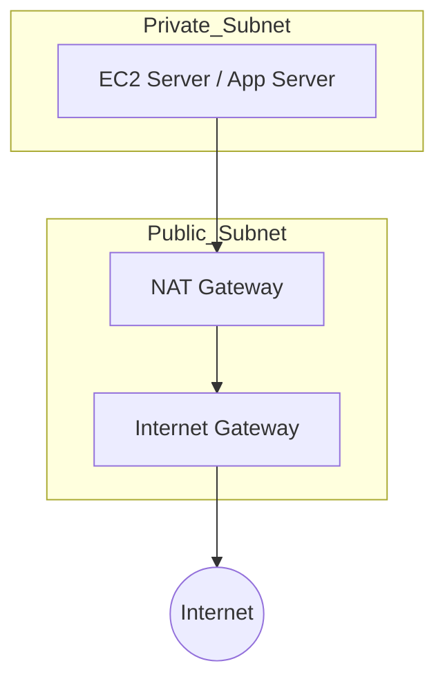
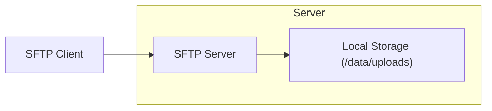
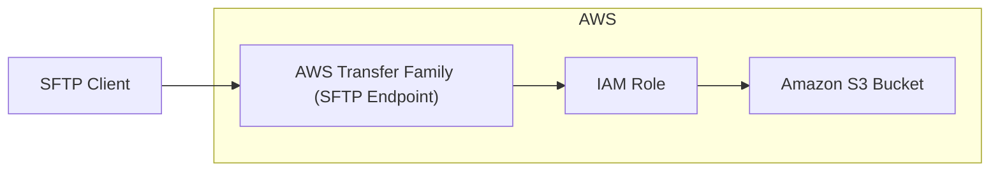

# AWS NAT Gateway

>Private Subnet에 있는 서버들이 **인터넷으로 나갈 수 있게 해주는** AWS 관리형 네트워크 장치.  
단, **외부에서는 Private Subnet으로 직접 접근할 수 없음** (보안↑).

`Private Subnet`에 있는 EC2, Lambda, 컨테이너 등이:
- OS 업데이트 필요
- 패키지 다운로드 필요
- 외부 API 호출 필요
- S3·DynamoDB 같은 퍼블릭 서비스에 접근 필요

하지만 **Public IP가 없어 직접 인터넷 연결이 안됨** → NAT Gateway로 우회.

---

# NAT Instance

> AWS 시험 관점에서 NAT Instance는 더 이상 권장되지 않는 방식. 사실상 Legay.

|항목|NAT Gateway|NAT Instance|
|---|---|---|
|관리|AWS 자동 관리|OS 업데이트, 패치 직접|
|성능|자동 스케일|인스턴스 스펙만큼만|
|HA|기본 제공|직접 구성|
|유지보수|없음|많음|
AWS는 NAT Instance를 **레거시 옵션**으로 간주하고, 공식 문서와 시험에서는  
**NAT Gateway 사용을 표준 모범 사례(Best Practice)** 로 제시함.

---

# SFTP 서버

>**SFTP(Server / Secure File Transfer Protocol) 서버는  
파일을 인터넷으로 안전하게 전송하기 위해 SSH 기반으로 동작하는 파일 전송 서버**야.**

쉽게 말하면,

> **FTP를 더 안전하게 만든 버전**  
> (모든 데이터가 암호화되어 전송됨)

---

# Network ACL

>**서브넷 전체에 적용되는 보안 규칙 리스트.** 
>들어오는 트래픽(ingress)과 나가는 트래픽(egress)을 **허용/거부(Allow/Deny)** 할 수 있음.

**보안 그룹과 NACL의 차이 (시험에서 100% 나옴)**

|구분|보안 그룹|네트워크 ACL|
|---|---|---|
|적용 범위|**EC2 인스턴스**(ENI)|**서브넷 전체**|
|규칙 방식|Allow만 있음|Allow/Deny 모두 있음|
|상태성|**Stateful**|**Stateless**|
|규칙 평가|모든 규칙 적용해 최종 허용|번호 낮은 순서로 즉시 결정|
|기본 설정|모든 Outbound 허용|모든 In/Out 허용(Default NACL)|

---
