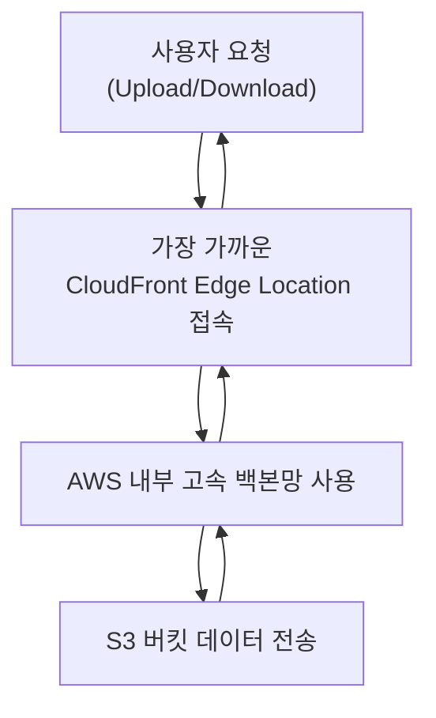

# Versioning

>*Versioning = “데이터를 덮어쓰지 않고 버전별로 누적 보관한다.”*

|항목|설명|
|---|---|
|목적|**객체 변경 및 삭제 이력을 모두 보관**|
|동작 방식|수정/삭제 시 **새 버전이 생성되고**, 기존 버전은 그대로 유지|
|장점|잘못 덮어쓰기/삭제해도 **이전 버전 복구 가능**|
|특징|버전 ID 단위로 객체 존재 → 삭제마저도 “삭제 마커”가 생성될 뿐, 실제 데이터는 남아 있음|
|전제|**S3 Object Lock을 사용하려면 Versioning이 반드시 활성화되어 있어야 함**|

---

# Legal Hold

> *Legal Hold = “지정 해제 권한자가 풀기 전까지 절대 삭제/수정 불가능한 무기한 잠금.”*

| 항목        | 설명                                         |
| --------- | ------------------------------------------ |
| 목적        | 객체가 **삭제되거나 덮어씌워지는 것을 아예 막기**              |
| 보존 기간     | **기한 없음 (무기한 유지)** → 해제할 때까지 불변            |
| 누가 해제 가능? | **`s3:PutObjectLegalHold` 권한이 있는 사용자만** 가능 |
| 특징        | **WORM(Write Once Read Many)** 정책 구현 가능    |
| 활용 예      | 회사가 “변경 금지” 기간을 유동적으로 관리해야 할 때 최적          |

# Stroage Class

| 스토리지 클래스                          | 주요 사용 사례                       | 첫 바이트 지연 시간         | 가용 영역     | 가용성 SLA | 최소 보관 비용 기간 | 특징 요약                    |
| --------------------------------- | ------------------------------ | ------------------- | --------- | ------- | ----------- | ------------------------ |
| **S3 Standard**                   | 자주 액세스하는 일반 데이터                | 밀리초(ms)             | **≥3 AZ** | 99.9%   | 없음          | 기본 스토리지, 가장 범용적          |
| **S3 Intelligent-Tiering**        | **액세스 패턴 예측 불가** 데이터 자동 비용 최적화 | 밀리초                 | **≥3 AZ** | 99%     | 없음          | 사용량에 따라 자동으로 IA 계층 이동    |
| **S3 Express One Zone**           | **초저지연 고성능** 단일 AZ 애플리케이션      | **한 자릿수 ms**        | **1 AZ**  | 99.9%   | 1시간         | 빠름 + 단일 AZ (고성능 캐시/분석용)  |
| **S3 Standard-IA**                | 자주 액세스하지 않지만 **빠른 접근 필요**      | 밀리초                 | **≥3 AZ** | 99%     | **30일**     | Standard 대비 저렴하지만 조회비 있음 |
| **S3 One Zone-IA**                | **재생 가능한 데이터**, 단일 AZ 보관       | 밀리초                 | **1 AZ**  | 99%     | **30일**     | 싸지만 **AZ 장애 시 위험**       |
| **S3 Glacier Instant Retrieval**  | **거의 액세스하지 않으나 빠른 복구 필요**      | 밀리초                 | **≥3 AZ** | 99%     | **90일**     | 장기 보관 + 빠른 검색            |
| **S3 Glacier Flexible Retrieval** | **드물게 복구**, 수 분~수 시간 대기 가능     | 분 ~ 시간              | **≥3 AZ** | 99.9%   | **90일**     | 예전 이름: Glacier. 표준 아카이브용 |
| **S3 Glacier Deep Archive**       | **최장기 보관 (감사/법적 문서)**          | **시간 단위(최대 12+시간)** | **≥3 AZ** | 99.9%   | **180일**    | **가장 저렴**, 거의 접근 없음      |

---

# Amazon S3 Transfer Acceleration

>***전 세계 어디서든 S3 버킷으로 데이터를 더 빠르게 업로드/다운로드**할 수 있도록 해주는 기능*

사용자는 가까운 **AWS 엣지 로케이션(CloudFront Edge)** 으로 접속하고,  
AWS 내부 고속 네트워크를 통해 **S3 버킷 위치까지 빠르게 전달**되는 구조.

| 상황                                 | 의미                            |
| ---------------------------------- | ----------------------------- |
| **사용자가 S3 버킷 리전과 지리적으로 멀리 떨어져 있음** | 거리로 인해 전송 속도가 느릴 때 가속 효과 큼    |
| **대용량 파일 업/다운로드가 잦음**              | 데이터 전송 시간 단축 가능               |
| **전 세계 분산 사용자 환경**                 | 예: 글로벌 서비스, 게임 런처, 미디어 업로드 포털 |
|                                    |                               |
### 작동 방식

1. 사용자가 `bucketname.s3-accelerate.amazonaws.com` 으로 업로드 요청
2. 요청은 **가장 가까운 CloudFront Edge Location** 으로 전달
3. 엣지 로케이션 → AWS 전용 백본 네트워크 → S3 버킷으로 고속 전송

`Client  →  Edge Location  →  AWS Backbone Network  →  S3 Bucket`