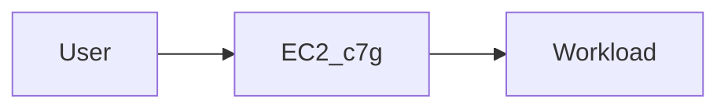
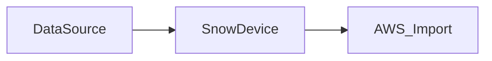
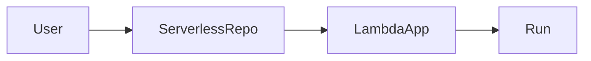
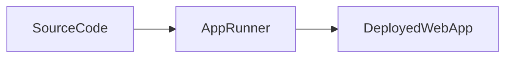
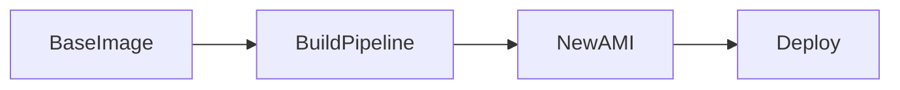

#Compute
# Amazon EC2 C7g (Graviton3)

> _고성능·고효율 ARM 기반 EC2 인스턴스로 연산 집약 작업에 적합._

`대규모 계산(시뮬레이션, AI 전처리, 압축/암호화)을 저비용으로 빠르게 수행하고 싶을 때.`

---

# AWS Snow Family

> _네트워크가 느리거나 차단된 환경에서 데이터를 물리 장비로 수집 후 AWS로 전송._

|장비|유형|저장 용량|특징|
|---|---|---|---|
|**Snowcone**|소형 Edge 디바이스|**8 TB HDD** (유효 약 4–5 TB)|가장 작음, 휴대 가능, 저전력|
|**Snowcone SSD**|소형 Edge 디바이스|**14 TB SSD** (유효 약 8 TB)|에지 컴퓨팅 및 빠른 로컬 처리|
|**Snowball Edge – Storage Optimized**|중형 장비|**80 TB 사용 가능**|대규모 데이터 전송, 적재 최적화|
|**Snowball Edge – Compute Optimized**|중형 장비|**42 TB SSD**|CPU·GPU 포함, ML/edge compute|
|**Snowmobile**|초대형(트럭)|**100 PB**|데이터센터 수준 마이그레이션, EB급 지원

`산간/공장/군사 시설과 같이 인터넷이 느린 환경에서 테라바이트 이상의 데이터를 수집할 때.`

---

# AWS Serverless Application Repository

> _서버리스(Lambda 기반) 애플리케이션을 검색·배포·공유하는 저장소._

`로그인/이미지 리사이징/웹훅 등 흔한 기능을 재사용해 개발 시간을 줄이고 싶을 때.`

---

# AWS Auto Scaling

> _부하 변화에 따라 리소스 수를 자동으로 증가/감소._

` 낮엔 사용자 많고 밤엔 적은 웹서비스에서 비용 낭비 없이 운영하고 싶을 때.`

---

# Amazon EKS

> _Kubernetes를 AWS에서 관리형으로 실행._

` 이미 사내에서 K8s를 사용 중이며 클라우드로 확장해도 동일한 오케스트레이션 방식을 유지해야 할 때.`

---

# Amazon EC2

> _운영체제를 직접 선택하고 관리하는 가상 서버._

` 커스텀 OS 설정, 보안 모듈 설치, 특정 런타임 튜닝 등 서버 제어가 필요한 경우.`

---

# Amazon EC2 Spot Instances

> _유휴 리소스를 저렴하게 사용하지만 언제든 종료 가능._

`중단돼도 괜찮은 Batch 처리, 로그 분석, AI 학습 작업에서 비용을 최대 절감할 때.`

---

# AWS Lambda

> _서버 없이 이벤트에 따라 코드를 실행._

`파일 업로드 → 자동 썸네일 생성, API Gateway → 짧은 백엔드 실행 같은 이벤트 기반 로직.`

---

# AWS App Runner

> _코드나 컨테이너 이미지만 제공하면 자동으로 웹서비스 구성._

`인프라 관리 없이 빠르게 웹서비스를 배포하고 싶은 소규모/스타트업 환경.`

---

# Amazon Lightsail

> _간단 UI와 정액 과금 기반의 초보자용 VPS._

`개인 블로그/소규모 포트폴리오 사이트를 최소한의 설정으로 운영할 때.`

---

# AWS Batch

> _대량 작업을 자동 큐잉 / 스케줄링._

`예시: 하루에 한 번 100,000개 로그를 분석하거나 모델을 재학습할 때.`

---

# AWS Compute Optimizer

> _리소스 사용 패턴 분석 후 적절한 인스턴스 추천._

`예시: 서버가 과하게 크거나 작아 비용/성능이 비효율적인 상황을 최적화할 때.`

---

# AWS Local Zones

> _사용자와 가까운 위치에서 애플리케이션 실행 → 지연 최소화._

`영상 편집, 게임 스트리밍처럼 지연에 민감한 서비스를 사용자 근처에서 운영할 때.`

---

# AWS Elastic Beanstalk

> _코드만 주면 인프라 생성·운영 자동화._

`웹 앱을 빨리 배포하고 싶지만 Kubernetes/EC2 설정까지 다 하고 싶지 않을 때.`

---

# AWS Outposts

> _온프레미스 환경에서 AWS 인프라를 그대로 운영._

`예시: 법/보안/속도 문제로 데이터를 외부 리전에 둘 수 없지만 AWS API는 그대로 쓰고 싶을 때.`

---

# Amazon ECS

> _AWS 네이티브 컨테이너 오케스트레이션._

`컨테이너 기반 배포를 하고 싶지만 Kubernetes까지의 복잡함은 원치 않을 때.`

---

# AWS Wavelength

> _5G망 내부에서 초저지연 앱 제공._

`자율주행·AR·실시간 게임 같은 밀리초 단위 응답 요구 서비스.`

---

# AWS Fargate

> _서버/노드 관리 없이 컨테이너 실행._

`ECS/EKS에서 Container는 쓰고 싶지만 서버 인프라 운영은 하고 싶지 않을 때.`

---

# EC2 Image Builder

> _AMI 이미지를 자동으로 생성/검사/배포._

` 서버 이미지를 일일/주간 단위로 자동 업데이트하여 보안 패치 유지하고 싶을 때.`