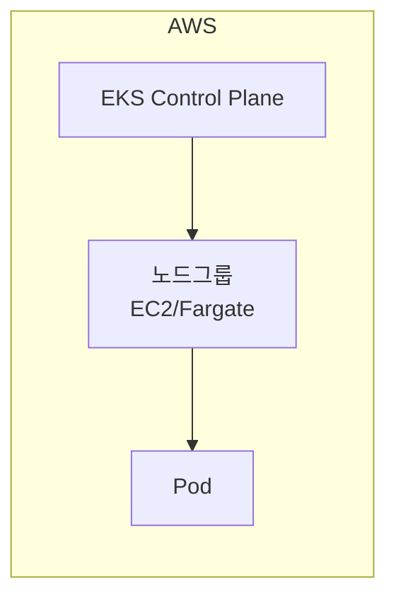
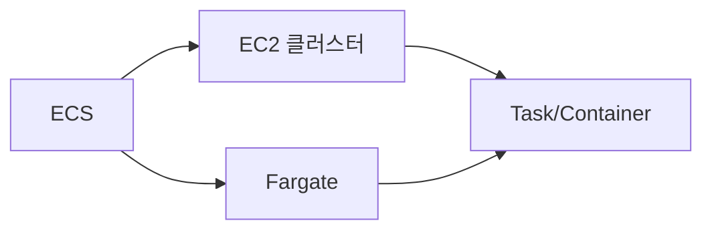
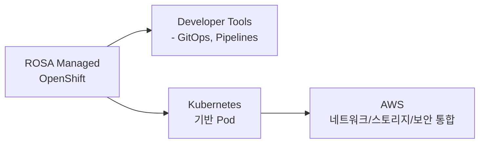

#Containers
# AWS Copilot

> AWS에서 컨테이너 앱을 가장 쉽게 배포·관리할 수 있는 CLI 도구

`ECS + Fargate를 자동 구성하고 싶을 때`
`인프라 고민 없이 애플리케이션 중심 배포를 하고 싶을 때`
`CI/CD, 파이프라인, 모니터링까지 간단히 자동화하고 싶을 때`

---

# AWS App2Container

> 기존 Java/.NET 애플리케이션을 자동으로 컨테이너화하는 도구

`온프레미스/EC2에서 돌아가는 레거시 앱을 컨테이너 기반으로 바꾸고 싶을 때`
`Dockerfile, ECS/EKS 배포 매니페스트를 자동 생성하고 싶을 때`
`Modernization(Migration) 속도를 빠르게 올리고 싶을 때`

---

# Amazon Elastic Kubernetes Service (EKS)

> AWS 제공 완전관리형 Kubernetes 서비스

`표준 Kubernetes API 기반으로 운영하고 싶을 때`
`다중 클러스터, 하이브리드 클라우드 등 고급 운영이 필요할 때`
`쿠버네티스 생태계(Helm, Istio, ArgoCD 등)를 그대로 쓰고 싶을 때`

---

# Amazon Elastic Container Registry (ECR)

> Docker 이미지 저장·관리 레지스트리 서비스

`안전한 이미지 저장소가 필요할 때(Docker Hub 대체)`
`이미지 스캔, 버전 관리, IAM 기반 접근 제어가 필요할 때`
`ECS/EKS 배포 파이프라인에서 자동으로 이미지 가져오고 싶을 때`

---

# Amazon Elastic Container Service (ECS)

> AWS가 직접 만든 컨테이너 오케스트레이션 서비스(쿠버네티스보다 단순·안정적)

`쿠버네티스의 복잡함 없이 컨테이너 운영하고 싶을 때`
`AWS와 깊은 통합(CloudWatch, ALB, IAM 등)을 원할 때`
`자동 스케일링, 블루/그린 배포를 쉽게 구성하고 싶을 때`

---

# AWS Fargate

> 서버를 직접 관리하지 않고 컨테이너만 실행하는 Serverless Compute

`EC2 노드 관리가 귀찮을 때`
`트래픽에 따라 자동 확장되는 완전 서버리스 환경을 원할 때`
`ECS/EKS 모두에서 노드 없이 컨테이너 실행하고 싶을 때`

---

# Red Hat OpenShift Service on AWS (ROSA)

> Red Hat OpenShift를 AWS에서 완전관리형으로 제공하는 서비스

`OpenShift 환경을 그대로 AWS에서 사용하고 싶은 기업`
`엔터프라이즈 DevOps (CI/CD, GitOps, ServiceMesh) 통합 플랫폼이 필요할 
때`
`이미 OpenShift를 사용 중인 조직이 클라우드로 확장할 때`

