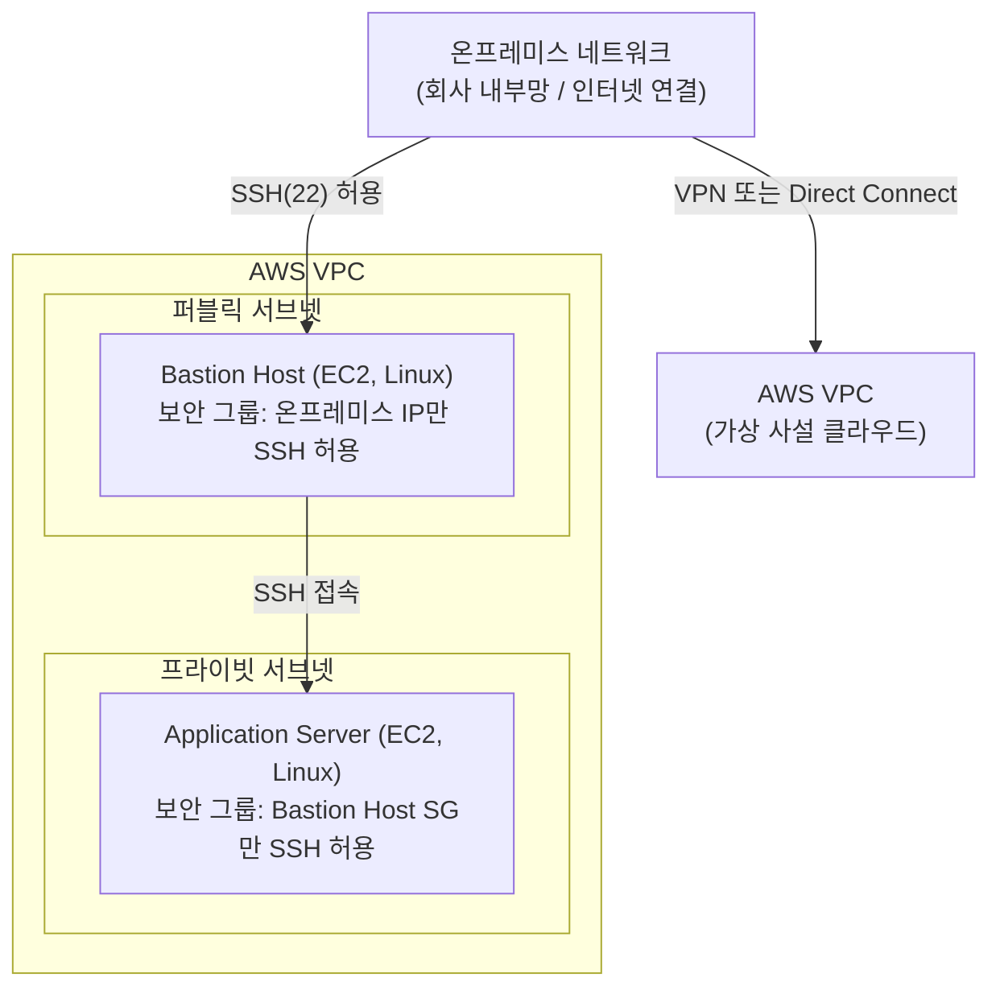
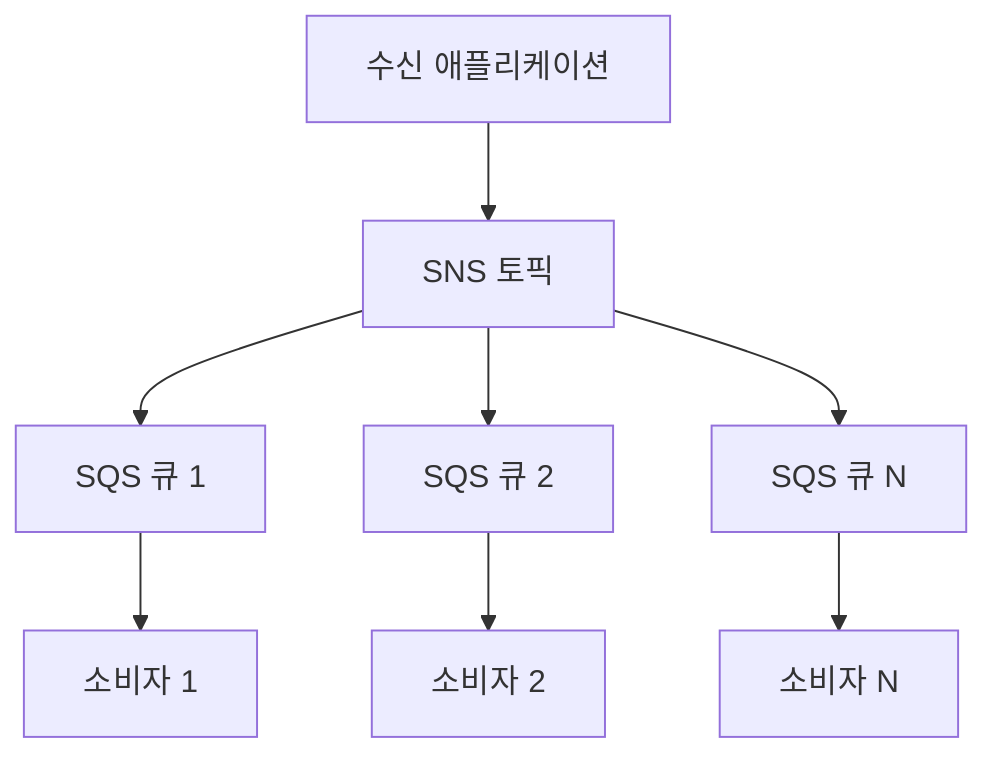
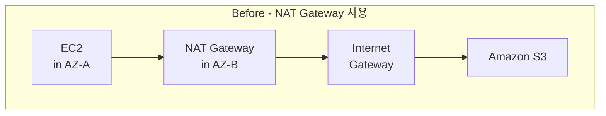
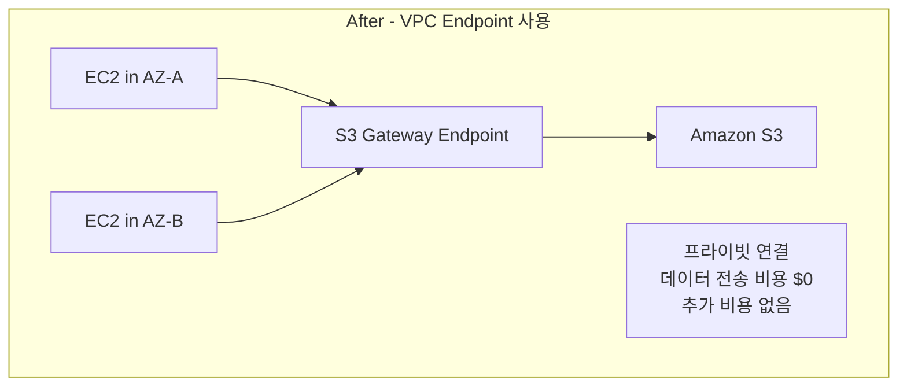
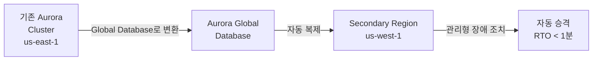
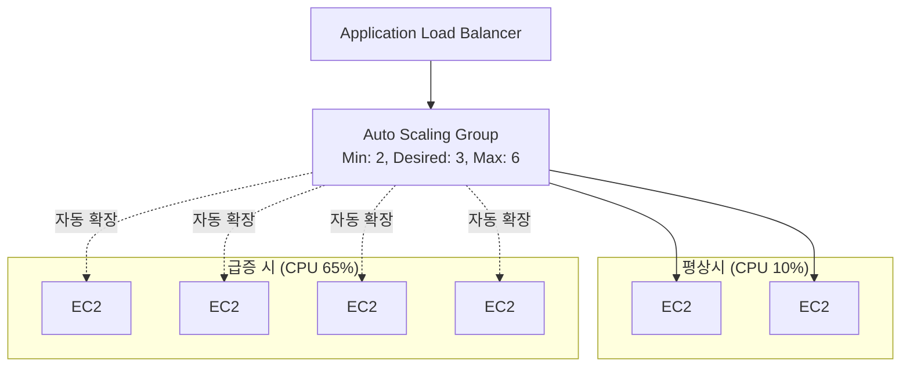
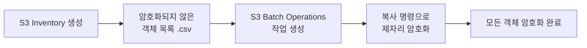

# 1.1

매일 30TB이상, 클릭스트림데이터
정답: 4

---
# 1.2

쿼리 문자열을 기반으로 트래픽을 다른 대상 그룹으로 라우팅 -> application 계층 라우팅 = ALB.
정답: 1
[[IAM vs ACM]]

---

# 1.3

***도메인(URL) 기반의 아웃바운드 트래픽 제어를 하려면, 어떤 서비스가 적절한가?***

| 번호    | 설명 요약                                                                     | 핵심 기능                          |
| ----- | ------------------------------------------------------------------------- | ------------------------------ |
| **①** | 프라이빗 서브넷의 아웃바운드 트래픽을 **AWS Network Firewall**로 라우팅하고 **도메인 목록 규칙 그룹**을 구성 | ✅ 도메인 기반 아웃바운드 필터링 가능          |
| **②** | **AWS WAF**를 설정해 **IP 기반 규칙**으로 트래픽 요청을 필터링                               | ❌ 웹 트래픽(HTTP/HTTPS) 인바운드 전용    |
| **③** | **보안 그룹(SG)**으로 인바운드/아웃바운드 트래픽 제어                                         | ❌ 도메인(URL) 기반 제어 불가능 (IP만 가능)  |
| **④** | **ALB**를 통해 아웃바운드 트래픽 제어                                                  | ❌ ALB는 인바운드 로드 밸런싱용, 아웃바운드 불가능 |

정답: 1

---

# 2.1

### 💡 정답 조합

- **3.** 배스천 호스트의 현재 보안 그룹을 **회사의 외부 IP 범위**로부터의 인바운드 액세스만 허용하는 보안 그룹으로 교체합니다.
- **4.** 애플리케이션 인스턴스의 현재 보안 그룹을 **배스천 호스트의 사설(Private) IP 주소**에서만 인바운드 SSH 액세스를 허용하는 보안 그룹으로 바꿉니다.

### 🔍 해설

#### 🏗️ 시나리오 요약

- 퍼블릭 서브넷: **배스천 호스트 (Bastion Host)**
- 프라이빗 서브넷: **애플리케이션 서버 (Private EC2)**
- 온프레미스 → 인터넷 → 배스천 호스트 → 프라이빗 서버  
    (즉, **SSH 접속은 배스천을 통해서만 가능**해야 함)
### 🧩 **각 옵션 분석**

| 번호      | 설명                                 | 평가                                                          |
| ------- | ---------------------------------- | ----------------------------------------------------------- |
| **1**   | 배스천 호스트를 애플리케이션 인스턴스에서만 접근 허용      | ❌ 틀림 – 애플리케이션 서버는 배스천에 SSH 접속하지 않습니다. 반대 방향이에요.             |
| **2**   | 회사 **내부 IP 범위** (Private range) 허용 | ❌ 틀림 – 온프레미스는 인터넷을 통해 접근하므로 “외부 IP” 범위여야 합니다.               |
| **✅ 3** | 회사의 **외부(공인) IP 범위**만 인바운드 SSH 허용  | ✅ 올바름 – 배스천은 인터넷에서 접근 가능해야 하며, 제한된 공인 IP 범위를 지정해야 안전합니다.    |
| **✅ 4** | 프라이빗 인스턴스에서 배스천의 **사설 IP**만 SSH 허용 | ✅ 올바름 – 배스천과 애플리케이션 서버는 같은 VPC 내부에서 사설 IP로 통신해야 합니다.        |
| **5**   | 프라이빗 인스턴스가 배스천의 **공인 IP**에서 SSH 허용 | ❌ 틀림 – 내부 트래픽은 NAT 없이 사설 네트워크를 통해 전달됩니다. 공인 IP 사용 시 라우팅 불가. |
정답: 3,4

---

# 2.2

**분석**

가능한 빠르게 대규모로 패치해야하는 상황에서,,,

Lambda : 대규모 패치에 적합하지 않음
Patch Manager : **운영체제(OS) 수준의 패치 관리 도구**
Run Command: EC2나 온프레미스 서버의 **OS 쉘(Bash, PowerShell 등)** 에서 명령을 실행하는 기능

정답: 4

---

# 2.3

💡 정답: 2번

  📊 상세 해설

  ✅ 왜 Snowball Edge가 정답인가?

  1. 대용량 데이터 (70TB)
    - 인터넷으로 전송 시 매우 오래 걸림
    - 물리적 디바이스 전송이 더 빠름
  2. 최소 네트워크 대역폭
    - Snowball Edge는 물리적 배송 → 네트워크 거의 미사용
    - 데이터는 로컬에서 디바이스로 복사 (LAN 속도)
  3. 일회성 마이그레이션
    - "더 이상 증가하지 않음" → 한 번만 마이그레이션
    - 지속적인 동기화 불필요 → File Gateway 불필요

  ❌ 다른 옵션이 부적합한 이유

  1번 (AWS CLI):
  - 70TB를 전송 → 매우 느리고 대역폭 많이 사용

  3번 (File Gateway + 인터넷):
  - 여전히 인터넷으로 70TB 전송해야 함
  - File Gateway는 하이브리드 환경/지속적 동기화에 적합

  4번 (Direct Connect):
  - Direct Connect 구축에 시간 소요 (몇 주~몇 달)
  - "가능한 한 빨리" 요구사항에 부합하지 않음
  - 70TB 전송 여전히 시간 소요

---

# 3.1

정답: 4

---

# 3.2

정답: 2

---

# 3.3

**분석

| 구분 |예약 인스턴스 (RI)| 온디맨드 용량 예약|
|-------|-----------------|-----------------|
| 목적    | 비용 절감 (할인)      | 용량 확보           |
| 기간    | 1년 또는 3년 장기 약정  | 단기간 가능 (1주일 OK) |
| 용량 보장 | ❌ 없음 (단지 요금 할인) | ✅ 있음            |
| AZ 지정 | 불가능 (리전 단위)     | ✅ 가능            |
| 약정    | 장기 약정 필요        | 필요 없음           |

- 예약 인스턴스: 리전 레벨에서만 작동 (특정 AZ 지정 불가)
- 온디맨드 용량 예약: 특정 AZ를 명시적으로 지정 가능

| 번호  | 설명                         | 평가                          |
|-----|----------------------------|-----------------------------|
| 1   | 필요한 리전 지정하는 예약 인스턴스        | ❌ 용량 보장 안 됨, 1주일 단기간에 부적합   |
| 2   | 필요한 리전 지정하는 온디맨드 용량 예약     | ⚠️ AZ 지정이 없어서 불완전           |
| 3   | 리전 + 3개 AZ 지정하는 예약 인스턴스    | ❌ RI는 AZ 지정 불가능, 용량 보장도 안 됨 |
| ✅ 4 | 리전 + 3개 AZ 지정하는 온디맨드 용량 예약 | ✅ 모든 요구사항 충족                |

답: 4번

---


# 4.1

**분석**

RPO(Recovery Point Objective): 15분
RTO(Recovery Time Objective): 1시간
DynamoDB 데이터 손상 시 복구

| 번호  | 설명                            | 평가                                                               |
| --- | ----------------------------- | ---------------------------------------------------------------- |
| 1   | Global Tables - 다른 리전으로 전환    | ❌ 데이터 손상이 복제되므로 RPO 충족 불가                                        |
| ✅ 2 | Point-in-Time Recovery (PITR) | ✅ 최근 35일 내 특정 시점으로 복구 가능, RPO 15분 충족                             |
| 3   | S3 Glacier로 일일 내보내기           | ❌ 일일 S3 Glacier 내보내기는 RPO가 최소 24시간 수준이고 복구 느림                    |
| 4   | EBS 스냅샷 15분마다                 | ❌ DynamoDB에 적용할 수 있는 방식이 아닙니다(EBS는 블록 스토리지, DynamoDB는 관리형 NoSQL) |

**정답: 2**

💡 **Point-in-Time Recovery (PITR)의 특징:**
- 최근 35일 이내의 임의 시점으로 복구 가능
- 초 단위 정밀도로 복구 시점 선택
- RPO 15분, RTO 1시간 요구사항 모두 충족

---

# 4.2

정답: 1,2

---

# 4.3
정답:4

| 요구 조건                        | 설명                               |
| ---------------------------- | -------------------------------- |
| **데이터는 업로드 후 변경 불가**         | WORM(Write Once Read Many) 형태 필요 |
| **변경/삭제 시 회사가 명시적으로 결정해야 함** | 즉, 임의 수정 불가                      |
| **삭제는 특정 사용자만 가능**           | IAM 권한 제어 필요                     |
| **보존 기간은 불특정**               | 정해진 날짜 없이 유지되어야 함                |

| 번호         | 방식                                                                   | WORM(변경 불가)               | 보존 기간                 | 삭제 허용 제어                                     | 요구사항 충족 여부       | 이유                                             |
| ---------- | -------------------------------------------------------------------- | ------------------------- | --------------------- | -------------------------------------------- | ---------------- | ---------------------------------------------- |
| **1**      | Glacier Vault Lock                                                   | 가능                        | 기간 지정 필요              | 제어 가능                                        | ❌                | S3가 아니라 Glacier에 적용되는 기능 → 문제 조건에서 벗어남         |
| **2**      | S3 Object Lock + Versioning + **거버넌스 모드** + **100년 보존기간**            | 가능                        | **보존 기간이 고정됨 (100년)** | 우회 권한 있으면 변경 가능                              | ❌                | “불특정 기간 유지” 요구 충족 X                            |
| **3**      | CloudTrail + 수정 감지 후 백업으로 복원                                         | 불가                        | 무관                    | 무관                                           | ❌                | 변경 자체를 막지 못함 (사후복구 방식)                         |
| **4 (정답)** | **S3 Object Lock + Versioning + Legal Hold + 특정 사용자만 hold 해제 권한 부여** | ✅ 가능 (Legal hold는 무기한 유지) | ✅ **무기한 (불특정 기간)**    | ✅ 특정 사용자만 `s3:PutObjectLegalHold` + 삭제 권한 부여 | **✅ 요구사항 완전 충족** | Legal hold 해제 전까지 수정/삭제 불가능 → 회사가 결정할 때만 해제 가능 |

---

# 5.1

**정답: 3번**

**분석**

| 요구 조건                 | 설명                      |
| --------------------- | ----------------------- |
| **정적 웹사이트 (S3 호스팅)**  | HTML, CSS, JS 등 정적 콘텐츠  |
| **전 세계 수요 증가**        | 글로벌 사용자 대상              |
| **대기 시간(latency) 감소** | 사용자와 가까운 위치에서 콘텐츠 제공 필요 |
| **비용 효율적**            | 최소 비용으로 성능 개선           |

**선택지 비교**

| 번호  | 방식                                     | 대기 시간 감소 | 비용 효율성          | 평가                                                          |
| --- | -------------------------------------- | -------- | --------------- | ----------------------------------------------------------- |
| 1   | S3 버킷을 모든 리전에 복제 + Route 53 지리적 위치 라우팅 | ✅ 가능     | ❌ 매우 비효율적       | 모든 리전에 데이터 복제 → 스토리지 비용 폭증                                  |
| 2   | AWS Global Accelerator + S3            | ✅ 가능     | ❌ 비용 높음         | Global Accelerator는 TCP/UDP 최적화용, 정적 콘텐츠에는 CloudFront가 더 적합 |
| ✅ 3 | **Amazon CloudFront (CDN)**            | ✅ 최적     | ✅ **가장 비용 효율적** | 엣지 로케이션 캐싱으로 S3 요청 감소, 정적 웹사이트에 최적화                         |
| 4   | S3 Transfer Acceleration               | ⚠️ 일부 개선 | ❌ 업로드 최적화용      | 파일 업로드 속도 개선용 (다운로드/웹사이트 제공용 아님)                            |

**💡 CloudFront가 정답인 이유**

1. **엣지 로케이션 캐싱**
   - 전 세계 400+ 엣지 로케이션에서 콘텐츠 캐시
   - 사용자와 가장 가까운 위치에서 콘텐츠 제공

2. **비용 절감**
   - S3 직접 요청 대폭 감소 (캐시 히트율 증가)
   - 데이터 전송 비용 최적화
   - 추가 스토리지 비용 없음 (옵션 1 대비)

3. **정적 웹사이트 최적화**
   - HTTP/HTTPS 최적화
   - Gzip/Brotli 압축 지원
   - SSL/TLS 종료

4. **간편한 설정**
   - S3 버킷 앞에 CloudFront 배포 생성
   - Route 53에서 CloudFront 도메인 연결

**❌ 다른 옵션이 부적합한 이유**

**1번 (모든 리전에 복제):**
- 스토리지 비용이 리전 수만큼 배가됨
- 데이터 동기화 복잡도 증가
- 가장 비효율적인 방식

**2번 (Global Accelerator):**
- TCP/UDP 트래픽 최적화에 특화
- 정적 콘텐츠 캐싱 기능 없음
- CloudFront보다 비용 높음

**4번 (Transfer Acceleration):**
- **업로드** 속도 개선용 (S3로 파일 업로드 시)
- 다운로드/웹사이트 제공에는 효과 없음

---

# 5.2

**정답: 4번**

**분석**

| 요구 조건 | 설명 |
|---------|------|
| **DB 업그레이드 중 데이터 보존** | Lambda와 DB 사이 연결 끊김 시에도 데이터 유실 방지 |
| **고객 데이터 기록 보장** | 모든 이벤트에 대한 데이터가 손실 없이 저장되어야 함 |

**선택지 비교**

| 번호 | 방식 | 데이터 보존 | 확장성 | 평가 |
|-----|------|-----------|--------|------|
| 1 | RDS Proxy | ⚠️ 부분적 | ✅ | ❌ 연결 관리 개선이지만 DB 다운타임 시 데이터 손실 가능 |
| 2 | Lambda 실행 시간 증가 + 재시도 | ❌ | ❌ | ❌ DB 업그레이드가 장시간일 경우 Lambda 타임아웃 발생 |
| 3 | Lambda 로컬 스토리지 | ❌ | ❌ | ❌ Lambda는 ephemeral storage (휘발성), 신뢰성 없음 |
| ✅ 4 | **SQS FIFO 큐 + 별도 Lambda** | ✅ | ✅ | ✅ 메시지 큐로 데이터 버퍼링, DB 복구 후 처리 |

**💡 왜 4번 (SQS FIFO)이 정답인가?**

1. **내구성 있는 버퍼링**
   - SQS는 메시지를 지속적으로 저장 (최대 14일)
   - DB가 다운되어도 데이터 손실 없음

2. **비동기 처리**
   - API Gateway → Lambda → SQS (즉시 응답)
   - 별도 Lambda가 큐 폴링 → DB 저장
   - DB 업그레이드 중에도 데이터 수집 중단 없음

3. **FIFO 큐의 장점**
   - 순서 보장 (First-In-First-Out)
   - 중복 방지 (정확히 한 번 처리)
   - 고객 데이터 무결성 유지

4. **아키텍처**
```
API Gateway → Lambda (Producer) → SQS FIFO 큐
                                    ↓
                          Lambda (Consumer) → Aurora MySQL
```

**❌ 다른 옵션이 부적합한 이유**

**1번 (RDS Proxy):**
- RDS Proxy는 연결 풀링 및 장애 조치 개선
- DB가 완전히 다운된 상태에서는 여전히 데이터 손실 가능
- 업그레이드 중 버퍼링 기능 없음

**2번 (실행 시간 증가 + 재시도):**
- Lambda 최대 실행 시간: 15분
- DB 업그레이드가 15분 이상이면 타임아웃
- 비효율적이고 비용 증가

**3번 (Lambda 로컬 스토리지):**
- Lambda는 stateless, ephemeral storage
- 함수 종료 시 데이터 손실
- 신뢰성 없음

---

# 5.3

**정답: 4번**

**분석**

| 요구 조건              | 설명                               |
| ------------------ | -------------------------------- |
| **분리(Decoupling)** | 수신 애플리케이션과 소비자 애플리케이션 간 독립성 확보   |
| **확장성**            | 초당 100,000개 메시지 급증 처리 가능         |
| **다중 소비자**         | 수십 개의 애플리케이션/마이크로서비스가 동일한 메시지 사용 |

**선택지 비교**

| 번호  | 방식                                               | 평가                                                                                                                          |
| --- | ------------------------------------------------ | --------------------------------------------------------------------------------------------------------------------------- |
| 1   | Kinesis Data Analytics                           | - 실시간 스트림 데이터 **분석**에 특화된 서비스<br>- 여러 독립 소비자가 메시지를 읽는 용도에 부적합<br>- Fan-out 패턴 미지원                                           |
| 2   | EC2 Auto Scaling                                 | -  완전한 분리 달성 어려움 (직접 통신 필요)<br>- 인스턴스 시작 시간으로 인한 급증 대응 지연<br>- 인프라 관리 부담 증가<br>- 다중 소비자 구현 복잡                               |
| 3   | Kinesis Data Streams (단일 샤드) + Lambda + DynamoDB | - **단일 샤드 제한**: 초당 1,000레코드 또는 1MB/초<br>- 초당 100,000개 메시지 처리 불가능 (100개 샤드 필요)<br>- DynamoDB 추가로 복잡도 증가<br>- 비용 및 관리 오버헤드 증가 |
| ✅ 4 | **SNS + 다중 SQS 구독**                              | ✅ Fan-out 패턴으로 모든 요구사항 충족                                                                                                   |

**💡 왜 4번 (SNS + 다중 SQS)이 정답인가?**

1. **Fan-out 패턴** [wiki](https://en.wikipedia.org/wiki/Fan-out_(software))
   - SNS 토픽 1개 → 여러 SQS 큐 구독
   - 각 소비자 애플리케이션이 독립적인 큐에서 읽기
   - 메시지 복제로 모든 소비자가 동일한 메시지 수신

2. **완전한 분리(Decoupling)**
   - 메시지 발행자와 소비자가 완전히 독립적
   - 한 소비자의 장애가 다른 소비자에 영향 없음
   - 비동기 처리로 느슨한 결합 구현

3. **확장성**
   - SNS: 초당 100,000개 이상 메시지 처리 가능
   - SQS: 거의 무제한 처리량 (표준 큐)
   - 자동 확장, 관리 불필요

4. **아키텍처**


| 특징     | SNS + SQS    | Kinesis Data Streams     |
| ------ | ------------ | ------------------------ |
| 처리량    | 거의 무제한       | 샤드당 1,000 레코드/초          |
| 다중 소비자 | 쉬움 (Fan-out) | 복잡 (Enhanced Fan-out 필요) |
| 관리     | 완전 관리형       | 샤드 관리 필요                 |
| 비용     | 요청당 과금       | 샤드 시간당 과금                |
| 사용 사례  | 다중 소비자, 분리   | 순차 처리, 재처리               |

---

# 6.1

**정답: 3번**

**문제 분석**

| 요구 조건 | 설명 |
|----------|------|
| **사용 시간** | 월 1회, 48시간 (총 672시간 중 48시간만 사용) |
| **테스트 환경** | 프로덕션과 동일한 컴퓨팅 및 메모리 속성 필요 |
| **비용 최소화** | 사용하지 않는 시간의 비용을 최소화해야 함 |

**선택지 분석**

| 번호  | 방식                                | 평가                                                |
| --- | --------------------------------- | ------------------------------------------------- |
| 1   | 테스트 완료 후 DB 인스턴스 중지 (Stop)        | ❌ 최대 7일까지만 중지 가능, 7일 후 자동 재시작 → 월 1회 48시간 사용에 부적합 |
| 2   | DB 인스턴스와 Auto Scaling 정책 사용       | ❌ RDS는 단일 인스턴스의 수직 자동 확장 미지원                      |
| ✅ 3 | 테스트 완료 후 스냅샷 생성, 인스턴스 종료, 필요 시 복원 | ✅ 컴퓨팅 비용 완전 제거, 스냅샷 스토리지 비용만 발생                   |
| 4   | 테스트 완료 후 저용량 인스턴스로 수정             | ❌ "컴퓨팅 및 메모리 속성을 줄이지 않고" 요구사항 위배                  |
|     |                                   |                                                   |

**💡 왜 3번이 정답인가?**

1. **컴퓨팅 비용 완전 제거**
   - 인스턴스 종료(Terminate) → 컴퓨팅 리소스 비용 0원
   - 월 672시간 중 624시간 동안 비용 절감

2. **스냅샷 비용은 매우 저렴**
   - 스토리지 비용만 발생 (GB당 약 $0.095/월)
   - 컴퓨팅 비용 대비 극히 일부

3. **동일한 환경 유지**
   - 스냅샷에서 복원 시 동일한 인스턴스 타입으로 생성 가능
   - 컴퓨팅 및 메모리 속성 동일하게 유지
   - Performance Insights 설정도 보존됨

4. **비용 비교 예시** (db.r5.large 기준)
   ```
   [옵션 1 - 인스턴스 중지]
   - 7일 후 자동 재시작 → 월 ~672시간 과금
   - 월 비용: ~$276 (중지 불가능)

   [옵션 3 - 스냅샷 + 종료]
   - 48시간 실행: $19.68
   - 스냅샷 스토리지 (100GB): $9.50
   - 월 총 비용: ~$29.18
   - 절감액: ~$246.82 (약 89% 절감)
   ```

**❌ 다른 옵션이 부적합한 이유**

**1번 (RDS 중지):**


**2번 (Auto Scaling 정책):**
- RDS는 읽기 전용 복제본 추가(수평 확장)만 지원
- 단일 인스턴스의 수직 자동 확장은 지원하지 않음
- 테스트 완료 후 자동 조정 불가능

**4번 (저용량 인스턴스로 수정):**
- 문제에서 **"컴퓨팅 및 메모리 속성을 줄이지 않고"** 명시
- 요구사항에 직접 위배됨

---

# 6.2

**정답: 1번**

**문제 분석**

| 요구 조건 | 설명 |
|----------|------|
| **AWS 계정 없는 사용자** | 제품 관리자에게 AWS 계정이 없음 |
| **CloudWatch 대시보드 액세스** | 애플리케이션 지표를 정기적으로 확인해야 함 |
| **최소 권한 원칙** | 필요한 권한만 부여해야 함 |

**선택지 분석**

| 번호  | 방식                                       | 평가                           |
| --- | ---------------------------------------- | ---------------------------- |
| ✅ 1 | CloudWatch 콘솔에서 대시보드 공유, 이메일 기반          | ✅ AWS 계정 불필요, 읽기 전용, 최소 권한   |
| 2   | IAM 사용자 생성 + CloudWatchReadOnlyAccess 정책 | ❌ AWS 계정 생성 필요, 자격 증명 관리 부담  |
| 3   | IAM 사용자 생성 + ViewOnlyAccess 정책           | ❌ AWS 계정 필요, 과도한 권한 (모든 서비스) |
| 4   | 배스천 서버 + RDP + 캐시된 자격 증명                 | ❌ 과도한 복잡도, 보안 위험, 비용 비효율     |

**💡 왜 1번 (CloudWatch Dashboard Sharing)이 정답인가?**

1. **AWS 계정 불필요**
   - 공유 가능한 링크로 브라우저에서 직접 접근
   - IAM 사용자 생성 및 관리 불필요
   - 자격 증명 공유 위험 없음

2. **최소 권한 원칙 준수**
   - 읽기 전용 접근 (데이터 수정 불가)
   - 특정 대시보드만 공유 (다른 리소스 접근 불가)
   - 시간 제한 설정 가능

3. **간편한 관리**
   - 이메일 주소만으로 공유 설정
   - 공유 링크 언제든지 취소 가능
   - 추가 인프라 불필요

4. **CloudWatch Dashboard Sharing 흐름**
   ```
   AWS 계정 소유자 → CloudWatch Console → 대시보드 선택
   → Share 버튼 → 이메일 입력 → 공유 링크 생성
   → 제품 관리자에게 링크 전달 → 브라우저로 읽기 전용 접근
   ```

**❌ 다른 옵션이 부적합한 이유**

**2번 (IAM 사용자 + CloudWatchReadOnlyAccess):**
- 문제에서 **"제품 관리자에게 AWS 계정이 없습니다"** 명시
- IAM 사용자 생성 = AWS 계정 제공 → 요구사항 위배
- 자격 증명 관리 부담 (비밀번호 정책, MFA, 갱신 등)
- 계정이 있으면 실수로 권한 오용 가능성

**3번 (IAM 사용자 + ViewOnlyAccess):**
- 2번과 동일하게 AWS 계정 생성 필요
- **ViewOnlyAccess**는 모든 AWS 서비스에 대한 읽기 권한
- CloudWatch 대시보드만 필요한데 과도한 권한 부여
- 최소 권한 원칙 위배 (예: EC2, S3, RDS 등도 조회 가능)

**4번 (배스천 서버 + RDP):**
- 과도하게 복잡한 아키텍처
  - 퍼블릭 서브넷, 배스천 서버 구축 필요
  - RDP 자격 증명 관리 필요
  - 대시보드 볼 때마다 서버 시작/중지
- 보안 위험
  - RDP 노출 (브루트 포스 공격 대상)
  - 캐시된 AWS 자격 증명 유출 위험
- 비용 비효율
  - EC2 인스턴스 비용 발생
  - 관리 오버헤드

**📋 CloudWatch Dashboard Sharing 설정 방법**

1. CloudWatch 콘솔 → Dashboards 선택
2. 공유할 대시보드 클릭
3. **Actions** → **Share dashboard** 클릭
4. **Share with specific people** 선택
5. 이메일 주소 입력
6. 공유 만료 시간 설정 (선택)
7. **Share** 클릭
8. 생성된 링크를 제품 관리자에게 전달

**🔒 보안 특징**

| 특징 | 설명 |
|------|------|
| **읽기 전용** | 대시보드 데이터만 조회, 수정/삭제 불가 |
| **범위 제한** | 공유된 대시보드만 접근, 다른 AWS 리소스 접근 불가 |
| **시간 제한** | 링크 만료 시간 설정 가능 |
| **즉시 취소** | 공유 링크를 언제든 비활성화 가능 |
| **감사 로그** | CloudTrail로 접근 기록 추적 가능 |

---

# 6.3

**정답: 2번**

**문제 분석**

| 요구 조건 | 설명 |
|----------|------|
| **AMI 공유** | 기존 AWS 계정의 AMI를 MSP 파트너 계정과 공유 |
| **EBS 지원 AMI** | EBS 볼륨 스냅샷으로 구성됨 |
| **KMS 암호화** | 고객 관리형 KMS 키로 EBS 스냅샷 암호화됨 |
| **가장 안전한 방법** | 최소 권한, 공개하지 않고 공유 |

**선택지 분석**

| 번호 | 방식 | 평가 |
|------|------|------|
| 1 | AMI와 스냅샷을 **공개적으로** 공유 + KMS 키 정책 수정 | ❌ 공개 공유는 가장 안전하지 않음, 보안 위험 |
| ✅ 2 | AMI **launchPermission**으로 특정 계정만 공유 + KMS 키 정책 수정 | ✅ 특정 계정만 접근, KMS 키도 함께 공유 |
| 3 | AMI launchPermission 공유 + MSP 파트너 KMS 키 신뢰 | ❌ 불필요하게 복잡, MSP 파트너 키는 불필요 |
| 4 | S3로 AMI 내보내기 + MSP 파트너 KMS 키로 암호화 | ❌ AMI는 S3로 직접 내보내기 불가, 비효율적 |

**💡 왜 2번이 정답인가?**

1. **특정 계정과만 공유 (가장 안전)**
   - `launchPermission` 속성으로 MSP 파트너 계정 ID만 지정
   - 공개하지 않음 (public sharing 금지)
   - 최소 권한 원칙 준수

2. **KMS 암호화된 AMI 공유 프로세스**
   ```
   [단계 1] AMI launchPermission 수정
   → MSP 파트너 AWS 계정 ID 추가

   [단계 2] KMS 키 정책 수정
   → MSP 파트너 계정이 kms:DescribeKey, kms:CreateGrant 등 권한 부여

   [단계 3] MSP 파트너 계정에서 AMI 사용
   → EC2 인스턴스 시작 시 자동으로 KMS 키 사용하여 복호화
   ```

3. **KMS 키 정책 수정 필수**
   - AMI만 공유해도 KMS 키 접근 권한이 없으면 사용 불가
   - MSP 파트너 계정에 다음 권한 부여 필요:
     - `kms:DescribeKey`: 키 메타데이터 조회
     - `kms:CreateGrant`: EC2가 EBS 볼륨 복호화에 사용
     - `kms:Decrypt`: 스냅샷 복호화
     - `kms:ReEncrypt`: 다른 키로 재암호화 (선택)

4. **Cross-Account AMI Sharing 아키텍처**
   ```
   [계정 A - 소스 계정]
   ├─ AMI (ami-xxxxx)
   │  └─ EBS 스냅샷 (snap-xxxxx) → KMS 키 A로 암호화
   ├─ KMS 고객 관리형 키 A
   │  └─ 키 정책: 계정 B에 Decrypt, CreateGrant 허용
   └─ AMI launchPermission: 계정 B 추가

   [계정 B - MSP 파트너 계정]
   └─ EC2 인스턴스 시작
      ├─ AMI (ami-xxxxx) 사용
      └─ KMS 키 A로 EBS 볼륨 복호화 (CreateGrant 사용)
   ```

**❌ 다른 옵션이 부적합한 이유**

**1번 (공개적으로 공유):**
- **"가장 안전한 방법"** 요구사항 위배
- AMI와 스냅샷을 공개(public)하면 모든 AWS 계정이 접근 가능
- 보안 위험: 민감한 데이터, 라이선스 소프트웨어 노출 가능
- 참고: **KMS로 암호화된 AMI는 공개 공유 자체가 불가능**
  - AWS는 암호화된 AMI의 공개 공유를 기술적으로 차단함

**3번 (MSP 파트너의 KMS 키를 신뢰):**
- "MSP 파트너가 소유한 새 KMS 키를 신뢰" → 불필요
- 소스 계정의 KMS 키 정책만 수정하면 됨
- MSP 파트너는 자신의 KMS 키를 사용할 필요 없음
- 복잡도 증가, 키 관리 혼란

**4번 (S3로 AMI 내보내기):**
- **AMI는 S3로 직접 내보낼 수 없음**
  - AMI는 EBS 스냅샷과 메타데이터의 조합
  - `aws ec2 export-image` 명령은 제한적 (VMware, VHD 등 특정 형식만)
- 비효율적인 프로세스:
  - AMI → VM 이미지 변환 → S3 업로드 → 다운로드 → 재등록
  - 시간 소모, 데이터 전송 비용 발생
- launchPermission으로 직접 공유하는 것이 표준 방식

**📋 AMI 공유 설정 방법 (AWS CLI)**

1. **AMI launchPermission 수정**
   ```bash
   aws ec2 modify-image-attribute \
     --image-id ami-xxxxx \
     --launch-permission "Add=[{UserId=MSP파트너계정ID}]"
   ```

2. **KMS 키 정책 수정**
   ```json
   {
     "Sid": "Allow MSP partner to use the key",
     "Effect": "Allow",
     "Principal": {
       "AWS": "arn:aws:iam::MSP파트너계정ID:root"
     },
     "Action": [
       "kms:DescribeKey",
       "kms:CreateGrant",
       "kms:Decrypt",
       "kms:ReEncryptFrom"
     ],
     "Resource": "*"
   }
   ```

3. **MSP 파트너 계정에서 확인**
   ```bash
   aws ec2 describe-images --image-ids ami-xxxxx
   aws ec2 run-instances --image-id ami-xxxxx --instance-type t3.micro
   ```

**🔒 보안 모범 사례**

| 항목 | 권장 사항 |
|------|----------|
| **AMI 공유** | launchPermission으로 특정 계정만 지정 (절대 public 금지) |
| **KMS 키 정책** | 최소 권한만 부여 (Decrypt, CreateGrant만) |
| **모니터링** | CloudTrail로 AMI 사용 및 KMS 키 호출 추적 |
| **정기 검토** | 공유된 AMI 목록 정기 감사 (`describe-image-attribute`) |
| **키 회전** | KMS 자동 키 회전 활성화 (annual rotation) |

---

# 7.1

| 요구조건       | 설명                                   |
| ---------- | ------------------------------------ |
| **아키텍처**   | 단일 VPC, 다중 AZ, 다중 서브넷의 EC2 인스턴스      |
| **S3 사용**  | EC2에서 S3로 이미지 다운로드 및 업로드             |
| **현재 문제**  | 단일 NAT 게이트웨이 사용 → 교차 AZ 데이터 전송 비용 발생 |
| **목표**     | 지역(리전) 내 데이터 전송 요금 최소화               |
| **비용 효율성** | 가장 비용 효율적인 솔루션 필요                    |

## 2. 선택지 분석

| 번호  | 방식                            | (사용서비스)               | 평가                                                        |
| --- | ----------------------------- | --------------------- | --------------------------------------------------------- |
| 1   | 각 가용 영역에서 NAT 게이트웨이 시작        | (NAT Gateway)         | ⚠️ 교차 AZ 트래픽 감소하지만 NAT Gateway 비용 증가 (각 $0.045/시간 × AZ 수) |
| 2   | NAT 게이트웨이를 NAT 인스턴스로 교체       | (NAT Instance)        | ❌ 여전히 교차 AZ 트래픽 발생, 관리 부담 증가, 가용성 저하                      |
| ✅ 3 | Amazon S3용 게이트웨이 VPC 엔드포인트 배포 | (S3 Gateway Endpoint) | ✅ NAT Gateway 우회, 데이터 전송 비용 $0, 추가 비용 없음                  |
| 4   | EC2 전용 호스트 프로비저닝              | (EC2 Dedicated Host)  | ❌ 네트워크 트래픽과 무관, 비용만 증가                                    |

## 3. 부연설명

**정답: 3번 - Amazon S3용 게이트웨이 VPC 엔드포인트 배포**

### 💡 왜 3번이 정답인가?





### 🔍 S3 Gateway Endpoint의 장점

**1. 비용 절감**
- VPC 엔드포인트 자체는 **무료**
- NAT Gateway를 통하지 않음 → NAT Gateway 데이터 처리 비용 $0
- 교차 AZ 데이터 전송 비용 $0
- S3 데이터 전송 비용도 **동일 리전 내 무료**

**2. 성능 향상**
- AWS 내부 네트워크를 통한 직접 연결
- 인터넷을 거치지 않음
- 대역폭 제한 없음
- 낮은 지연시간

**3. 보안 강화**
- 프라이빗 연결 (인터넷 노출 없음)
- S3 버킷 정책으로 VPC 엔드포인트만 허용 가능
- VPC 외부 트래픽 차단

**4. 간편한 설정**
- 라우팅 테이블에 자동으로 경로 추가
- EC2 인스턴스 설정 변경 불필요
- 애플리케이션 코드 수정 불필요

### ❌ 다른 옵션이 부적합한 이유

**1번 (각 AZ에 NAT Gateway):**
- 교차 AZ 트래픽은 줄지만 NAT Gateway 비용이 배가됨
- 3개 AZ라면 NAT Gateway 비용: $0.045/시간 × 3 = $0.135/시간 (월 ~$97)
- 데이터 처리 비용: $0.045/GB (여전히 발생)
- VPC Endpoint 대비 매우 비효율적

**2번 (NAT Instance로 교체):**
- NAT Instance는 단일 장애 지점 (SPOF)
- 고가용성 구현 복잡 (Auto Scaling, Health Check 필요)
- 여전히 교차 AZ 데이터 전송 비용 발생
- 인스턴스 관리 부담 (패치, 보안, 모니터링)
- EC2 비용 + 데이터 전송 비용

**4번 (EC2 Dedicated Host):**
- 네트워크 트래픽 경로와 전혀 무관
- 라이선스 관리용 (예: Windows Server, SQL Server)
- 비용만 대폭 증가 (월 수천 달러)
- 문제 해결에 도움 안 됨

### 📊 비용 비교 (월간 예시)

가정: 3개 AZ, 월 10TB S3 트래픽

| 옵션 | NAT Gateway 비용 | 데이터 처리 비용 | 교차 AZ 비용 | VPC Endpoint | 총 비용 |
|------|-----------------|----------------|-------------|--------------|---------|
| **현재 (단일 NAT)** | $32.40 | $450 | $200 | - | **$682.40** |
| **1번 (각 AZ NAT)** | $97.20 | $450 | $0 | - | **$547.20** |
| **✅ 3번 (VPC Endpoint)** | - | - | - | $0 | **$0** |

### 📋 S3 Gateway Endpoint 설정 방법

1. **VPC Console → Endpoints → Create Endpoint**
2. **Service category**: AWS services 선택
3. **Service name**: `com.amazonaws.[region].s3` (Gateway 타입)
4. **VPC**: 해당 VPC 선택
5. **Route tables**: EC2 인스턴스가 있는 서브넷의 라우팅 테이블 선택
6. **Policy**: Full Access 또는 커스텀 정책
7. **Create endpoint**

생성 후 라우팅 테이블에 자동 추가:
```
Destination: pl-xxxxx (S3 Prefix List)
Target: vpce-xxxxx (VPC Endpoint)
```

### 🔑 핵심 포인트

| 항목                      | 내용                           |
| ----------------------- | ---------------------------- |
| **S3 Gateway Endpoint** | VPC 내부에서 S3로 직접 연결하는 프라이빗 경로 |
| **비용**                  | 엔드포인트 무료 + 데이터 전송 무료 (동일 리전) |
| **대안 비교**               | NAT Gateway 대비 월 수백 달러 절감    |
| **추가 이점**               | 성능 향상, 보안 강화, 관리 간소화         |
| **설정**                  | 라우팅 테이블만 업데이트, 애플리케이션 변경 불필요 |

---

# 7.2

**정답: 2번**

**문제 분석**

| 요구 조건 | 설명 |
|----------|------|
| **RPO: 5분** | 데이터 손실 허용 범위 최대 5분 |
| **RTO: 20분** | 복구 시간 목표 최대 20분 |
| **운영 효율성** | 구성 변경 최소화, 관리 간소화 |
| **교차 리전 DR** | us-east-1 → us-west-1 |

**선택지 비교**

| 번호  | 방식                                | RPO      | RTO                | 운영 효율성 | 평가                     |
| --- | --------------------------------- | -------- | ------------------ | ------ | ---------------------- |
| 1   | Aurora 읽기 전용 복제본                  | ~초 단위    | ❌ 수동 승격 필요 (긴 RTO) | 보통     | ❌ RTO 20분 충족 어려움       |
| ✅ 2 | **Aurora 글로벌 데이터베이스 + 관리형 장애 조치** | **< 1초** | **< 1분**           | ✅ 최고   | ✅ 모든 요구사항 충족           |
| 3   | 교차 리전 복제 (신규 클러스터)                | 불명확      | 수동                 | ❌ 복잡   | ❌ Aurora 기본 기능 아님, 불명확 |
| 4   | AWS DMS 동기화                       | ~초-분     | 수동 전환              | ❌ 낮음   | ❌ 관리 부담, 복잡도 증가        |

**💡 왜 2번이 정답인가?**

**1. Aurora 글로벌 데이터베이스의 특징**
- **RPO: 1초 미만** (5분 요구사항 초과 달성)
- **RTO: 1분 미만** (관리형 장애 조치 사용 시, 20분 요구사항 초과 달성)
- 교차 리전 복제 자동화
- 물리적 복제 (스토리지 레벨)

**2. 관리형 장애 조치 (Managed Failover)**
- 자동 장애 감지 및 전환
- RTO 1분 이내 달성
- 수동 개입 최소화
- 설정 후 자동 운영

**3. 운영 효율성**


**4. 구성 변경 최소화**
- 기존 클러스터를 글로벌 데이터베이스로 **변환**만 하면 됨
- 애플리케이션 코드 변경 불필요
- 엔드포인트만 업데이트

**❌ 다른 옵션이 부적합한 이유**

**1번 (읽기 전용 복제본):**
- Aurora 읽기 전용 복제본 교차 리전 생성 가능
- 하지만 **수동 승격(promote)** 필요
- 승격 시간: 수 분~수십 분 소요 가능
- RTO 20분 달성 불확실
- 운영 효율성 낮음 (수동 개입 필요)

**3번 (교차 리전 복제 - 신규 클러스터):**
- Aurora의 "교차 리전 복제"는 **글로벌 데이터베이스**를 의미
- 신규 클러스터 생성보다 기존 클러스터 변환이 더 간단
- 불명확한 표현으로 오답 가능성

**4번 (AWS DMS):**
- Database Migration Service는 마이그레이션/동기화 도구
- 실시간 복제 가능하지만:
  - 애플리케이션 레벨 복제 (느림)
  - 수동 장애 조치 필요
  - DMS 리소스 관리 부담
  - 복잡도 증가
  - Aurora 글로벌 DB 대비 비효율적


| 항목 | Aurora 글로벌 DB | 읽기 전용 복제본 | AWS DMS |
|------|-----------------|-----------------|---------|
| **RPO** | < 1초 | ~초 단위 | ~초-분 |
| **RTO** | < 1분 (관리형) | 수 분 (수동 승격) | 수동 전환 |
| **복제 방식** | 물리적 (스토리지) | 논리적 (바이너리 로그) | 논리적 (CDC) |
| **장애 조치** | 자동 관리형 | 수동 | 수동 |
| **운영 복잡도** | 낮음 | 중간 | 높음 |
| **비용** | 중간 | 낮음 | 높음 (DMS 인스턴스) |


---

# 7.3


  **정답: 1번**

  간단한 풀이:
  - 정적 콘텐츠 → S3로 이동하여 EC2 비용 절감
  - CloudFront로 전 세계에 콘텐츠 캐싱하여 S3 요청 비용 감소
  - ALB + EC2보다 S3 + CloudFront가 비용 효율적

---

# 8.1

**정답: 1**

| 요구조건 | 설명 |
|---------|------|
| **데이터 규모** | 1,000만 개 이상의 행 |
| **스토리지** | 2TB 범용 SSD (gp2/gp3) |
| **문제 상황** | 삽입 작업이 10초 이상 소요 |
| **원인** | 데이터베이스 스토리지 성능 문제 |
| **목표** | 스토리지 성능 개선으로 삽입 성능 향상 |

| 번호      | 방식                                    | (사용서비스)                | 평가                                                      |
| ------- | ------------------------------------- | ---------------------- | ------------------------------------------------------- |
| **✅ 1** | 스토리지 유형을 프로비저닝된 IOPS SSD로 변경          | (Amazon EBS - io1/io2) | ✅ **정답** - 높은 IOPS 제공으로 삽입 성능 대폭 개선                     |
| **2**   | DB 인스턴스를 메모리 최적화 인스턴스 클래스로 변경         | (r5/r6 시리즈)            | ❌ 스토리지 문제 해결 불가 (메모리 증가만)                               |
| **3**   | DB 인스턴스를 버스트 가능한 성능 인스턴스 클래스로 변경      | (t3/t4 시리즈)            | ❌ 오히려 성능 저하 가능,<br><br>대부분 Idle인데 갑자기 트래픽 잠깐 피크인 녀석에 적합 |
| **4**   | MySQL 기본 비동기 복제로 다중 AZ RDS 읽기 복제본 활성화 | (Read Replica)         | ❌ 쓰기 성능 개선 효과 없음 (읽기만 분산)                               |

---

# 8.2

**정답: 1**

| 요구조건 | 설명 |
|---------|------|
| **UDP 연결** | VoIP 서비스는 UDP 프로토콜 사용 |
| **다중 리전 배포** | 여러 AWS 리전에 배포됨 |
| **지연시간 최소화** | 사용자를 가장 가까운 리전으로 라우팅 |
| **자동 장애 조치** | 리전 간 자동화된 장애 조치 필요 |

| 번호 | 방식 | (사용서비스) | 평가 |
|------|------|------------|------|
| **✅ 1** | NLB + AWS Global Accelerator | (NLB, Global Accelerator) | ✅ UDP 지원, 자동 장애 조치, 지연시간 최소화 |
| **2** | ALB + AWS Global Accelerator | (ALB, Global Accelerator) | ❌ ALB는 UDP 미지원 (HTTP/HTTPS만) |
| **3** | NLB + Route 53 지연 시간 레코드 + CloudFront | (NLB, Route 53, CloudFront) | ❌ CloudFront는 UDP 미지원 |
| **4** | ALB + Route 53 가중치 레코드 + CloudFront | (ALB, Route 53, CloudFront) | ❌ ALB와 CloudFront 모두 UDP 미지원 |

---

# 8.3

**정답: 1**

| 요구조건 | 설명 |
|---------|------|
| **데이터 규모** | 매일 1TB, 각 알림 2KB (약 5억 개/일) |
| **즉시 분석** | 14일간 데이터 즉시 접근 가능 |
| **장기 보관** | 14일 이후 데이터는 아카이브 |
| **고가용성** | 시스템 중단 없이 데이터 수집 |
| **비용 최소화** | 최소 비용으로 운영 |
| **운영 효율성** | 추가 인프라 관리 불필요 (서버리스) |

| 번호      | 방식                                              | (사용서비스)                            | 평가                                |
| ------- | ----------------------------------------------- | ---------------------------------- | --------------------------------- |
| **✅ 1** | Kinesis Data Firehose → S3 → Glacier (수명 주기 정책) | (Kinesis Firehose, S3, S3 Glacier) | ✅ 완전 관리형, 자동 전환, 비용 효율적           |
| **2**   | EC2 + ELB → S3 → Glacier                        | (EC2, ELB, S3, Glacier)            | ❌ EC2 인프라 관리 필요 (운영 효율성 ↓)        |
| **3**   | Kinesis Firehose → OpenSearch → 수동 스냅샷          | (Kinesis Firehose, OpenSearch)     | ❌ OpenSearch 클러스터 비용 높음, 수동 작업 필요 |
| **4**   | SQS → 수동 처리 → S3                                | (SQS, S3)                          | ❌ 14일 보존 제한, 수동 로직 필요, 복잡함        |

**핵심 이유**:
- **Kinesis Data Firehose**: 완전 관리형, 확장 자동, 인프라 불필요
- **S3 수명 주기 정책**: 14일 후 자동으로 Glacier 전환
- **비용 효율**: EC2 불필요, OpenSearch 불필요, 스토리지 비용만 발생

---

# 9.1
정답: 1,3

---

# 9.2

정답: 1,4

| 번호  | 정답  | 이유                                                                                                                                    |
| --- | --- | ------------------------------------------------------------------------------------------------------------------------------------- |
| 1   | ✅   | 고정 세션을 통해 사용자의 요청을 항상 동일한 EC2 인스턴스로 라우팅하여 세션 일관성을 유지합니다. <br>이는 Auto Scaling 환경에서 세션 관리를 개선하는 데 효과적입니다.                               |
| 2   | ❌   | DynamoDB는 지속성을 제공하지만, 세션 데이터의 빈번한 읽기/쓰기 작업에 최적화되어 있지 않습니다. <br>ElastiCache에 비해 지연 시간이 더 길어 실시간 세션 관리에 적합하지 않습니다.                      |
| 3   | ❌   | Cognito는 주로 사용자 인증과 권한 부여에 사용되며, 세션 데이터의 지속적인 저장과 관리에 최적화되어 있지 않습니다.<br>문제에서 요구하는 세션 관리 기능을 완전히 충족시키지 못합니다.                           |
| 4   | ✅   | Redis는 인메모리 데이터 저장소로, 세션 데이터의 빠른 읽기와 쓰기를 제공합니다.<br>또한 영구 저장 기능을 갖추고 있어 세션 데이터의 지속성을 보장하며, 여러 EC2 인스턴스 간에 세션 데이터를 효과적으로 공유할 수 있게 해줍니다. |
| 5   | ❌   | Systems Manager Application Manager는 애플리케이션과 AWS 리소스의 관리 및 모니터링을 위한 도구입니다. <br>세션 데이터의 저장이나 관리를 위한 서비스가 아니므로, 문제의 요구사항을 충족시키지 못합니다.   |


---
# 9.3

**정답: 2번**

**문제 분석**

| 요구 조건      | 설명                                       |
| ---------- | ---------------------------------------- |
| **현재 상황**  | 5개 EC2 인스턴스, 평균 CPU 10% 미만, 때때로 65%까지 급증 |
| **ALB 사용** | Application Load Balancer로 트래픽 분산        |
| **목표**     | 확장성 자동화, 비용 최적화, 급증 시 충분한 CPU 리소스 확보     |
|            |                                          |

**선택지 분석**

| 번호 | 방식 | 평가 |
|------|------|------|
| 1 | CloudWatch 경보(CPU < 20%) + Lambda로 인스턴스 종료 | ❌ 수동적, 급증 시 대응 불가, 확장 기능 없음 |
| ✅ 2 | **Auto Scaling 그룹 + 대상 추적 조정 정책 (목표 50%)** | ✅ 자동 확장/축소, 비용 최적화, 급증 대응 |
| 3 | Auto Scaling 그룹(최소 2, 희망 3, 최대 6) - 조정 정책 없음 | ❌ 자동 확장 안 됨 (정책 없음) |
| 4 | CloudWatch 경보 2개 + SNS 이메일 + 수동 조정 | ❌ 수동 개입 필요, 자동화 아님 |

**💡 왜 2번이 정답인가?**

1. **대상 추적 조정 정책 (Target Tracking Scaling)**
   - 목표 CPU 사용률 50%로 설정
   - CPU가 50%를 초과하면 자동으로 인스턴스 추가
   - CPU가 50% 미만으로 떨어지면 자동으로 인스턴스 제거
   - ASGAverageCPUUtilization 지표 기반

2. **비용 최적화**
   - 최소 인스턴스 2개: 평상시(CPU 10%) 비용 절감
   - 희망 용량 3개: 초기 시작 용량
   - 최대 인스턴스 6개: 급증 시(CPU 65%) 충분한 리소스 확보

3. **자동화**
   - 수동 개입 불필요
   - 실시간 모니터링 및 자동 조정
   - CloudWatch 지표 기반 자동 스케일링

4. **아키텍처**


**❌ 다른 옵션이 부적합한 이유**

**1번 (CloudWatch + Lambda 종료):**
- CPU 20% 미만일 때만 인스턴스 1개 종료
- 급증 시 인스턴스 추가 메커니즘 없음
- 확장성(scalability) 요구사항 미충족

**3번 (Auto Scaling 그룹만, 조정 정책 없음):**
- 2~6개 인스턴스 범위 설정만 됨
- **조정 정책이 없어서** 자동으로 확장/축소되지 않음
- 희망 용량 3개로 고정됨

**4번 (CloudWatch + SNS + 수동 조정):**
- 이메일로 알림만 받음
- 수동으로 로그인해서 인스턴스 수 조정 필요
- "자동화" 요구사항 미충족
- 급증 시 즉각 대응 불가능

**📊 대상 추적 조정 정책의 동작**

| 상황 | CPU 사용률 | Auto Scaling 동작 |
|------|-----------|------------------|
| 평상시 | 10% | 인스턴스 2개 유지 (최소) |
| 트래픽 증가 | 50% → 65% | 인스턴스 추가 (최대 6개까지) |
| 트래픽 감소 | 65% → 50% 이하 | 인스턴스 제거 (최소 2개 유지) |

**🔑 핵심 포인트**

- **자동 확장**: 대상 추적 조정 정책으로 CPU 기반 자동 스케일링
- **비용 최적화**: 평상시 최소 인스턴스(2개)로 운영
- **급증 대응**: 최대 6개까지 자동 확장하여 충분한 리소스 확보
- **운영 효율성**: 수동 개입 불필요, 완전 자동화

---


# 10.1

**정답:D

---


# 10.2

**정답: B**

**문제 분석**

| 요구 조건 | 설명 |
|----------|------|
| **현재 상황** | 수백만 개의 S3 객체, 암호화 미설정 |
| **목표** | 모든 기존 객체 + 향후 객체 암호화 |
| **제약** | 최소한의 노력 (least amount of effort) |
| **서비스** | CloudFront 배포 사용 중 |

**선택지 비교**

| 번호 | 방식 | 평가 |
|------|------|------|
| A | 새 버킷 생성 + 다운로드/재업로드 | ❌ 수백만 개 객체 다운로드/업로드 비현실적 |
| ✅ B | **기본 암호화 + S3 Inventory + S3 Batch Operations** | ✅ 자동화, 최소 노력, 모든 요구사항 충족 |
| C | SSE-KMS + 버전 관리 | ❌ 기존 객체는 암호화 안 됨 |
| D | 콘솔에서 수동 암호화 | ❌ 수백만 개 객체 수동 작업 불가능 |

**💡 왜 B번이 정답인가?**

1. **S3 기본 암호화 설정**
   - 향후 업로드되는 모든 객체에 자동 암호화 적용
   - SSE-S3 또는 SSE-KMS 선택 가능

2. **S3 Inventory**
   - 버킷의 모든 객체 목록을 .csv 파일로 생성
   - 암호화 상태 필드 포함
   - 암호화되지 않은 객체 식별

3. **S3 Batch Operations**
   - 수백만 개 객체를 일괄 처리
   - 복사 명령(copy in-place)으로 암호화 적용
   - 자동화, 진행 상황 추적 가능

**처리 흐름**


**❌ 다른 옵션이 부적합한 이유**

**A번 (새 버킷 + 다운로드/업로드):**
- 수백만 개 객체 다운로드 시간 및 대역폭 소모
- 재업로드 시간 및 비용 발생
- CloudFront 배포 오리진 변경 필요
- 매우 비효율적

**C번 (KMS + 버전 관리):**
- 기본 암호화는 **새로 업로드되는 객체에만** 적용
- 기존 수백만 개 객체는 암호화되지 않은 상태 유지
- 버전 관리는 암호화와 무관
- 요구사항 미충족

**D번 (콘솔에서 수동 작업):**
- 수백만 개 객체를 하나씩 선택/수정 불가능
- "최소한의 노력" 요구사항 완전 위배
- 시간상 비현실적

**🔑 핵심 포인트**

| 항목 | 내용 |
|------|------|
| **기본 암호화** | 향후 객체 자동 암호화 |
| **S3 Inventory** | 기존 객체 암호화 상태 파악 |
| **S3 Batch Operations** | 수백만 객체 일괄 암호화 |
| **최소 노력** | 완전 자동화, 수동 작업 최소화 |

---

# 10.3

**정답: 2번**

**문제 분석**

| 요구 조건      | 설명                                       |
| ---------- | ---------------------------------------- |
| **현재 상황**  | 5개 EC2 인스턴스, 평균 CPU 10% 미만, 때때로 65%까지 급증 |
| **ALB 사용** | Application Load Balancer로 트래픽 분산        |
| **목표**     | 확장성 자동화, 비용 최적화, 급증 시 충분한 CPU 리소스 확보     |

**선택지 비교**

| 번호 | 방식 | 평가 |
|------|------|------|
| 1 | CloudWatch 경보(CPU < 20%) + Lambda로 인스턴스 종료 | ❌ 수동적, 급증 시 대응 불가, 확장 기능 없음 |
| ✅ 2 | **Auto Scaling 그룹 + 대상 추적 조정 정책 (목표 50%)** | ✅ 자동 확장/축소, 비용 최적화, 급증 대응 |
| 3 | Auto Scaling 그룹(최소 2, 희망 3, 최대 6) - 조정 정책 없음 | ❌ 자동 확장 안 됨 (정책 없음) |
| 4 | CloudWatch 경보 2개 + SNS 이메일 + 수동 조정 | ❌ 수동 개입 필요, 자동화 아님 |

**💡 왜 2번이 정답인가?**

1. **대상 추적 조정 정책 (Target Tracking Scaling)**
   - 목표 CPU 사용률 50%로 설정
   - CPU가 50%를 초과하면 자동으로 인스턴스 추가
   - CPU가 50% 미만으로 떨어지면 자동으로 인스턴스 제거
   - ASGAverageCPUUtilization 지표 기반

2. **비용 최적화**
   - 최소 인스턴스 2개: 평상시(CPU 10%) 비용 절감
   - 희망 용량 3개: 초기 시작 용량
   - 최대 인스턴스 6개: 급증 시(CPU 65%) 충분한 리소스 확보

3. **자동화**
   - 수동 개입 불필요
   - 실시간 모니터링 및 자동 조정
   - CloudWatch 지표 기반 자동 스케일링

**❌ 다른 옵션이 부적합한 이유**

**1번 (CloudWatch + Lambda 종료):**
- CPU 20% 미만일 때만 인스턴스 1개 종료
- 급증 시 인스턴스 추가 메커니즘 없음
- 확장성(scalability) 요구사항 미충족

**3번 (Auto Scaling 그룹만, 조정 정책 없음):**
- 2~6개 인스턴스 범위 설정만 됨
- **조정 정책이 없어서** 자동으로 확장/축소되지 않음
- 희망 용량 3개로 고정됨

**4번 (CloudWatch + SNS + 수동 조정):**
- 이메일로 알림만 받음
- 수동으로 로그인해서 인스턴스 수 조정 필요
- "자동화" 요구사항 미충족
- 급증 시 즉각 대응 불가능

**📊 대상 추적 조정 정책의 동작**

| 상황 | CPU 사용률 | Auto Scaling 동작 |
|------|-----------|------------------|
| 평상시 | 10% | 인스턴스 2개 유지 (최소) |
| 트래픽 증가 | 50% → 65% | 인스턴스 추가 (최대 6개까지) |
| 트래픽 감소 | 65% → 50% 이하 | 인스턴스 제거 (최소 2개 유지) |

**🔑 핵심 포인트**

- **자동 확장**: 대상 추적 조정 정책으로 CPU 기반 자동 스케일링
- **비용 최적화**: 평상시 최소 인스턴스(2개)로 운영
- **급증 대응**: 최대 6개까지 자동 확장하여 충분한 리소스 확보
- **운영 효율성**: 수동 개입 불필요, 완전 자동화

---

# 11.1
# 11.2
# 11.3
# 12.1
# 12.2
# 12.3
# 13.1
# 13.2
# 13.3
# 14.1
# 14.2
# 14.3
# 15.1
# 15.2
# 15.3
# 16.1
# 16.2
# 16.3
# 17.1
# 17.2
# 17.3
# 18.1
# 18.2
# 18.3
# 19.1
# 19.2
# 19.3
# 20.1
# 20.2
# 20.3
