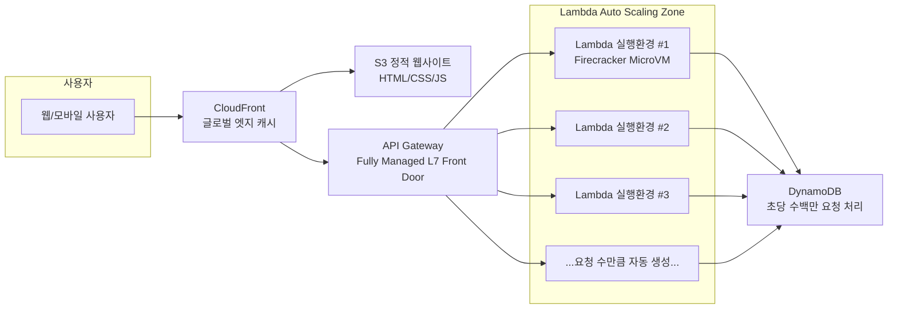
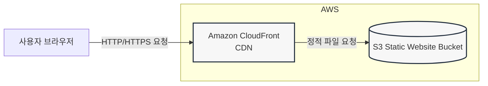

# Q1 

**정답: A**

https://www.examtopics.com/discussions/amazon/view/84973-exam-aws-certified-solutions-architect-associate-saa-c03/

**왜 A가 최선인가?**
1. **S3 Transfer Acceleration**
   - CloudFront의 전 세계 엣지 로케이션 활용
   - 엣지 로케이션에서 AWS 백본 네트워크를 통해 S3로 최적화된 경로 사용
   - 장거리 전송 시 50-500% 속도 향상 가능

2. **멀티파트 업로드**
   - 500GB 대용량 파일을 여러 파트로 분할하여 병렬 업로드
   - 네트워크 오류 시 전체 재시작 불필요 (실패한 파트만 재업로드)
   - 5MB 이상 파트 사용 권장, 100MB 이상 파일에 필수적

**다른 옵션들이 부적합한 이유:**
- **B**: 리전별 중간 버킷 관리, CRR 설정, 원본 삭제 작업 등 운영 복잡도 높음
- **C**: 고속 인터넷이 있는데 물리적 디바이스 사용은 비효율적, 배송 시간으로 인한 지연
- **D**: EC2/EBS 인프라 관리 부담, 스냅샷 복사 과정에서 추가 지연 발생

**핵심 키워드:**
- 고속 인터넷 ✓ → 네트워크 전송 가능
- 최대한 빨리 ✓ → Transfer Acceleration
- 운영 복잡성 최소화 ✓ → 직접 업로드 (중간 단계 없음)
- 500GB 대용량 ✓ → 멀티파트 업로드

---

# Q2

**정답: C**

https://www.examtopics.com/discussions/amazon/view/84848-exam-aws-certified-solutions-architect-associate-saa-c03/

## 설명

**핵심 요구사항:**
- S3에 JSON 형식 로그 저장
- 간단한 주문형(on-demand) 쿼리
- 최소한의 아키텍처 변경
- 최소한의 운영 오버헤드

**왜 C (Amazon Athena)인가?**

S3에 쿼리하는 건 Athena.
Athena 가 사용 가능한 모든 리전에서 Amazon Athena 를 사용하여 표준 SQL 로 Amazon S3 인벤토리를 쿼리할 수 있습니다.
https://docs.aws.amazon.com/ko_kr/AmazonS3/latest/userguide/storage-inventory-athena-query.html

Athena로 JSON 쿼리 가능.
Amazon Athena 를 사용하면 JSON 인코딩 값을 구문 분석하고, JSON 에서 데이터를 추출하고, 값을 검색하고, JSON 배열의 길이와 크기를 찾을 수 있습니다.
https://docs.aws.amazon.com/athena/latest/ug/querying-JSON.html

**Athena의 장점:**
- 서버리스 → 인프라 관리 불필요
- S3 데이터 직접 쿼리 → 데이터 이동/로드 불필요
- 사용한 만큼만 과금 (주문형에 최적)
- 표준 SQL 지원
- 기존 S3 아키텍처 변경 없음

**오답 분석:**
- **A (Redshift)**: 데이터 로드 필요, 클러스터 프로비저닝 및 관리 필요 → 운영 오버헤드 높음
- **B (CloudWatch Logs)**: S3 → CloudWatch 데이터 이동 필요 → 아키텍처 변경 큼, CloudWatch는 SQL 쿼리 미지원
- **D (Glue + EMR)**: EMR 클러스터 관리 필요, 복잡한 설정 → 운영 오버헤드 매우 높음

---

# Q3

**정답: A**

https://www.examtopics.com/discussions/amazon/view/84838-exam-aws-certified-solutions-architect-associate-saa-c03/

## 설명

**핵심 요구사항:**
- AWS Organizations 환경에서 여러 계정 관리
- S3 버킷 액세스를 조직 내 계정 사용자로만 제한
- 최소한의 운영 오버헤드

**왜 A (aws:PrincipalOrgID)인가?**

aws:PrincipalOrgID 라는 조건 키를 권한 정책에 사용하여 조직 내의 계정에 해당하는 IAM 보안 주체(사용자 및 역할)만 리소스에 액세스할 수 있도록 합니다.
https://aws.amazon.com/ko/about-aws/whats-new/2018/05/principal-org-id/

aws:PrincipalOrgID 전역 키는 조직의 모든 AWS 계정에 대한 모든 계정 ID를 나열하는 대신 사용할 수 있습니다. 예를 들어 다음 Amazon S3 버킷 정책은 XXX 조직의 모든 계정 구성원이 버킷에 객체를 추가하도록 허용합니다.

```json
{
  "Version": "2020-09-10",
  "Statement": {
    "Sid": "AllowPutObject",
    "Effect": "Allow",
    "Principal": "*",
    "Action": "s3:PutObject",
    "Resource": "arn:aws:s3:::examtopics/*",
    "Condition": {
      "StringEquals": {
        "aws:PrincipalOrgID": ["XXX"]
      }
    }
  }
}
```

https://docs.aws.amazon.com/IAM/latest/UserGuide/reference_policies_condition-keys.html

**aws:PrincipalOrgID의 장점:**
- 단일 조직 ID만 명시하면 됨
- 계정 추가/제거 시 정책 수정 불필요
- 간단한 구성 → 최소 운영 오버헤드
- 조직 전체에 자동 적용

**오답 분석:**
- **B (aws:PrincipalOrgPaths)**: 다중 값 조건 키로 OU별 세부 제어에 사용. 조직 전체 제한이 목적인 이 문제에서는 불필요하게 복잡함
  - aws:PrincipalOrgPaths는 특정 OU 경로를 지정해야 하므로 관리 복잡도 증가
  - https://docs.aws.amazon.com/ko_kr/IAM/latest/UserGuide/reference_policies_condition-keys.html
- **C (CloudTrail 모니터링)**: CloudTrail은 리소스 내역 기록/전송 서비스로, 액세스 제어와 무관. 또한 수동으로 정책을 업데이트해야 하므로 운영 오버헤드 높음
- **D (aws:PrincipalTag)**: 각 사용자마다 태그를 달아야 하므로 최소 운영 오버헤드 조건 불충족
  - aws:PrincipalTag/tag-key는 보안 주체에 연결된 태그를 비교하는 방식으로, 사용자 관리 부담 증가
  - https://docs.aws.amazon.com/ko_kr/IAM/latest/UserGuide/reference_policies_condition-keys.html

---

# Q4

**정답: A**

https://www.examtopics.com/discussions/amazon/view/84980-exam-aws-certified-solutions-architect-associate-saa-c03/

## 설명

**핵심 요구사항:**
- VPC 내 EC2 인스턴스에서 S3 버킷 액세스
- 인터넷 연결 없이 S3 접근 필요
- 프라이빗 네트워크 연결 제공

**Gateway VPC Endpoint의 특징:**
- S3와 DynamoDB는 Gateway Endpoint 지원
- 인터넷 게이트웨이 또는 NAT 불필요
- VPC 라우팅 테이블을 통해 트래픽 라우팅
- 추가 비용 없음 (무료)
- 프라이빗 네트워크 내에서 S3 액세스

**Gateway Endpoint vs Interface Endpoint:**
- **Gateway Endpoint**: S3, DynamoDB 전용, 라우팅 테이블 사용, 무료
- **Interface Endpoint**: 기타 AWS 서비스, ENI 사용, 시간당 요금

**오답 분석:**
- **B (CloudWatch Logs → S3)**: 로그를 CloudWatch로 스트리밍 후 S3로 내보내는 방식은 불필요한 우회 경로. 인터넷 없이 직접 S3 접근이 목표이므로 요구사항 불충족
- **C (인스턴스 프로파일)**: IAM 역할/권한 설정일 뿐, 네트워크 연결 문제를 해결하지 못함. 인터넷 없이 S3 접근하려면 네트워크 경로(VPC Endpoint) 필요
- **D (API Gateway + PrivateLink)**: 불필요하게 복잡한 아키텍처. API Gateway는 API 관리 서비스이며, S3 직접 접근에는 Gateway Endpoint가 가장 간단하고 효율적

---

# Q5

**정답: C**

https://www.examtopics.com/discussions/amazon/view/84981-exam-aws-certified-solutions-architect-associate-saa-c03/

## 설명

**핵심 요구사항:**
- 2개 AZ에 걸친 EC2 인스턴스 (ALB 뒤)
- 각 인스턴스는 별도의 EBS 볼륨 사용
- 사용자가 새로고침 시 일부 문서만 보임 (데이터 불일치)
- 모든 문서를 한 번에 볼 수 있어야 함

**문제 원인:**
각 AZ의 EC2 인스턴스가 독립적인 EBS 볼륨을 사용하여 데이터가 공유되지 않음. ALB가 요청을 분산하면서 사용자는 서로 다른 데이터를 보게 됨.

**왜 C (Amazon EFS)인가?**

**EBS vs EFS 핵심 차이:**
- **EBS**: 단일 AZ 내에서만 접근 가능한 블록 스토리지, 단일 EC2 인스턴스에만 연결
- **EFS**: 다중 AZ에서 접근 가능한 공유 파일 스토리지, 여러 EC2 인스턴스 동시 마운트

https://docs.aws.amazon.com/efs/latest/ug/how-it-works.html#how-it-works-ec2

**EFS의 장점:**
- 다중 AZ 지원 → 여러 EC2 인스턴스 동시 접근
- 공유 파일 시스템 → 데이터 일관성 보장
- 자동 확장 → 용량 관리 불필요
- NFSv4 프로토콜 지원

**오답 분석:**
- **A (두 EBS 볼륨에 데이터 복사)**: 수동 동기화 필요, 실시간 업데이트 시 데이터 불일치 발생. EBS는 여전히 독립적이므로 근본적 해결 안 됨
- **B (사용자를 특정 서버로 안내)**: Sticky Session을 의미하는데, 이는 특정 사용자를 같은 서버로 고정하는 것일 뿐 모든 문서를 볼 수 있게 하지 못함. 각 서버에 다른 문서가 있으면 여전히 일부만 보임
- **D (두 서버 모두에 요청 전송)**: ALB는 단일 서버로 라우팅하는 로드 밸런서이며, 여러 서버에 동시 요청을 보내고 결과를 조합하는 기능이 없음. 아키텍처적으로 불가능하고 비효율적

---

# Q6

**정답: B**

**핵심 요구사항:**
- 70TB 대용량 데이터 마이그레이션
- 최소한의 네트워크 대역폭 사용
- 가능한 빨리 마이그레이션

**Snowball Edge 선택 이유:**
- **용량**: 100TB 제공 (사용 가능: 83TB) → 70TB 데이터를 한 번에 전송 가능
- **네트워크 대역폭**: 물리적 디바이스를 통한 오프라인 전송 → 네트워크 대역폭 사용 최소화
- **속도**: 인터넷 전송 대비 월등히 빠름
- **호환성**: NFS 프로토콜 지원으로 기존 스토리지와 호환

**오답 분석:**
- **A (AWS CLI 복사)**: 70TB를 인터넷으로 전송 시 네트워크 대역폭 과다 사용, 전송 시간 매우 오래 걸림
- **C (S3 File Gateway)**: 인터넷을 통해 데이터 전송하므로 네트워크 대역폭 많이 사용, Snowball보다 느림
- **D (Direct Connect + S3 File Gateway)**: Direct Connect 설정에 시간 소요 (수주~수개월), 높은 초기 비용, 일회성 마이그레이션에 비효율적

**참고:**
- Snowball (구형): 50TB/80TB (사용 가능: 42TB/72TB)
- Snowball Edge (현재): 100TB (사용 가능: 83TB)

---

# Q7

**정답: D**

**핵심 요구사항:**
- 들어오는 메시지를 수집
- 수십 개의 애플리케이션/마이크로서비스가 메시지 소비
- 초당 100,000개까지 급증하는 메시지량
- 솔루션 분리 (Decoupling)
- 확장성 (Scalability)

**SNS + 여러 SQS 구독 선택 이유:**
- **Fan-out 패턴**: SNS 토픽 하나가 여러 SQS 대기열로 메시지 자동 배포 → 수십 개의 마이크로서비스가 각각 독립적으로 소비
- **완전한 분리**: Publisher(메시지 생산자)와 Subscriber(소비자) 완전 분리
- **높은 확장성**: SQS는 거의 무제한 처리량 지원, 초당 100,000개 메시지 처리 가능
- **독립적 소비**: 각 마이크로서비스가 자신의 SQS 대기열에서 독립적으로 메시지 처리, 다른 서비스에 영향 없음
- **관리형 서비스**: 자동 확장, 별도 인프라 관리 불필요

**오답 분석:**
- **A (Kinesis Data Analytics)**: 실시간 **분석** 서비스로 메시지 배포가 아닌 스트림 분석용. 여러 소비자에게 메시지 배포하는 용도 아님
- **B (EC2 Auto Scaling)**: 수집 애플리케이션만 확장할 뿐, 메시지 분리/배포 메커니즘 제공 안 함. 소비자 애플리케이션과의 디커플링 해결 불가
- **C (Kinesis 단일 샤드 + Lambda + DynamoDB)**: 단일 샤드는 초당 1,000레코드/1MB 제한. 초당 100,000개 처리 불가능. 수십 개 소비자에게 독립적 배포 어려움

---

# Q8

**정답: B**

**핵심 요구사항:**
- 레거시: 기본 서버가 여러 컴퓨팅 노드의 작업 조정
- 탄력성(Resilience) 극대화
- 확장성(Scalability) 극대화
- 애플리케이션 현대화

**SQS 대기열 + 대기열 크기 기반 Auto Scaling 선택 이유:**
- **완전한 디커플링**: SQS로 기본 서버(작업 생성자)와 컴퓨팅 노드(작업 소비자) 완전 분리 → 독립적 확장 및 관리 가능
- **높은 탄력성**: 작업이 SQS에 안전하게 보관되므로 컴퓨팅 노드 장애 시에도 작업 손실 없음. 노드 복구 후 처리 재개 가능
- **동적 확장성**: 대기열 크기(ApproximateNumberOfMessages)에 따라 Auto Scaling → 실제 워크로드에 맞춰 실시간 자동 조정
- **비용 최적화**: 작업량 증가 시 인스턴스 추가, 감소 시 자동 축소 → 필요한 만큼만 리소스 사용
- **단일 장애점 제거**: 중앙 집중식 기본 서버 제거 → 아키텍처 현대화

**오답 분석:**
- **A (예약된 조정)**: Scheduled Scaling은 예측 가능한 패턴(예: 매일 오전 9시 트래픽 증가)에만 적합. 실시간 워크로드 변화에 대응 불가. 탄력성 부족
- **C (CloudTrail)**: API 호출 감사/로깅 서비스로 작업 큐 역할 불가능. 작업 대상으로 부적합
- **D (EventBridge + 노드 부하 기반)**: 기본 서버가 여전히 존재하여 단일 장애점(SPOF) 유지. 완전한 디커플링 안 됨. EventBridge는 이벤트 라우팅용이지 작업 큐가 아님

---

# Q9

**정답: B**

**핵심 요구사항:**
- SMB 파일 서버 (온프레미스)
- 대용량 파일, 처음 며칠은 자주 액세스, 7일 후 거의 액세스 안 함
- 저장 공간 부족 문제 해결
- 최근 파일에 대한 저지연 액세스 유지
- 파일 수명 주기 관리 필요

**S3 File Gateway + S3 Lifecycle Policy 선택 이유:**
- **하이브리드 스토리지**: S3 File Gateway로 온프레미스 환경과 AWS 클라우드 통합 → 온프레미스 유지하면서 클라우드 스토리지 활용
- **SMB 호환성**: SMB v2/v3 프로토콜 지원 → 기존 SMB 파일 서버 워크플로우 유지, 애플리케이션 변경 불필요
- **로컬 캐싱**: 자주 액세스하는 파일을 게이트웨이에 캐싱 → 최근 파일에 대한 저지연 액세스 보장
- **무제한 확장**: 모든 파일이 S3로 자동 업로드되어 사실상 무제한 스토리지 확보 → 온프레미스 용량 부족 문제 근본 해결
- **자동 수명 주기 관리**: S3 Lifecycle Policy로 7일 후 Glacier Deep Archive로 자동 전환 → 장기 보관 비용 대폭 절감, 향후 스토리지 문제 방지

**오답 분석:**
- **A (DataSync)**: 7일 지난 데이터만 일회성 복사. 지속적인 저장 공간 증가 문제 해결 안 됨. AWS 측 스토리지 타입 불명확. 하이브리드 아키텍처 아님
- **C (FSx for Windows)**: 온프레미스 저장 공간 문제 해결 안 됨. 완전히 AWS로 마이그레이션 필요. 자동 수명 주기 관리 기능 없음
- **D (각 사용자 PC에 유틸리티)**: SMB 파일 서버 사용 불가능. 기존 워크플로우 완전 변경 필요. 사용자별 유틸리티 설치 및 관리 복잡도 매우 높음

---

# Q10

**정답: B**

**핵심 요구사항:**
- 전자 상거래 웹 애플리케이션
- API Gateway REST API로 주문 정보 수신
- **주문이 접수된 순서대로 처리** (순서 보장 필수)

**SQS FIFO 대기열 + Lambda 선택 이유:**
- **엄격한 순서 보장**: FIFO (First-In-First-Out) 대기열은 메시지 송수신 순서를 정확히 보장 → 첫 번째 주문이 먼저 처리됨
- **정확히 한 번 처리**: FIFO는 중복 메시지 자동 제거 기능 제공 → 동일 주문 중복 처리 방지
- **네이티브 통합**: API Gateway에서 직접 SQS로 메시지 전송 가능 (Lambda 없이도 통합 가능)
- **자동 Lambda 트리거**: SQS FIFO 대기열에서 Lambda를 직접 트리거하여 순차적으로 주문 처리
- **안정성**: 메시지가 대기열에 보관되므로 처리 실패 시 재시도 가능

**오답 분석:**
- **A (SNS + Lambda)**: SNS는 순서 보장 없음. Pub/Sub 패턴으로 여러 구독자에게 동시 메시지 전달 (Fan-out). 순차 처리 불가능
- **C (API Gateway 권한 부여자)**: 권한 부여자(Authorizer)는 인증/인가 전용 기능. 순서 보장이나 메시지 큐잉 기능 없음. 요청 차단만으로 순서 보장 불가능
- **D (SQS 표준 대기열)**: Best-effort ordering으로 순서 보장 없음. 높은 처리량 제공하지만 메시지 순서가 바뀔 수 있어 주문 처리 순서 보장 불가

---

# Q11

**정답: A**

**핵심 요구사항:**
- EC2 인스턴스가 Aurora 데이터베이스에 연결
- 현재: 파일에 로컬로 저장된 사용자 이름과 암호 사용
- **자격 증명 관리의 운영 오버헤드 최소화**

**AWS Secrets Manager + 자동 회전 선택 이유:**
- **중앙 집중식 관리**: 파일 기반 저장 방식 제거 → Secrets Manager에서 자격 증명 안전하게 중앙 관리
- **자동 회전**: 데이터베이스 자격 증명을 자동으로 주기적 교체 (예: 30일마다) → 수동 암호 변경 불필요, 운영 오버헤드 최소화
- **Aurora 네이티브 통합**: Secrets Manager는 Aurora/RDS와 직접 통합 → 자동 회전 시 데이터베이스 암호 자동 업데이트, 애플리케이션 중단 없음
- **자동 암호화**: KMS로 저장 및 전송 중 자격 증명 자동 암호화
- **IAM 통합**: EC2 인스턴스 역할(Instance Profile)로 Secrets Manager 접근 제어 → 자격 증명 노출 방지
- **버전 관리**: 자격 증명 변경 이력 자동 추적

**오답 분석:**
- **B (Systems Manager Parameter Store)**: **자동 회전 기능 없음**. 구성 데이터 저장 용도이지 자격 증명 자동 관리 부적합. 암호 교체 시 수동 업데이트 필요 → 운영 오버헤드 증가
- **C (S3 + KMS 암호화)**: 자동 회전 기능 없음. 파일 기반 저장 방식 그대로 유지. 암호 변경 시 수동으로 S3 객체 업데이트 및 EC2에 배포 필요 → 운영 오버헤드 매우 높음
- **D (암호화된 EBS)**: 자동 회전 기능 없음. 여전히 파일 기반 저장. EBS 암호화는 디스크 보호일 뿐 자격 증명 라이프사이클 관리 아님 → 운영 오버헤드 해결 안 됨

---

# Q12

**정답: A**

**핵심 요구사항:**
- 글로벌 회사 (전 세계 사용자)
- 웹 애플리케이션: ALB 뒤 EC2 (동적 데이터) + S3 버킷 (정적 데이터)
- **정적 및 동적 데이터의 성능 개선 및 대기 시간 감소**
- Route 53에 등록된 자체 도메인 사용

**CloudFront (S3 + ALB 오리진) + Route 53 선택 이유:**
- **단일 엔드포인트**: CloudFront 하나로 정적(S3)과 동적(ALB) 데이터 모두 제공 → 단일 도메인으로 간편하게 관리
- **글로벌 엣지 캐싱**: CloudFront의 전 세계 400+ 엣지 로케이션에서 콘텐츠 캐싱 → 사용자와 가까운 위치에서 제공, 대기 시간 대폭 감소
- **다중 오리진 지원**: CloudFront는 여러 오리진(S3, ALB 등) 동시 지원 → 경로 패턴별로 다른 오리진 라우팅 가능 (예: /static/* → S3, /api/* → ALB)
- **정적 콘텐츠 최적화**: S3 오리진으로 이미지, CSS, JS 등 정적 파일 빠르게 제공, 엣지에서 캐싱
- **동적 콘텐츠 가속**: ALB 오리진으로 동적 요청도 CloudFront를 통해 TCP 연결 최적화, Gzip 압축 등 성능 향상
- **Route 53 통합**: 자체 도메인(예: www.example.com)을 CloudFront 배포로 A/AAAA 레코드 라우팅 → 사용자 경험 일관성

**오답 분석:**
- **B (CloudFront + Global Accelerator)**: Global Accelerator는 TCP/UDP 계층(L4) 가속화 서비스로 캐싱 기능 없음. S3를 Global Accelerator 엔드포인트로 사용하는 것은 부적절하고 비효율적. 불필요한 복잡성 추가
- **C (CloudFront + Global Accelerator 혼합)**: 아키텍처 과도하게 복잡. Global Accelerator는 HTTP/HTTPS 캐싱 미지원. CloudFront만으로 정적/동적 데이터 모두 처리 가능
- **D (두 개의 도메인 이름)**: 정적/동적 콘텐츠에 각각 다른 도메인 사용 → 사용자 경험 나쁨 (두 도메인 관리 필요), CORS 문제 발생 가능, 관리 복잡도 증가. 단일 엔드포인트가 Best Practice

---

# Q13

**정답: A**

**핵심 요구사항:**
- 월별 유지 관리 활동
- **여러 AWS 리전**에서 MySQL용 RDS 데이터베이스 자격 증명 교체
- **최소한의 운영 오버헤드**

**Secrets Manager + 다중 리전 복제 + 자동 회전 선택 이유:**
- **다중 리전 비밀 복제**: Secrets Manager의 네이티브 기능으로 기본 리전의 비밀을 여러 리전에 자동 복제 → 각 리전마다 개별 관리 불필요
- **일정 기반 자동 회전**: 월별 일정에 따라 자동 회전 설정 가능 (예: 매월 1일) → 수동 작업 완전 제거, 운영 오버헤드 최소화
- **RDS 네이티브 통합**: Secrets Manager는 RDS/Aurora와 직접 통합 → 자동 회전 시 데이터베이스 암호를 Secrets Manager가 자동 업데이트
- **자동 동기화**: 기본 리전에서 비밀 회전 시 복제된 모든 리전의 비밀도 자동 동기화 → 리전별 개별 작업 불필요
- **완전 관리형**: AWS가 복제, 암호화(KMS), 회전 로직 모두 관리 → 인프라 관리 불필요
- **감사 로깅**: CloudTrail과 통합되어 비밀 액세스 및 회전 이력 자동 기록

**오답 분석:**
- **B (Systems Manager Parameter Store)**: **다중 리전 복제 기능 없음**. 각 리전마다 개별 파라미터 생성 및 수동 동기화 필요. **자동 회전 기능 없음** → 월별 수동 교체 필요, 운영 오버헤드 매우 높음
- **C (S3 + EventBridge + Lambda)**: 사용자 정의 솔루션으로 아키텍처 복잡도 높음. Lambda 함수로 자격 증명 교체 로직 직접 개발 및 유지보수 필요. 여러 리전 동기화 로직 구현 필요 → 운영 오버헤드 높음
- **D (KMS + DynamoDB Global Tables + Lambda)**: 과도하게 복잡한 아키텍처. Lambda로 RDS API 호출하여 비밀 교체 로직 직접 구현 필요. DynamoDB 테이블 관리, KMS 키 관리 등 추가 운영 부담. Secrets Manager의 네이티브 기능 대비 매우 비효율적 → 운영 오버헤드 매우 높음

---

# Q14

**정답: C**

**핵심 요구사항:**
- 전자 상거래 애플리케이션 (ALB + EC2 Auto Scaling, 여러 AZ)
- 현재: EC2 인스턴스 호스팅 MySQL 8.0 데이터베이스
- 로드 증가 시 데이터베이스 성능 저하
- **읽기 요청 >> 쓰기 트랜잭션** (읽기 집약적 워크로드)
- **고가용성 유지**
- **예측할 수 없는 읽기 워크로드에 자동 확장**

**Aurora 다중 AZ + Aurora 복제본 + Aurora Auto Scaling 선택 이유:**
- **자동 스토리지 확장**: Aurora는 10GB에서 시작하여 128TB까지 10GB 단위로 자동 확장 → 스토리지 관리 불필요
- **다중 AZ 고가용성**: 3개 AZ에 6개 복제본 자동 생성 → 최대 2개 복제본 손실에도 쓰기 가용성, 3개 복제본 손실에도 읽기 가용성 유지. 자동 장애 조치
- **읽기 확장성**: Aurora 복제본(최대 15개)으로 읽기 트래픽 분산 → 읽기 집약적 워크로드에 최적화
- **Aurora Auto Scaling**: 읽기 워크로드 메트릭(CPU, 연결 수 등)에 따라 Aurora 복제본 자동 추가/제거 → 예측 불가능한 읽기 워크로드에 자동 대응
- **MySQL 호환성**: MySQL 8.0과 완벽 호환 → 기존 애플리케이션 코드 변경 최소화, 마이그레이션 용이
- **고성능**: 표준 MySQL 대비 최대 5배 빠른 읽기/쓰기 성능 → 성능 저하 문제 해결

**오답 분석:**
- **A (Redshift 단일 노드)**: Redshift는 OLAP 데이터 웨어하우스로 OLTP 트랜잭션 처리 부적합. 단일 노드는 고가용성 미지원. MySQL과 호환되지 않아 애플리케이션 재작성 필요
- **B (RDS 단일 AZ + 리더 인스턴스)**: 단일 AZ 배포는 고가용성 요구사항 미충족. 기본 인스턴스 장애 시 가용성 손실. 읽기 복제본 수동 추가 필요 → 자동 확장 아님
- **D (ElastiCache + EC2 스팟)**: ElastiCache는 캐싱 계층일 뿐 트랜잭션 데이터베이스 대체 불가 (데이터 영속성 없음). 스팟 인스턴스는 언제든 중단 가능 → 고가용성 미지원. 다중 AZ 언급 없음

---

# Q15

**정답: C**

**핵심 요구사항:**
- AWS로 마이그레이션한 회사
- 프로덕션 VPC로 들어오고 나가는 트래픽 보호
- 온프레미스: 검사 서버로 **트래픽 흐름 검사** 및 **트래픽 필터링** 수행
- AWS 클라우드에서 동일한 기능 필요

**AWS Network Firewall 선택 이유:**
- **트래픽 검사**: Stateful(상태 유지) 및 Stateless(무상태) 검사 엔진으로 VPC 인바운드/아웃바운드 트래픽 검사
- **트래픽 필터링**: 방화벽 규칙 기반으로 트래픽 차단(DROP), 허용(PASS), 알림(ALERT) → 온프레미스 검사 서버와 동일한 기능 제공
- **VPC 경계 보호**: VPC로 들어오고 나가는 모든 트래픽을 네트워크 레벨에서 제어
- **심층 패킷 검사 (DPI)**: 애플리케이션 계층(L7)까지 검사 가능, HTTP, DNS, TLS 등 프로토콜 분석
- **침입 방지 시스템 (IPS)**: Suricata 호환 IPS 규칙 지원 → 알려진 위협 패턴 차단
- **완전 관리형**: AWS가 인프라 관리, 자동 확장, 고가용성 보장

**오답 분석:**
- **A (GuardDuty)**: 위협 탐지 서비스로 AWS 계정 및 워크로드의 악의적 활동 모니터링 및 알림. 실시간 트래픽 검사 및 필터링 기능 없음. 사후 탐지만 가능, 사전 차단 불가
- **B (트래픽 미러링)**: ENI에서 네트워크 트래픽을 복사하여 다른 위치(분석 도구)로 전송하는 기능. 자체적으로 검사/필터링 수행 안 함. 별도 검사 솔루션 필요 → 불완전한 솔루션
- **D (Firewall Manager)**: 여러 AWS 계정과 리소스에 걸쳐 방화벽 규칙(WAF, Shield, Network Firewall 등)을 중앙 관리하는 서비스. 실제 트래픽 검사/필터링을 수행하지 않음. 관리 도구일 뿐

---

# Q16

**정답: B**

**핵심 요구사항:**
- 데이터 레이크: Amazon S3 + PostgreSQL용 RDS
- **데이터 시각화** 및 보고 솔루션 필요
- **모든 데이터 소스 포함** (S3 + RDS)
- **관리팀**: 모든 시각화에 대한 전체 액세스
- **나머지 회사**: 제한된 액세스

**QuickSight → 사용자(User) & 그룹(Group) 기반 공유 구조

- Admin 그룹: 전체 접근
- 일반 그룹: 제한된 접근
- Row-level Security(RLS)도 QuickSight 내부 기능

>*QuickSight 사용 권한과 시각화 공유는 오직 QuickSight User/Group 기반*

**오답 분석:**
- **A (IAM 역할과 공유)**: QuickSight 대시보드는 **IAM 역할과 공유 불가능**. QuickSight 사용자 및 그룹과만 공유 가능. IAM 역할은 QuickSight 서비스 자체의 AWS 리소스 액세스 제어용이지 대시보드 공유 메커니즘 아님
- **C (Glue + ETL + S3 보고서)**: Glue는 ETL(추출/변환/적재) 서비스로 데이터 변환 용도. S3에 정적 보고서 게시는 시각화가 아닌 파일 저장. 대화형 시각화 불가능. RDS 데이터 통합 방법 언급 없음
- **D (Glue + Athena + S3)**: Athena는 SQL 쿼리 엔진이지 시각화 도구 아님. S3에 정적 보고서 게시는 대화형 대시보드 제공 불가. 사용자별 세분화된 액세스 제어 어려움. 시각화 기능 없음

---

# Q17

**정답: A**

**핵심 요구사항:**
- 새로운 비즈니스 애플리케이션
- 두 개의 EC2 인스턴스에서 실행
- S3 버킷을 문서 저장용으로 사용
- **EC2 인스턴스가 S3 버킷에 액세스 가능하도록 보장**

**IAM 역할 생성 및 EC2 인스턴스에 연결 선택 이유:**
- **Instance Profile**: IAM 역할을 EC2 인스턴스에 연결(Instance Profile을 통해) → AWS Best Practice
- **임시 자격 증명**: EC2 메타데이터 서비스를 통해 임시 보안 자격 증명 자동 관리, 주기적 자동 로테이션 → 수동 관리 불필요
- **보안 강화**: 액세스 키 하드코딩 불필요 → 자격 증명 노출 위험 제거, 코드 저장소에 비밀 유출 방지
- **자동 관리**: AWS SDK 및 CLI가 메타데이터 서비스에서 자격 증명 자동 획득 → 애플리케이션 코드 변경 불필요
- **최소 권한 원칙**: 필요한 S3 버킷 및 작업(예: s3:GetObject, s3:PutObject)에만 권한 부여 가능
- **확장성**: 여러 EC2 인스턴스에 동일한 역할 적용 가능

**오답 분석:**
- **B (IAM 정책)**: IAM 정책은 독립적으로 EC2 인스턴스에 직접 연결 불가능. 정책은 반드시 역할, 사용자, 또는 그룹에 첨부되어야 함. 정책 자체는 권한 정의일 뿐 자격 증명 제공 안 함
- **C (IAM 그룹)**: IAM 그룹은 IAM 사용자들을 그룹화하는 용도로만 사용. EC2 인스턴스(AWS 리소스)에 연결 불가능. 그룹은 사람 사용자 관리 전용
- **D (IAM 사용자)**: 사용자 액세스 키를 EC2 인스턴스에 하드코딩해야 함 → 보안 위험 매우 높음, 키 노출 가능, 수동 로테이션 필요, AWS Best Practice 위반. 장기 자격 증명 사용은 보안 취약점

---

# Q18

**정답: A, B**

**핵심 요구사항:**
- 큰 이미지를 압축 이미지로 변환하는 마이크로서비스
- 사용자 이미지 업로드 → S3 저장 → Lambda 처리/압축 → 다른 S3 저장
- **내구성이 있는 상태 비저장(Stateless) 구성 요소 사용**
- **이미지를 자동으로 처리**
- **(2개 선택)**

**A + B 조합 선택 이유:**

**A (S3 이벤트 알림 → SQS 대기열):**
- S3 이벤트 알림으로 이미지 업로드(ObjectCreated) 시 SQS로 자동 메시지 전송
- **내구성**: SQS가 메시지를 안전하게 보관 (기본 4일, 최대 14일)
- **디커플링**: S3와 Lambda 사이에 SQS 큐로 분리 → 독립적 확장 가능

**B (Lambda가 SQS를 이벤트 소스로 사용):**
- Lambda가 SQS 대기열에서 메시지 자동 폴링 및 처리
- **상태 비저장**: Lambda는 stateless, 모든 처리 정보는 SQS 메시지에 포함
- **자동 삭제**: 성공적으로 처리된 메시지는 SQS에서 자동 삭제
- **재시도**: 처리 실패 시 메시지가 큐에 남아 자동 재시도 → 내구성 보장

**통합 장점:**
- **완전 자동화**: S3 → SQS → Lambda 플로우 완전 자동, 사람 개입 불필요
- **확장성**: Lambda 자동 확장으로 대량 이미지 업로드 처리 가능
- **간단한 아키텍처**: 최소 구성 요소로 운영 및 비용 효율적
- **장애 복원력**: Lambda 장애 시에도 SQS에 메시지 보관 → 처리 보장

**오답 분석:**
- **C (메모리의 텍스트 파일)**: 메모리에 상태 저장 → **상태 비저장 요구사항 위반**. Lambda 종료 시 데이터 손실 → **내구성 없음**
- **D (EC2 + 텍스트 파일)**: 텍스트 파일에 상태 저장 → **상태 비저장 위반**. EC2 인스턴스 관리 필요 → 운영 오버헤드 증가, 서버리스 아님
- **E (EventBridge → SNS → 이메일)**: 이메일로 알림만 전송, 사람이 수동 처리 → **자동 처리 아님**. 내구성 및 상태 비저장과 무관

---

# Q19

**정답: D**

**핵심 요구사항:**
- 3계층 웹 애플리케이션 (웹 서버: 퍼블릭 서브넷, 앱/DB 서버: 프라이빗 서브넷)
- 타사 가상 방화벽 어플라이언스가 검사 VPC에 배포됨
- IP 패킷을 수락할 수 있는 IP 인터페이스
- **트래픽이 웹 서버 도달 전에 모든 트래픽 검사**
- **최소한의 운영 오버헤드**

**Gateway Load Balancer + GWLB 엔드포인트 선택 이유:**
- **타사 어플라이언스 통합**: GWLB는 타사 가상 어플라이언스(방화벽, IDS/IPS, 심층 패킷 검사 등) 통합을 위해 특별히 설계된 L3 게이트웨이 + L4 로드 밸런서
- **투명한 트래픽 삽입/반환**: GWLB 엔드포인트를 통해 트래픽을 투명하게 검사 VPC로 라우팅 → 어플라이언스 검사 → 원래 경로로 반환 (Bump-in-the-wire 방식)
- **자동 확장 및 고가용성**: 여러 어플라이언스 인스턴스에 트래픽 자동 분산, 장애 시 자동 failover, 헬스 체크 제공
- **VPC 간 트래픽 교환**: PrivateLink 기반 GWLB 엔드포인트로 검사 VPC ↔ 애플리케이션 VPC 간 안전한 트래픽 교환
- **GENEVE 프로토콜**: IP 패킷을 GENEVE 캡슐화하여 어플라이언스로 전달 → 원본 IP 정보 보존
- **최소 운영 오버헤드**: 완전 관리형 서비스, 자동 확장, 복잡한 수동 라우팅 설정 불필요

**아키텍처 플로우:**
1. 인터넷 → 애플리케이션 VPC IGW → GWLB 엔드포인트 (인그레스 라우팅)
2. GWLB 엔드포인트 → 검사 VPC의 GWLB → 타사 방화벽 어플라이언스 (검사)
3. 어플라이언스 → GWLB → GWLB 엔드포인트 → 웹 서버 (허용된 트래픽만)

**오답 분석:**
- **A (NLB)**: L4 로드 밸런서로 백엔드 타겟으로 트래픽 분산 용도. 패킷 검사 후 원래 경로로 투명하게 반환하는 기능 없음. 타사 어플라이언스 통합 미지원
- **B (ALB)**: L7 로드 밸런서로 HTTP/HTTPS 트래픽 분산 전용. 가상 어플라이언스 통합 불가능. 모든 IP 패킷 처리 불가 (HTTP/HTTPS만)
- **C (Transit Gateway만)**: VPC 간 연결 허브 제공하지만 GWLB 없이는 타사 어플라이언스로 트래픽을 투명하게 삽입/검사/반환 불가능. 복잡한 라우팅 테이블 구성 및 유지 필요 → 운영 오버헤드 높음

---

# Q20

**정답: D**

**핵심 요구사항:**
- 동일 AWS 리전에서 대량 프로덕션 데이터를 테스트 환경으로 복제
- 데이터는 EBS 볼륨에 저장
- **복제된 데이터 수정 시 프로덕션 환경에 영향 없음**
- **일관되게 높은 I/O 성능 요구**
- **복제 시간 최소화**

**EBS 스냅샷 + Fast Snapshot Restore + 새 EBS 볼륨 선택 이유:**
- **독립적인 볼륨**: 스냅샷에서 새로운 독립적인 EBS 볼륨 생성 → 테스트 환경에서 데이터 수정해도 프로덕션 환경에 전혀 영향 없음
- **빠른 스냅샷 복원 (FSR)**: 스냅샷에서 볼륨 생성 시 **즉시 전체 성능 제공** → 초기화 대기 시간(lazy loading) 제거
- **높은 I/O 성능 보장**: FSR로 생성된 볼륨은 생성 즉시 프로비저닝된 IOPS/처리량 완전 사용 가능 → 일관되게 높은 I/O 성능 제공
- **복제 시간 최소화**: FSR 없이는 처음 액세스하는 블록을 S3에서 가져오는 지연(latency penalty) 발생. FSR은 블록을 미리 로드하여 즉시 사용 가능
- **스냅샷 효율성**: 증분 스냅샷으로 변경된 블록만 저장 → 스냅샷 생성 시간 및 저장 비용 절감

**Fast Snapshot Restore (FSR) 작동 원리:**
- FSR 활성화 시: 스냅샷 데이터를 S3에서 미리 로드하여 완전히 초기화된 볼륨 생성
- FSR 비활성화 시: 볼륨 생성 후 처음 액세스하는 블록마다 S3에서 가져오는 지연 발생 (성능 저하)

**오답 분석:**
- **A (인스턴스 스토어)**: 인스턴스 스토어는 **휘발성** 임시 스토리지. EC2 중지/종료 시 데이터 완전 손실. 영구 데이터 저장 불가능. 스냅샷을 인스턴스 스토어로 복원 불가능
- **B (EBS 다중 연결)**: 동일 EBS 볼륨을 프로덕션과 테스트 인스턴스에 동시 연결 → 테스트에서 수정 시 프로덕션에도 즉시 영향 → **요구사항 위반**. 데이터 독립성 없음
- **C (볼륨 생성 후 복원)**: EBS는 스냅샷에서 **직접 볼륨 생성**하는 방식. 빈 볼륨 생성 후 스냅샷을 복원하는 절차는 존재하지 않음. **잘못된 프로세스**

---

# Q21

**정답: D**

 **문제 요약**
- 하루 24시간 동안 하나의 제품만 판매하는 전자상거래 웹사이트
- 피크 시간에 시간당 수백만 개의 요청을 밀리초 지연시간으로 처리
- 최소한의 운영 오버헤드 필요

**옵션 분석**

**A. S3 + CloudFront + S3에 주문 데이터 저장**
- ❌ S3는 객체 스토리지로 트랜잭션 데이터 처리에 부적합
- ❌ 동적 주문 처리 기능 없음

**B. EC2 Auto Scaling + ALB + RDS MySQL**
- ❌ EC2 인스턴스 관리 필요 (패치, 모니터링, 확장 설정)
- ❌ RDS 관리 및 용량 계획 필요
- ❌ 운영 오버헤드 높음

**C. EKS + Kubernetes + RDS MySQL**
- ❌ Kubernetes 클러스터 관리 복잡성 매우 높음
- ❌ 컨테이너 오케스트레이션 운영 부담
- ❌ 가장 높은 운영 오버헤드

**D. S3 + CloudFront + API Gateway + Lambda + DynamoDB** ✅
- ✅ 완전한 서버리스 아키텍처 → 인프라 관리 불필요
- ✅ 정적 콘텐츠 = S3 + CloudFront (전 세계 엣지에서 밀리초 응답)
- ✅ 백엔드 = API Gateway + Lambda (완전 서버리스, 운영 부담 없음)
- ✅ DB = DynamoDB
    - 초당 수백만 요청도 처리 가능
    - 자동 확장
    - 운영 오버헤드 없음

**선택 이유
서버리스 아키텍처는 인프라 프로비저닝, 패치, 확장 관리가 모두 자동화되어 있어 운영 오버헤드를 최소화하면서도 피크 트래픽을 효과적으로 처리할 수 있습니다. 모든 구성 요소가 관리형 서비스로 자동 확장되어 밀리초 단위 응답 시간을 보장합니다.

---

# Q22

**정답: B**

**문제 요구사항**
- 가용 영역 손실에 대한 복원력 필요
- 일부 파일은 자주 액세스, 다른 파일은 예측 불가능한 패턴으로 거의 액세스
- 저장 및 검색 비용 최소화

**옵션 분석**

**A. S3 Standard**
- ✅ 가용 영역 복원력 (최소 3개 AZ)
- ❌ 모든 파일에 높은 스토리지 비용 → 거의 액세스 안 되는 파일 비효율
- ❌ 액세스 패턴 최적화 없음

**B. S3 Intelligent-Tiering** ✅
- ✅ 가용 영역 복원력 (최소 3개 AZ에 복제)
- ✅ 자동으로 액세스 패턴 모니터링
- ✅ 자주 액세스: Frequent Access 계층 유지
- ✅ 30일 미액세스: Infrequent Access 계층으로 자동 이동
- ✅ 90일 미액세스: Archive 계층으로 추가 절감
- ✅ **예측 불가능한 패턴에 최적** → 자동 비용 최적화
- ✅ 검색 비용 없음 (Retrieval charge 없음)
- ✅ 관리 오버헤드 없음

**C. S3 Standard-IA**
- ✅ 가용 영역 복원력
- ❌ 자주 액세스되는 파일에는 비효율 (검색 비용 발생)
- ❌ 혼합된 액세스 패턴에 부적합
- ❌ 수동으로 파일을 분류해야 함

**D. S3 One Zone-IA**
- ❌ **단일 가용 영역만 사용** → AZ 손실 시 데이터 손실
- ❌ 복원력 요구사항 미충족

**선택 이유
핵심 키워드는 **"예측 불가능한 액세스 패턴 (unpredictable patterns)"**입니다. S3 Intelligent-Tiering은 액세스 빈도를 자동으로 모니터링하여 적절한 스토리지 계층으로 객체를 이동시킵니다. 자주 액세스되는 파일은 빠른 액세스를, 거의 사용하지 않는 파일은 저렴한 비용을 자동으로 제공하므로 혼합된 액세스 패턴에 최적입니다.

---

# Q23

**정답: B**

**문제 요구사항
- S3 Standard에 백업 파일 저장
- 1개월 동안 자주 액세스
- 1개월 이후에는 액세스하지 않음
- 파일을 무기한 보관 필요
- 가장 비용 효율적인 솔루션

**옵션 분석

**A. S3 Intelligent-Tiering**
- ❌ 객체 모니터링 비용 발생
- ❌ 액세스 패턴이 명확한 경우 (1개월 후 미액세스) 불필요한 오버헤드
- ❌ 예측 가능한 패턴에는 비효율적

**B. S3 Glacier Deep Archive로 전환** ✅
- ✅ **S3에서 가장 저렴한 스토리지 클래스**
- ✅ 1개월 후 액세스 안 함 → 장기 아카이브에 최적
- ✅ 무기한 보관에 적합 (11 nines 내구성)
- ✅ S3 수명 주기 정책으로 자동 전환
- ✅ 최대 비용 절감 (Standard 대비 약 95% 이상 저렴)
- ✅ 검색 시간: 12시간 (백업 파일이므로 문제 없음)

**C. S3 Standard-IA로 전환**
- ❌ 1개월 후 액세스 안 하는데 IA 사용은 비효율
- ❌ Glacier Deep Archive보다 훨씬 비쌈
- ❌ 장기 아카이브용이 아닌 가끔 액세스용

**D. S3 One Zone-IA로 전환**
- ❌ Standard-IA보다는 저렴하지만 Glacier Deep Archive보다 비쌈
- ❌ 단일 AZ → 내구성 낮음 (백업 파일에 부적합)
- ❌ 비용 최적화 부족

**선택 이유
핵심 키워드는 **"1개월 이후 액세스하지 않음 + 무기한 보관"**입니다. 이는 전형적인 장기 아카이브 시나리오입니다. S3 Glacier Deep Archive는 장기 보관용 데이터에 최적화되어 있으며 S3 스토리지 클래스 중 가장 저렴합니다. 검색에 최대 12시간이 걸리지만, 액세스하지 않는 백업 파일이므로 문제가 되지 않습니다.

---

# Q24

**정답: B**

**문제 요구사항
- 지난 2개월간 EC2 비용 비교 그래프 생성
- 인스턴스 유형별 심층 분석 수행
- 수직적 확장의 근본 원인 식별
- 운영 오버헤드가 가장 적은 방법

**옵션 분석

**A. AWS Budgets으로 예산 보고서 생성**
- ❌ Budgets는 예산 설정 및 임계값 알림용 도구
- ❌ 비용 분석 및 시각화 기능 제한적
- ❌ 인스턴스 유형별 심층 분석 어려움
- ❌ 근본 원인 분석에 부적합

**B. Cost Explorer의 세분화된 필터링** ✅
- ✅ **AWS 콘솔에서 즉시 사용 가능** → 별도 설정 불필요
- ✅ 인스턴스 유형별 그룹화 및 필터링 지원
- ✅ 최대 12개월 데이터 조회 가능 (2개월 비교 충분)
- ✅ 시계열 그래프 자동 생성
- ✅ 다양한 차원으로 드릴다운 분석 가능 (서비스, 리전, 태그 등)
- ✅ **최소한의 운영 오버헤드** (클릭 몇 번으로 분석 완료)

**C. Billing and Cost Management 대시보드**
- ❌ 기본 대시보드는 고수준 요약만 제공
- ❌ 인스턴스 유형별 세부 분석 기능 부족
- ❌ Cost Explorer보다 기능 제한적

**D. Cost and Usage Report + QuickSight**
- ❌ S3 버킷 생성 및 구성 필요
- ❌ Cost and Usage Report 활성화 및 대기 시간 필요
- ❌ QuickSight 설정, 데이터셋 생성, 대시보드 구축 필요
- ❌ **매우 높은 운영 오버헤드**
- ❌ 복잡한 커스텀 분석에는 유용하지만 이 문제에는 과도함

**선택 이유
핵심 키워드는 **"운영 오버헤드가 가장 적은"**입니다. AWS Cost Explorer는 별도 설정 없이 AWS 콘솔에서 즉시 사용할 수 있으며, 인스턴스 유형별 필터링과 시계열 비교 그래프를 손쉽게 생성할 수 있습니다. 지난 12개월 데이터를 지원하므로 2개월 비교는 물론, 심층 분석을 위한 다양한 필터링 옵션을 제공합니다.

---

# Q25

**정답: D**

**문제 상황
- API Gateway → Lambda → Aurora PostgreSQL 구조
- 대용량 데이터 처리 시 Lambda 할당량을 크게 늘려야 함
- 확장성 개선 + 구성 노력 최소화 필요

**옵션 분석

**A. Lambda를 EC2 + Tomcat + JDBC로 리팩터링**
- ❌ 전체 아키텍처 리팩터링 필요 → 매우 높은 구성 노력
- ❌ EC2 인스턴스 관리 오버헤드 (패치, 확장, 모니터링)
- ❌ Auto Scaling 별도 설정 필요
- ❌ 서버리스 장점 상실

**B. Aurora를 DynamoDB + DAX로 변경**
- ❌ 데이터베이스 플랫폼 완전 변경 → 매우 높은 구성 노력
- ❌ PostgreSQL → DynamoDB 데이터 마이그레이션 복잡
- ❌ 애플리케이션 로직 전체 수정 필요
- ❌ 문제 근본 원인 미해결 (Lambda 동시성 한계는 여전함)

**C. 두 개의 Lambda + SNS로 통합**
- ❌ SNS는 pub/sub 메시징 (일대다 전송)
- ❌ **메시지 큐/버퍼링 기능 없음** → 트래픽 제어 불가
- ❌ 대량 데이터 처리 시 여전히 Lambda 동시성 한계
- ❌ 메시지 지속성 보장 안 함 (휘발성)

**D. 두 개의 Lambda + SQS로 통합** ✅
- ✅ **SQS가 버퍼 역할** → Lambda 동시성 한계 해결
- ✅ Lambda 1: API Gateway → SQS (빠르게 메시지 전송)
- ✅ Lambda 2: SQS → Aurora (배치 처리, 속도 조절)
- ✅ **디커플링 아키텍처** → 확장성 크게 개선
- ✅ SQS 배치 크기 조정으로 DB 부하 최적화
- ✅ 자동 재시도 및 DLQ(Dead Letter Queue) 지원
- ✅ **구성 노력 최소** (기존 Lambda 코드 재사용 가능)
- ✅ Lambda 할당량 증가 불필요

**선택 이유
핵심 문제는 **"Lambda 동시 실행 한계"**입니다. SQS 큐를 중간에 두면:
1. 첫 번째 Lambda는 빠르게 메시지를 SQS에 넣고 종료 → API 응답 빠름
2. SQS가 대량의 메시지를 안전하게 버퍼링
3. 두 번째 Lambda가 SQS에서 배치로 꺼내서 DB에 저장 → 속도 조절
4. Lambda 동시성 한계 극복 + Aurora 부하 분산

**SQS vs SNS 차이:**
- **SQS**: 메시지 큐 (일대일, 버퍼링, 속도 조절 가능)
- **SNS**: 메시징 서비스 (일대다, 즉시 전송, 버퍼링 없음)

---

# Q26

**정답: A**

**문제 요구사항
- Amazon S3 버킷에 무단 구성 변경이 없는지 확인
- AWS 클라우드 배포 검토

**옵션 분석

**A. AWS Config를 적절한 규칙으로 켜기** ✅
- ✅ **리소스 구성 변경을 지속적으로 모니터링 및 기록**
- ✅ S3 버킷 구성 변경 감지:
  - 퍼블릭 액세스 설정 변경
  - 암호화 설정 변경
  - 버킷 정책 변경
  - 버전 관리 설정 변경
- ✅ 관리형 규칙 제공:
  - `s3-bucket-public-read-prohibited`
  - `s3-bucket-public-write-prohibited`
  - `s3-bucket-server-side-encryption-enabled`
  - `s3-bucket-versioning-enabled`
- ✅ 구성 변경 이력 유지 (누가, 언제, 무엇을)
- ✅ 규칙 위반 시 자동 알림 (SNS 통합)
- ✅ 규정 준수 대시보드 제공

**B. AWS Trusted Advisor**
- ❌ 비용 최적화, 성능, 보안 **모범 사례 권장** 도구
- ❌ 구성 변경 추적 기능 없음
- ❌ 실시간 모니터링 불가
- ❌ 일회성 검사 (지속적 모니터링 아님)

**C. Amazon Inspector**
- ❌ **애플리케이션 보안 취약점 스캔** 도구
- ❌ EC2 인스턴스 및 컨테이너 워크로드 전용
- ❌ S3 버킷 구성 변경 감지 불가
- ❌ 용도가 다름 (취약점 스캔 vs 구성 변경 추적)

**D. S3 서버 액세스 로깅 + EventBridge**
- ❌ 서버 액세스 로그는 **객체 수준 액세스** 기록 (GET, PUT, DELETE)
- ❌ **버킷 구성 변경은 기록하지 않음** (버킷 정책, 퍼블릭 액세스 등)
- ❌ 복잡한 수동 구성 및 로그 파싱 필요
- ❌ 구성 준수 평가 기능 없음

**선택 이유
핵심은 **"구성 변경 감지 및 추적"**입니다. AWS Config는 AWS 리소스의 구성 변경을 지속적으로 모니터링하고 기록하며, 정의된 규칙에 따라 준수 여부를 자동으로 평가합니다. S3 버킷의 퍼블릭 액세스 설정, 암호화, 버전 관리 등의 구성 변경을 감지하고 규칙 위반 시 알림을 보냅니다.

**AWS Config vs S3 액세스 로그:**
- **AWS Config**: 버킷 구성 변경 추적 (설정 변경)
- **S3 액세스 로그**: 객체 액세스 추적 (데이터 액세스)

---

# Q27

**정답: A**

**풀이:**

문제의 핵심 요구사항:
1. 제품 관리자는 AWS 계정이 없음
2. CloudWatch 대시보드 접근 필요
3. 최소 권한 원칙 적용

각 보기 분석:

**A. CloudWatch 대시보드 공유 기능 사용** ✅
- AWS 계정 없이 대시보드 접근 가능
- 이메일 주소로 고유 암호 생성하여 공유
- 대시보드만 볼 수 있어 최소 권한 원칙 충족
- 추가 인프라/사용자 관리 불필요

**B. IAM 사용자 + CloudWatchReadOnlyAccess** ❌
- IAM 사용자 생성 = AWS 계정 제공하는 것
- "AWS 계정이 없다"는 요구사항 위배
- 불필요한 IAM 사용자 관리 오버헤드

**C. IAM 사용자 + ViewOnlyAccess** ❌
- B와 동일한 이유로 부적절
- ViewOnlyAccess는 과도한 권한 (최소 권한 원칙 위배)

**D. 배스천 서버 사용** ❌
- 과도하게 복잡한 솔루션
- 높은 운영 오버헤드 (서버 관리, RDP 자격증명 관리)
- 보안 위험 증가
- 비용 증가

**결론:** CloudWatch 대시보드 공유 기능은 AWS 계정 없는 외부 사용자에게 특정 대시보드만 안전하게 공유할 수 있는 AWS의 네이티브 기능입니다.

https://www.examtopics.com/discussions/amazon/view/85227-exam-aws-certified-solutions-architect-associate-saa-c03/

https://docs.aws.amazon.com/AmazonCloudWatch/latest/monitoring/cloudwatch-dashboard-sharing.html

---

# Q28

**정답: B**

**풀이:**

문제의 핵심 요구사항:
1. AWS Organizations의 모든 계정에 SSO 필요
2. 온프레미스 자체 관리 Microsoft AD에서 사용자/그룹 관리 유지
3. AWS 계정과 리소스 접근을 위한 중앙 인증

각 보기 분석:

**A. AWS SSO + 단방향 트러스트** ❌
- AWS SSO(IAM Identity Center)를 사용하는 것은 맞음
- 하지만 **AWS Management Console 접근에는 양방향 트러스트 필요**
- 단방향 트러스트는 EC2, RDS, FSx 등에만 사용 가능
- SSO로 AWS 콘솔 접근 시 양방향 인증 필요

**B. AWS SSO + 양방향 포리스트 트러스트** ✅
- AWS SSO(IAM Identity Center) 활성화로 중앙 SSO 제공
- AWS Directory Service로 온프레미스 AD 연결
- 양방향 트러스트로 AWS 콘솔 및 엔터프라이즈 앱 접근 가능
- 온프레미스 AD에서 사용자 관리 계속 가능
- Organizations의 모든 계정에 SSO 적용 가능

**C. AWS Directory Service만 사용** ❌
- **AWS Directory Service는 디렉터리 연결만 제공** 
	--> SSO 기능은 IAM Identity Center(AWS SSO)가 필요
- Organizations 전체에 SSO를 제공하지 못함
- 각 계정별로 개별 설정 필요 (중앙 관리 불가)

**D. 온프레미스 IdP + AWS SSO** ❌
- 불필요하게 복잡한 구조
- 이미 온프레미스 Microsoft AD가 있는데 별도 IdP 배포는 중복
- Microsoft AD를 직접 연결하는 것이 더 간단하고 효율적
- 추가 인프라 관리 오버헤드

**결론:** AWS SSO(IAM Identity Center)와 AWS Directory Service를 양방향 트러스트로 연결하면, 온프레미스 AD를 그대로 사용하면서 AWS Organizations의 모든 계정에 중앙 집중식 SSO를 제공할 수 있습니다.

**핵심 개념:**
- AWS Management Console 접근: 양방향 트러스트 필수
- EC2, RDS, FSx 접근: 단방향 또는 양방향 트러스트 가능
- AWS SSO(IAM Identity Center): Organizations 전체에 SSO 제공

https://www.examtopics.com/discussions/amazon/view/85231-exam-aws-certified-solutions-architect-associate-saa-c03/
https://aws.amazon.com/ko/organizations/features/
 https://aws.amazon.com/ko/iam/identity-center/faqs/
https://docs.aws.amazon.com/directoryservice/latest/admin-guide/ms_ad_setup_trust.ht
https://docs.aws.amazon.com/ko_kr/IAM/latest/UserGuide/id_roles_providers.html

---

# Q29

**정답: A**

**풀이:**

문제의 핵심 요구사항:
1. UDP 프로토콜 지원 (VoIP 서비스)
2. 최저 지연 시간 라우팅 (여러 리전)
3. 리전 간 자동 장애 조치

**A. NLB + AWS Global Accelerator** ✅
- NLB: TCP/UDP 프로토콜 지원 (VoIP의 UDP 요구사항 충족)
- Global Accelerator: Anycast IP로 최저 지연 경로 자동 선택
- AWS 엣지 로케이션에서 가장 가까운 정상 엔드포인트로 라우팅
- 자동 헬스 체크 및 즉각적인 장애 조치 지원
- 각 리전의 NLB를 엔드포인트로 등록하여 글로벌 분산 가능

**B. ALB + AWS Global Accelerator** ❌
- ALB는 Layer 7 (HTTP/HTTPS)만 지원
- UDP 프로토콜 미지원 (VoIP 불가능)
- Global Accelerator 사용은 맞지만 로드밸런서가 부적절

**C. NLB + Route 53 지연 시간 라우팅 + CloudFront** ❌
- CloudFront는 HTTP/HTTPS 콘텐츠 캐싱/배포용 서비스
- UDP 실시간 스트리밍 미지원
- VoIP 같은 실시간 양방향 통신에 부적합
- Route 53만으로는 자동 장애 조치가 느림 (DNS TTL 문제)

**D. ALB + Route 53 가중치 라우팅 + CloudFront** ❌
- ALB는 UDP 미지원
- CloudFront는 UDP 미지원
- 가중치 라우팅은 최저 지연 시간 라우팅이 아님 (수동 설정 비율)

**결론:** UDP 프로토콜과 최저 지연 시간 라우팅이 필요한 글로벌 서비스는 NLB + AWS Global Accelerator 조합이 최적입니다.

**핵심 개념:**
- **Layer 4 (NLB)**: TCP/UDP 지원
- **Layer 7 (ALB)**: HTTP/HTTPS만 지원
- **Global Accelerator**: Anycast IP로 최저 지연 경로 + 자동 장애 조치
- **CloudFront**: HTTP/HTTPS 캐싱 전용 (실시간 UDP 미지원)

**참고:**
- https://www.examtopics.com/discussions/amazon/view/85029-exam-aws-certified-solutions-architect-associate-saa-c03/
- https://aws.amazon.com/ko/global-accelerator/faqs/
- https://aws.amazon.com/global-accelerator/faqs/

---

# Q30

**정답: C**

**풀이:**

문제의 핵심 요구사항:
1. 한 달에 48시간만 사용 (사용률 약 6.7%)
2. 컴퓨팅/메모리 속성 유지 (성능 저하 불가)
3. 비용 최소화

각 보기 분석:

**A. DB 인스턴스 중지/재시작** ❌
- RDS 인스턴스 중지 시에도 스토리지(EBS) 비용 계속 부과
- 프로비저닝된 IOPS, 백업 스토리지 비용도 유지
- 중지는 최대 7일까지만 가능 (자동 재시작됨)
- 한 달 중 대부분 기간 동안 불필요한 스토리지 비용 발생

**B. Auto Scaling 정책 사용** ❌
- RDS는 수직 확장만 가능 (인스턴스 타입 변경)
- Auto Scaling으로 축소해도 인스턴스는 계속 실행 상태
- 최소 인스턴스가 항상 실행되어 컴퓨팅 비용 발생
- 스냅샷보다 훨씬 높은 비용

**C. 스냅샷 생성 후 종료, 필요시 복원** ✅
- 테스트 후 스냅샷 생성 → DB 인스턴스 완전 종료
- 스냅샷 스토리지 비용만 발생 (증분 백업으로 매우 저렴)
- 필요시 스냅샷에서 동일한 사양으로 복원 (컴퓨팅/메모리 유지)
- 인스턴스, IOPS, 백업 비용 등 모두 제거
- 사용률 6.7%일 때 최대 93% 비용 절감 가능

**D. 저용량 인스턴스로 수정** ❌
- 컴퓨팅/메모리 속성 유지 요구사항 위배
- 인스턴스가 계속 실행되어 컴퓨팅 비용 발생
- 수정/재수정 시 다운타임 발생
- 비용 절감 효과가 스냅샷보다 훨씬 낮음

**결론:** 사용률이 매우 낮을 때(한 달에 48시간)는 스냅샷 생성 후 인스턴스를 완전히 종료하는 것이 가장 비용 효율적입니다.

**비용 비교 (월 기준):**
- **A (중지)**: 스토리지 비용 (~30일) + 컴퓨팅 (자동 재시작)
- **B (Auto Scaling)**: 컴퓨팅 비용 (~30일, 축소해도)
- **C (스냅샷)**: 스냅샷 비용 (~28일) + 컴퓨팅 비용 (2일) ← 최저
- **D (저용량)**: 컴퓨팅 비용 (~30일, 낮은 사양)

**참고:**
- https://www.examtopics.com/discussions/amazon/view/85030-exam-aws-certified-solutions-architect-associate-saa-c03/

---

# Q31 

**정답: A**

핵심 요구사항:
- EC2, RDS, Redshift가 태그로 구성되어 있는지 확인
- **운영 노력 최소화**

**선택지 분석:**

A. ✅ **AWS Config 규칙 사용**
   - AWS Config는 리소스 규정 준수 확인을 위한 관리형 서비스
   - `required-tags` 규칙으로 태그 검증 자동화
   - 지속적인 모니터링과 자동 탐지 제공
   - 완전 관리형으로 운영 노력 최소화

B. ❌ Cost Explorer + 수동 태그 지정
   - 수동 작업이 필요하여 운영 노력이 큼
   - 지속적인 모니터링 불가

C. ❌ API 호출 + EC2에서 주기적 실행
   - EC2 인스턴스 관리 필요 (패치, 가용성 등)
   - 커스텀 코드 유지보수 필요
   - 운영 노력이 큼

D. ❌ API 호출 + Lambda + CloudWatch
   - 서버리스이지만 커스텀 코드 작성/유지보수 필요
   - AWS Config가 이미 제공하는 기능을 재구현하는 것
   - A보다 운영 노력이 더 큼

**정답: A** - AWS Config는 리소스 태그 검증을 위한 완전 관리형 솔루션으로 운영 노력을 최소화합니다.

---

# Q32 

**정답: B**

**해설:**

핵심 요구사항:
- 웹사이트 콘텐츠: HTML, CSS, JavaScript, 이미지 (정적 콘텐츠만)
- **가장 비용 효율적인** 호스팅 방법

**선택지 분석:**

A. ❌ 컨테이너화 + Fargate
   - 컨테이너 오케스트레이션 서비스 (vCPU, 메모리 기반 과금)
   - 정적 콘텐츠 호스팅에는 과도한 솔루션
   - 비용이 S3보다 훨씬 높음

B. ✅ **Amazon S3 정적 웹사이트 호스팅**
   - 정적 콘텐츠 호스팅에 최적화된 서비스
   - 서버 관리 불필요 (완전 관리형)
   - 스토리지 및 데이터 전송 비용만 발생
   - 가장 비용 효율적

C. ❌ EC2 + 웹 서버
   - 인스턴스 24/7 실행 비용 발생
   - 서버 패치, 보안 업데이트 등 관리 필요
   - 정적 콘텐츠에는 과도한 솔루션

D. ❌ ALB + Lambda + Express.js
   - Lambda 실행 비용 + ALB 운영 비용
   - 정적 콘텐츠에는 불필요한 복잡도
   - S3보다 비용이 높음



**정답: B** - 정적 웹사이트(HTML, CSS, JS, 이미지)는 S3 정적 웹사이트 호스팅이 가장 비용 효율적인 솔루션입니다.

---

# Q33

**정답: C**

**해설:**

핵심 요구사항:
- 피크 시간에 수십만 사용자 (대규모 트래픽)
- 수백만 건의 금융 거래 데이터
- **확장 가능한 거의 실시간 솔루션**
- 여러 내부 애플리케이션과 데이터 공유
- 민감한 데이터 제거 처리
- 문서 데이터베이스(DynamoDB)에 저장
- 지연 시간이 짧은 검색

**선택지 분석:**

A. ❌ DynamoDB 직접 저장 + DynamoDB 규칙 + DynamoDB Streams
   - DynamoDB에는 쓰기 시 민감한 데이터를 제거하는 "규칙" 기능이 없음
   - 이러한 기능은 존재하지 않는 가상의 기능

B. ❌ Kinesis Data Firehose + Lambda + DynamoDB & S3
   - Firehose는 **전송/전달 서비스** (delivery service)
   - 버퍼링 메커니즘으로 인해 실시간성 저하 (최소 60초 버퍼)
   - 다른 애플리케이션이 S3 파일을 읽어야 함 (거의 실시간 불가)
   - 여러 컨슈머가 동시에 스트림 읽기 불가

C. ✅ **Kinesis Data Streams + Lambda + DynamoDB**
   - Kinesis Data Streams: **실시간 데이터 스트리밍 수집**
   - 여러 애플리케이션이 **동시에** 스트림에서 데이터 소비 가능
   - Lambda로 실시간 민감한 데이터 제거 (스트림 처리 중)
   - 처리된 데이터를 DynamoDB에 저장
   - 확장 가능 (샤드 추가로 처리량 증가)
   - 진정한 거의 실시간 솔루션

D. ❌ S3 일괄 처리 + Lambda + DynamoDB
   - 일괄 처리 방식 = 실시간 아님
   - 파일 기반 처리로 지연 시간 증가
   - 거의 실시간 요구사항 미충족

**Kinesis Data Streams vs Firehose:**
- **Data Streams**: 실시간 스트리밍 **수집 및 처리**, 여러 컨슈머, 사용자 정의 처리
- **Firehose**: 데이터 **전송/전달** 서비스, 지정된 대상으로 자동 전달, 버퍼링

**정답: C** - 실시간 데이터 수집 및 여러 애플리케이션 공유는 Kinesis Data Streams가 최적입니다.

---

# Q34

**정답: B**

**해설:**

핵심 요구사항:
- AWS 리소스의 **구성 변경 사항 추적**
- AWS 리소스에 대한 **API 호출 기록**
- 규정 준수, 거버넌스, 감사, 보안 목적

**AWS 서비스 역할 구분:**
- **AWS Config**: 리소스 구성 변경 추적 및 규정 준수 평가
- **AWS CloudTrail**: API 호출 기록 및 사용자 활동 감사
- **Amazon CloudWatch**: 모니터링, 메트릭, 로그 수집 (API 호출 기록 아님)

**선택지 분석:**

A. ❌ CloudTrail로 구성 변경 + Config로 API 호출
   - 서비스 역할이 완전히 반대로 설정됨
   - CloudTrail은 구성 변경 추적 서비스가 아님
   - Config는 API 호출 기록 서비스가 아님

B. ✅ **Config로 구성 변경 + CloudTrail로 API 호출**
   - AWS Config: 리소스 구성 변경 추적, 규정 준수 평가
   - AWS CloudTrail: API 호출 기록, 사용자 활동 감사
   - 각 서비스가 본래 목적에 맞게 사용됨

C. ❌ Config로 구성 변경 + CloudWatch로 API 호출
   - CloudWatch는 API 호출 기록 서비스가 아님
   - CloudWatch는 모니터링 및 메트릭 수집 서비스

D. ❌ CloudTrail로 구성 변경 + CloudWatch로 API 호출
   - CloudTrail은 구성 변경 추적 전문 서비스가 아님
   - CloudWatch는 API 호출 기록 서비스가 아님

**핵심 개념:**
- **AWS Config**: "무엇이(What) 변경되었나?" - 리소스 구성 상태 추적
  - EC2 인스턴스 타입 변경, 보안 그룹 규칙 변경 등
  - 규정 준수 확인 (required-tags, encrypted-volumes 등)

- **AWS CloudTrail**: "누가(Who) 언제(When) 무엇을(What) 했나?" - API 활동 기록
  - CreateBucket, TerminateInstances, PutBucketPolicy 등
  - 사용자 활동 감사 추적

**정답: B** - 구성 변경은 AWS Config, API 호출 기록은 AWS CloudTrail을 사용합니다.

---

# Q35

**정답: D**

**해설:**

핵심 요구사항:
- 공개 웹 애플리케이션
- 아키텍처: ELB + VPC + EC2
- DNS는 **타사 서비스** 사용
- **대규모 DDoS 공격 감지 및 보호**

**AWS 보안 서비스 역할:**
- **AWS Shield**: DDoS 보호 (Standard: 무료 기본 보호, Advanced: 고급 보호)
- **Amazon GuardDuty**: 위협 탐지 (악의적 활동, 비정상 동작 모니터링)
- **Amazon Inspector**: 취약성 평가 (소프트웨어 취약점 스캔)

**선택지 분석:**

A. ❌ Amazon GuardDuty
   - 위협 탐지 서비스 (계정 보안, 악의적 활동 모니터링)
   - DDoS 보호 전문 서비스가 아님
   - 이상 행위 탐지에 특화

B. ❌ Amazon Inspector
   - 취약성 평가 서비스 (보안 취약점 스캔)
   - EC2, ECR, Lambda의 취약점 평가
   - DDoS 보호와는 전혀 관련 없음

C. ❌ AWS Shield + Route 53 할당
   - DNS는 **타사 서비스를 사용 중**이므로 Route 53 사용 불가
   - Shield Standard는 기본 DDoS 보호만 제공
   - 대규모 DDoS 공격에는 부족

D. ✅ **AWS Shield Advanced + ELB 할당**
   - Shield Advanced: 정교한 대규모 DDoS 공격 보호
   - ELB를 Shield Advanced로 보호
   - **주요 기능:**
     - 실시간 공격 알림 및 탐지
     - DDoS Response Team (DRT) 24/7 지원
     - AWS WAF와 통합
     - DDoS로 인한 스케일링 비용 보호 (비용 환불)
     - 고급 공격 완화 및 분석
   - ELB, CloudFront, Route 53, Global Accelerator, EC2 보호 가능

**AWS Shield Standard vs Advanced:**
| 구분 | Standard | Advanced |
|------|----------|----------|
| 비용 | 무료 | 유료 ($3,000/월) |
| 보호 수준 | 기본 L3/L4 DDoS 보호 | 고급 L3/L4/L7 DDoS 보호 |
| DRT 지원 | 없음 | 24/7 지원 |
| 비용 보호 | 없음 | DDoS 스케일링 비용 환불 |

**정답: D** - 대규모 DDoS 공격 보호는 AWS Shield Advanced + ELB 조합이 최적입니다.

---

# Q36

**정답: B**

**해설:**

핵심 요구사항:
- 두 AWS 리전의 S3 버킷에 데이터 저장
- AWS KMS **고객 관리형 키** 사용
- 두 S3 버킷의 데이터는 **동일한 KMS 키**로 암호화/복호화
- **데이터와 키는 두 지역 각각에 저장**
- 최소한의 운영 오버헤드

**KMS 키 개념:**
- **단일 리전 KMS 키**: 한 리전에서만 사용 가능
- **다중 리전 KMS 키**: 여러 리전에 복제되며, 동일한 키 구성으로 상호 교환 가능

**선택지 분석:**

A. ❌ SSE-S3 (Amazon S3 관리형 암호화 키)
   - AWS가 키를 완전히 관리 (고객 관리형 키 아님)
   - 요구사항 위반: "고객 관리형 키 사용" 미충족

B. ✅ **다중 리전 KMS 키 + 클라이언트 측 암호화**
   - 고객 관리형 **다중 리전 KMS 키** 생성
   - 각 리전에 키 복제본 존재 (동일한 키 ID 및 구성)
   - 각 리전에 S3 버킷 생성
   - S3 버킷 간 복제 설정
   - 클라이언트 측 암호화: 애플리케이션이 KMS 키로 암호화
   - **장점:**
     - 각 리전에 키가 존재 (데이터 주권 요구사항 충족)
     - 동일한 키 패밀리로 암호화/복호화
     - 암호화된 데이터를 그대로 복제 (재암호화 불필요)

C. ❌ 각 리전에 별도 KMS 키 + SSE-S3
   - SSE-S3는 고객 관리형 키 사용 안 함
   - 요구사항 위반

D. ❌ 각 리전에 별도 KMS 키 + SSE-KMS
   - 각 리전에 **별도의** KMS 키 생성
   - 두 키는 완전히 다른 키 (다른 키 ID, 다른 키 구성)
   - 요구사항 위반: "동일한 KMS 키" 미충족
   - 리전 A의 키로 암호화한 데이터는 리전 B의 키로 복호화 불가

**다중 리전 KMS 키의 작동 방식:**
- 주 리전에 주 키 생성
- 다른 리전에 복제본 키 생성
- 모든 복제본 키는 동일한 키 구성 및 키 자료 공유
- 각 복제본은 독립적으로 작동하지만 상호 교환 가능
- 한 리전의 복제본 키로 암호화된 데이터는 다른 리전의 복제본 키로 복호화 가능

**왜 클라이언트 측 암호화인가?**
- 클라이언트 측 암호화: 애플리케이션이 암호화하고 암호화된 데이터를 S3에 업로드
- 복제 시 암호화된 데이터를 그대로 복제 (동일한 암호화 유지)
- 진정한 의미의 "동일한 키로 암호화된 데이터"

**정답: B** - 다중 리전 KMS 키를 사용하면 각 리전에 키가 있으면서도 동일한 키로 암호화/복호화할 수 있습니다.

---

# Q37

**정답: B**

**해설:**

핵심 요구사항:
- EC2 인스턴스에 원격으로 안전하게 액세스 및 관리
- 기본 AWS 서비스와 작동
- AWS Well-Architected 프레임워크 준수
- 반복 가능한 프로세스
- **최소한의 운영 오버헤드**

**선택지 분석:**

A. ❌ EC2 직렬 콘솔
   - 물리적 터미널 인터페이스 (케이블 연결 방식)
   - 트러블슈팅 및 비상 액세스용
   - 원격 관리 솔루션 아님
   - 반복 가능한 프로세스 불가

B. ✅ **IAM 역할 + AWS Systems Manager Session Manager**
   - **완전 관리형 서비스** (운영 오버헤드 최소)
   - SSH 키 관리 불필요
   - 인바운드 포트 열기 불필요 (보안 강화)
   - IAM을 통한 중앙 집중식 액세스 제어
   - **자동 감사 로깅:**
     - CloudTrail: 누가 언제 세션 시작했는지 추적
     - S3 또는 CloudWatch Logs: 실행된 명령 기록
   - 배스천 호스트 불필요
   - 반복 가능하고 표준화된 프로세스
   - Well-Architected 프레임워크 준수

C. ❌ SSH 키 쌍 + 배스천 호스트
   - 배스천 호스트 관리 필요 (패치, 가용성, 보안)
   - SSH 키 관리 및 배포 필요 (운영 오버헤드)
   - 배스천 호스트 비용 발생
   - 퍼블릭 서브넷 노출 (보안 위험)
   - 높은 운영 오버헤드

D. ❌ Site-to-Site VPN + SSH 키
   - VPN 연결 설정 및 관리 복잡
   - SSH 키 관리 필요
   - 온프레미스 네트워크 구성 필요
   - 높은 초기 설정 비용 및 운영 오버헤드

**AWS Systems Manager Session Manager 장점:**
- ✅ SSH 키 불필요 (IAM 기반 인증)
- ✅ 인바운드 포트 열기 불필요 (아웃바운드만 사용)
- ✅ 배스천 호스트 불필요
- ✅ 자동 감사 추적 (CloudTrail + S3/CloudWatch)
- ✅ 중앙 집중식 액세스 관리 (IAM)
- ✅ Linux 및 Windows 지원
- ✅ 운영 오버헤드 최소

**정답: B** - Systems Manager Session Manager는 최소 운영 오버헤드로 안전한 원격 액세스를 제공합니다.

---

# Q38

**정답: C**

**해설:**

핵심 요구사항:
- S3에서 정적 웹사이트 호스팅
- 전 세계적으로 수요 증가
- **사용자 대기 시간 감소**
- **가장 비용 효율적인** 솔루션

**선택지 분석:**

A. ❌ S3 버킷을 모든 AWS 리전에 복제 + Route 53 지리적 위치 라우팅
   - **모든 AWS 리전**에 버킷 복제는 매우 높은 비용
   - 복제 비용 + 스토리지 비용 + 데이터 전송 비용 중복
   - 콘텐츠 업데이트 시 모든 버킷에 복제 필요 (관리 복잡)
   - 비용 효율적이지 않음

B. ❌ AWS Global Accelerator + S3 버킷
   - Global Accelerator는 고정 비용 발생 (시간당 과금)
   - TCP/UDP 기반 네트워크 가속 (동적 애플리케이션에 적합)
   - 정적 콘텐츠 캐싱 기능 없음
   - 정적 웹사이트에는 과도한 솔루션

C. ✅ **Amazon CloudFront 배포 + S3 버킷**
   - **CDN (콘텐츠 전송 네트워크)**으로 전 세계 엣지 로케이션에서 캐싱
   - 400개 이상의 엣지 로케이션에서 콘텐츠 제공
   - **대기 시간 감소:**
     - 사용자와 가장 가까운 엣지에서 콘텐츠 제공
     - 캐시 히트 시 S3까지 갈 필요 없음
   - **비용 효율적:**
     - CloudFront의 데이터 전송 비용이 S3보다 저렴
     - 캐싱으로 S3 요청 수 감소
     - 사용량 기반 과금 (고정 비용 없음)
   - Route 53 별칭 레코드로 CloudFront 배포 연결
   - 자동 확장 및 고가용성

D. ❌ S3 Transfer Acceleration
   - **업로드** 속도 향상용 (클라이언트 → S3)
   - **다운로드** 성능 향상에는 효과 없음
   - 사용자가 웹사이트에 액세스하는 것은 다운로드
   - 요구사항과 맞지 않음

**CloudFront vs Global Accelerator:**
| 구분 | CloudFront | Global Accelerator |
|------|------------|-------------------|
| 용도 | 정적/동적 콘텐츠 전송 (CDN) | 네트워크 가속 (TCP/UDP) |
| 캐싱 | O (엣지 로케이션 캐싱) | X (캐싱 없음) |
| 비용 | 사용량 기반 (저렴) | 고정 비용 + 사용량 |
| 적합 사례 | 정적 웹사이트, API, 미디어 | 게임, IoT, VoIP |

**CloudFront가 비용 효율적인 이유:**
- S3에서 직접 전송보다 CloudFront 데이터 전송 비용이 저렴
- 캐싱으로 S3 요청 수 감소 → S3 비용 절감
- 고정 비용 없음 (사용한 만큼만 과금)

**정답: C** - CloudFront는 전 세계 사용자에게 낮은 지연 시간으로 정적 콘텐츠를 제공하는 가장 비용 효율적인 솔루션입니다.

---

# Q39

**정답: A**

**해설:**

핵심 요구사항:
- RDS for MySQL 데이터베이스 (천만 개 이상의 행)
- 현재: 2TB 범용 SSD 스토리지
- 매일 수백만 건의 업데이트 (쓰기 집약적)
- **삽입 작업이 10초 이상 소요** (성능 문제)
- 회사 판단: **데이터베이스 스토리지 성능이 문제**

**EBS 스토리지 유형:**
- **범용 SSD (gp2/gp3)**: 범용 워크로드, 중간 수준 IOPS
- **프로비저닝된 IOPS SSD (io1/io2)**: I/O 집약적 워크로드, 높은 IOPS 보장

**선택지 분석:**

A. ✅ **스토리지를 프로비저닝된 IOPS SSD로 변경**
   - **스토리지 성능 문제를 직접 해결**
   - 프로비저닝된 IOPS SSD (io1/io2):
     - 일관되고 예측 가능한 높은 IOPS 제공
     - 최대 64,000 IOPS (io2 Block Express: 256,000 IOPS)
     - I/O 집약적 데이터베이스 워크로드에 최적화
     - 짧은 지연 시간 보장
   - 범용 SSD 한계:
     - gp2: 최대 16,000 IOPS (크기에 따라 제한)
     - gp3: 최대 16,000 IOPS (기본 3,000 IOPS)
     - 수백만 건의 삽입/업데이트에는 부족
   - **근본 원인 해결**

B. ❌ 메모리 최적화 인스턴스 클래스로 변경
   - CPU 및 메모리 성능 향상
   - **스토리지 IOPS는 개선되지 않음**
   - 문제의 원인이 스토리지 성능이므로 효과 없음
   - 인스턴스 클래스는 연산 성능, 스토리지는 별도

C. ❌ 버스트 가능한 성능 인스턴스 클래스로 변경
   - CPU 크레딧 기반 버스트 (t2, t3, t4g)
   - 일시적인 CPU 성능 향상 (크레딧 소진 시 기준 성능으로 저하)
   - **스토리지 IOPS는 개선되지 않음**
   - 오히려 일반 인스턴스보다 성능 저하 가능

D. ❌ 다중 AZ 읽기 전용 복제본 활성화
   - 읽기 전용 복제본은 **읽기 성능 향상**용
   - 쓰기(삽입, 업데이트)는 주 DB에서만 수행
   - **삽입 작업 성능은 개선되지 않음**
   - 문제의 핵심인 쓰기 성능과 무관

**범용 SSD vs 프로비저닝된 IOPS SSD:**
| 구분 | 범용 SSD (gp2/gp3) | 프로비저닝된 IOPS SSD (io1/io2) |
|------|-------------------|--------------------------------|
| 최대 IOPS | 16,000 IOPS | 64,000 IOPS (io2 BE: 256,000) |
| IOPS 일관성 | 버스트 가능 (gp2) | 일관되고 예측 가능 |
| 지연 시간 | 밀리초 단위 | 서브 밀리초 단위 |
| 용도 | 범용 워크로드 | I/O 집약적 DB 워크로드 |
| 비용 | 저렴 | 높음 (성능 대비 적정) |

**왜 A가 정답인가?**
- 회사가 **스토리지 성능이 문제**라고 명확히 판단
- 수백만 건의 쓰기 작업 = 높은 IOPS 필요
- 범용 SSD의 IOPS 한계를 넘어섬
- 프로비저닝된 IOPS SSD로 근본 원인 해결

**정답: A** - 스토리지 성능 문제는 프로비저닝된 IOPS SSD로 전환하여 높은 IOPS를 제공해야 합니다.

---

# Q40

**정답: A**

**해설:**
- 수천 개의 에지 장치에서 매일 1TB의 경고 데이터를 수집하고 저장해야 하는 상황
- 고가용성, 비용 최소화, 추가 인프라 관리 불필요, 14일 데이터 보관 후 아카이브 필요
- **A(정답)**: Kinesis Data Firehose는 완전 관리형 서비스로 대량 스트리밍 데이터 수집에 최적화되어 있으며, 자동으로 S3에 전달하고 S3 수명 주기 정책으로 14일 후 Glacier로 자동 전환 가능
- B(오답): EC2 인스턴스는 추가 인프라 관리 필요, 운영 효율성 낮음
- C(오답): OpenSearch는 검색/분석용이며, 14일 후 데이터를 삭제하므로 보관 요구사항 미충족
- D(오답): SQS는 메시지 큐 서비스로 대용량 데이터 저장에 부적합

---

# Q41

**정답: B**

**해설:**
- EC2 인스턴스가 SaaS에서 데이터 수신, S3 업로드, 사용자 알림을 모두 처리하여 성능 저하 발생
- 최소 운영 오버헤드로 성능 개선 필요
- **B(정답)**: Amazon AppFlow는 SaaS 애플리케이션과 AWS 서비스 간 완전 관리형 데이터 통합 서비스로, EC2 부하를 제거하고 S3 이벤트 알림으로 자동 알림 처리
- A(오답): Auto Scaling은 EC2 부하 문제를 해결하지 못하며, 근본적인 아키텍처 개선 필요
- C(오답): EventBridge는 SaaS 직접 통합이 제한적이며, 복잡도 증가
- D(오답): ECS 컨테이너화는 근본 문제 해결하지 못하며, Container Insights는 알림용이 아님

---

# Q42

**정답: C**

**해설:**
- 다중 AZ의 EC2 인스턴스가 S3와 통신 시 NAT 게이트웨이를 통해 데이터 전송 요금 발생
- 지역(리전) 내 데이터 전송 요금을 피하는 것이 목표
- **C(정답)**: S3 Gateway VPC Endpoint를 배포하면 NAT 게이트웨이 없이 VPC에서 S3로 직접 연결되어 데이터 전송 요금 없음
- A(오답): 각 AZ마다 NAT 게이트웨이를 추가해도 여전히 NAT 게이트웨이 통과 시 요금 발생
- B(오답): NAT 인스턴스도 여전히 데이터 전송 요금 발생
- D(오답): 전용 호스트는 데이터 전송 요금과 무관

---

# Q43

**정답: B**

**해설:**
- 온프레미스에서 S3로 대용량 백업 시 인터넷 대역폭 제한으로 사용자 불만 발생
- 적시 백업과 내부 사용자 영향 최소화를 위한 장기 솔루션 필요
- **B(정답)**: AWS Direct Connect는 전용 네트워크 연결로 인터넷 대역폭을 사용하지 않아 내부 사용자에게 영향 없으며, 장기적으로 안정적인 고속 전송 제공
- A(오답): VPN은 여전히 인터넷을 사용하며, VPC Gateway Endpoint는 VPC 내부에서만 작동
- C(오답): 매일 Snowball 주문은 비현실적이며 배송 지연 발생
- D(오답): S3 서비스 제한 제거는 불가능하며, 대역폭 문제 해결하지 못함

---

# Q44

**정답: A, B**

**해설:**
- S3 버킷의 중요 데이터를 우발적 삭제로부터 보호 필요
- **A(정답)**: 버전 관리를 활성화하면 삭제된 객체의 모든 버전을 보존, 검색, 복원 가능
- **B(정답)**: MFA 삭제는 객체 영구 삭제 시 다중 인증 요구하여 우발적 삭제 방지
- C(오답): 버킷 정책은 액세스 권한 제어용이며 삭제 보호와 직접 관련 없음
- D(오답): 암호화는 데이터 기밀성을 위한 것이며 삭제 방지 기능 없음
- E(오답): 수명 주기 정책은 자동 삭제/이동을 위한 것으로 우발적 삭제 보호와 무관

---

# Q45

**정답: B, E**

**해설:**
- SNS → Lambda 구조에서 네트워크 연결 문제로 Lambda가 실패하면 데이터 손실 발생
- 모든 데이터 수집을 보장하기 위한 안정적인 아키텍처 필요
- **B(정답)**: SQS 대기열을 생성하여 SNS 주제를 구독하면 메시지가 대기열에 보관되어 Lambda 실패 시에도 메시지 손실 방지
- **E(정답)**: Lambda 함수를 SQS 대기열에서 읽도록 수정하면 자동 재시도 및 내결함성 제공
- A(오답): Lambda는 자동으로 다중 AZ에 배포되며, AZ 지정은 불필요
- C(오답): CPU/메모리 증가는 네트워크 연결 문제 해결하지 못함
- D(오답): Lambda에는 프로비저닝된 처리량 개념이 없음

---

# Q46

**정답: B**

**해설:**
- SFTP로 최대 200GB 파일 업로드 시 PII가 포함되면 관리자 경고 및 자동 문제 해결 필요
- 최소 개발 노력으로 구현
- **B(정답)**: Amazon Macie는 S3의 PII를 자동 검색하는 완전 관리형 서비스로, 최소 개발 노력으로 PII 검출 시 SNS 알림 전송하여 관리자에게 객체 제거 요청 가능
- A(오답): Amazon Inspector는 EC2 취약성 평가용이며 S3 콘텐츠 스캔 불가
- C(오답): Lambda 커스텀 알고리즘은 200GB 대용량 파일 처리에 상당한 개발 노력 필요
- D(오답): 커스텀 Lambda + SES + 수명 주기 정책은 불필요한 복잡성 증가

---

# Q47

**정답: D**

**해설:**
- 1주일간 예정된 이벤트를 위해 특정 리전의 3개 특정 AZ에서 보장된 EC2 용량 필요
- **D(정답)**: 온디맨드 용량 예약은 특정 AZ를 지정할 수 있으며, 1주일 단기간에도 사용 가능하고 용량 보장 제공
- A(오답): 예약 인스턴스는 리전 수준이며 특정 AZ 지정 불가
- B(오답): 온디맨드 용량 예약은 리전만 지정하면 특정 AZ 지정 불가
- C(오답): 예약 인스턴스는 1년 또는 3년 약정이며 1주일 단기 사용 불가

---

# Q48

**정답: D**

**해설:**
- EC2 인스턴스 스토어는 휘발성이므로 카탈로그의 고가용성과 내구성 있는 저장 필요
- **D(정답)**: Amazon EFS는 다중 AZ에 자동 복제되는 완전 관리형 파일 시스템으로, 고가용성과 내구성 제공하며 여러 EC2 인스턴스에서 동시 액세스 가능
- A(오답): ElastiCache는 인메모리 캐시 서비스로 내구성 있는 저장소가 아님
- B(오답): 더 큰 인스턴스 스토어도 여전히 휘발성이므로 내구성 미충족
- C(오답): S3 Glacier Deep Archive는 아카이브용 콜드 스토리지로 즉시 액세스 불가

---

# Q49

**정답: B**

**해설:**
- 1년 미만 파일은 빠른 쿼리/검색, 1년 이상 파일은 지연 허용하며 비용 효율적 솔루션 필요
- **B(정답)**: S3 Intelligent-Tiering은 액세스 패턴에 따라 자동 비용 최적화하며, 1년 후 Glacier Flexible Retrieval로 이동, Athena로 S3 쿼리, Glacier Select로 아카이브 쿼리 가능
- A(오답): Glacier Instant Retrieval에 모든 파일 저장은 비용 비효율적
- C(오답): S3 Standard → Glacier Instant Retrieval은 비용 최적화 미흡
- D(오답): RDS로 메타데이터 관리는 불필요한 복잡성 증가, Deep Archive는 검색 시간 12시간 이상

---

# Q50

**정답: D**

**해설:**
- 1,000개 EC2 Linux 인스턴스에 보안 취약성 패치를 가능한 빨리 적용 필요
- **D(정답)**: AWS Systems Manager Run Command는 리소스 그룹을 대상으로 즉시 사용자 지정 명령 실행 가능하여 1,000개 인스턴스에 빠른 패치 적용 가능
- A(오답): Lambda로 1,000개 인스턴스 패치는 비효율적이고 복잡함
- B(오답): Patch Manager는 자동 승인 규칙이 며칠 소요되어 "가능한 빨리" 요구사항 미충족
- C(오답): 유지 관리 기간 예약은 즉시 실행이 아니므로 긴급 패치에 부적합

---

# Q51

**정답: B, D**

**해설:**
- REST API로 배송 통계 검색, HTML 형식으로 구성, 매일 아침 여러 이메일 주소로 보고서 전송 필요
- **B(정답)**: Amazon SES는 HTML 형식의 이메일을 여러 수신자에게 전송할 수 있는 완전 관리형 이메일 서비스
- **D(정답)**: EventBridge 예약 이벤트는 매일 특정 시간에 Lambda를 호출하여 API 쿼리 및 데이터 추출 가능
- A(오답): Kinesis Data Firehose는 스트리밍 데이터 수집용이며 배치 보고서 생성에 부적합
- C(오답): AWS Glue는 ETL 작업용이며, Lambda가 API 쿼리에 더 적합하고 가벼움
- E(오답): S3 이벤트는 객체 업로드 시 트리거되며 예약 작업이나 이메일 전송에 직접 사용 불가

---

# Q52

**정답: C**

**해설:**
- 온프레미스 애플리케이션 AWS 마이그레이션, 수십 GB~수백 TB 출력 파일, 표준 파일 시스템 구조, 자동 확장, 고가용성, 최소 운영 오버헤드
- **C(정답)**: EC2 + Auto Scaling (고가용성) + Amazon EFS (표준 파일 시스템, 자동 확장, 다중 AZ, 페타바이트 규모 지원)
- A(오답): S3는 객체 스토리지로 표준 파일 시스템 구조 미지원
- B(오답): EBS는 단일 AZ에 종속되며 다중 EC2 동시 접근 제한적, 자동 확장 미지원
- D(오답): EBS는 수동 볼륨 크기 조정 필요하며 수백 TB 데이터에 비효율적, 다중 인스턴스 공유 어려움

---

# Q53

**정답: C**

**해설:**
- 회계 기록 1년 즉시 액세스, 추가 9년 보관, 10년간 누구도 삭제 불가, 최대 복원력
- **C(정답)**: S3 Standard (1년 즉시 액세스) → S3 Glacier Deep Archive (9년 보관), S3 Object Lock 규정 준수 모드로 10년간 삭제 방지, 다중 AZ 복제로 최대 복원력
- A(오답): S3 Glacier는 검색 시간 1-5분 소요로 "즉시 액세스" 요구사항 미충족
- B(오답): IAM 정책은 루트 사용자가 변경 가능하므로 삭제 방지 보장 불가
- D(오답): S3 One Zone-IA는 단일 AZ 저장으로 "최대 복원력" 요구사항 미충족, 거버넌스 모드는 특권 사용자가 삭제 가능

---

# Q54

**정답: C**

**해설:**
- 2개 EC2 인스턴스의 Windows 파일 공유, 고가용성 및 내구성, 현재 파일 액세스 방식 보존 필요
- **C(정답)**: Amazon FSx for Windows File Server는 완전 관리형 네이티브 Windows 파일 시스템으로 SMB 프로토콜 지원, 다중 AZ 자동 복제 및 페일오버, 기존 Windows 파일 공유 접근 방식 완전 호환
- A(오답): S3는 객체 스토리지로 Windows 파일 공유 프로토콜(SMB) 미지원, IAM 인증은 기존 접근 방식과 상이
- B(오답): S3 파일 게이트웨이는 S3를 NFS/SMB로 마운트하지만 완전한 Windows 파일 시스템 기능 미지원
- D(오답): Amazon EFS는 Linux 기반 NFS 프로토콜용이며 Windows 파일 공유(SMB) 미지원

---

# Q55

**정답: C**

**해설:**
- VPC 2개 AZ, 6개 서브넷 (퍼블릭/프라이빗/데이터베이스), 프라이빗 서브넷의 EC2만 RDS 액세스 가능
- **C(정답)**: 프라이빗 서브넷 EC2의 보안 그룹을 소스로 허용하는 보안 그룹을 DB에 연결하면, 해당 보안 그룹을 가진 인스턴스만 DB 접근 가능 (보안 그룹 체이닝)
- A(오답): 라우팅 테이블은 네트워크 경로 제어용이며, 특정 서브넷의 인스턴스만 선택적으로 접근 제어 불가
- B(오답): 보안 그룹은 거부 규칙 미지원, 허용 규칙만 가능
- D(오답): VPC 피어링은 서로 다른 VPC 간 연결용이며, 동일 VPC 내 서브넷 간에는 불필요하고 불가능

---

# Q56

**정답: C**

**해설:**
- Route 53 도메인, API Gateway ca-central-1 리전, HTTPS 사용, 회사 도메인 및 인증서로 API Gateway URL 설계
- **C(정답)**: 리전 API Gateway 엔드포인트 생성 → 회사 도메인 연결 → 동일 리전(ca-central-1) ACM으로 인증서 가져오기 → API Gateway 엔드포인트에 인증서 연결 → Route 53으로 트래픽 라우팅 (리전 사용자 지정 도메인은 동일 리전 인증서 필수)
- A(오답): 단계 변수는 환경별 설정용이며 사용자 지정 도메인 설정 불가
- B(오답): 리전 API Gateway는 us-east-1이 아닌 동일 리전(ca-central-1) 인증서 필요
- D(오답): us-east-1 인증서는 CloudFront 배포(엣지 최적화) 전용이며, 리전 엔드포인트는 동일 리전 인증서 필요, A 레코드는 직접 IP 지정용으로 부적합

---

# Q57

**정답: B**

**해설:**
- 소셜 미디어 이미지 업로드, 부적절한 콘텐츠 확인, 최소 개발 노력
- **B(정답)**: Amazon Rekognition은 이미지 및 비디오 분석을 위한 완전 관리형 ML 서비스로 부적절한 콘텐츠 자동 감지 API 제공, 신뢰도 점수로 인적 검토 대상 식별 가능
- A(오답): Amazon Comprehend는 텍스트 NLP 서비스로 이미지 콘텐츠 분석 불가
- C(오답): SageMaker는 커스텀 ML 모델 구축/훈련 플랫폼으로 상당한 개발 노력 필요
- D(오답): Fargate + 커스텀 모델은 최대 개발 노력 필요하며 인프라 관리 부담 증가

---

# Q58

**정답: C**

**해설:**
- 컨테이너 중요 애플리케이션, 확장성 및 가용성, 기본 인프라 관리 불원
- **C(정답)**: AWS Fargate + Amazon ECS는 서버리스 컨테이너 플랫폼으로 EC2 인스턴스 프로비저닝/관리 불필요, 자동 확장 및 고가용성 제공
- A(오답): EC2 + Docker는 인스턴스 프로비저닝, 패치, 확장 등 인프라 관리 필요
- B(오답): EC2 작업자 노드는 인스턴스 관리 필요
- D(오답): ECS 최적화 AMI 사용해도 EC2 인스턴스 관리 필요

---

# Q59

**정답: D**

**해설:**
- 300개 이상 글로벌 웹사이트, 매일 30TB 이상 클릭스트림 데이터 분석 플랫폼
- **D(정답)**: Kinesis Data Streams (실시간 대용량 데이터 수집) → Kinesis Data Firehose (S3 데이터 레이크 자동 전송) → Redshift (대규모 분석 쿼리) 구조로 완전 관리형 스트리밍 데이터 파이프라인 구축
- A(오답): Data Pipeline은 배치 ETL용이며 실시간 스트리밍 데이터에 부적합
- B(오답): EC2 Auto Scaling은 운영 오버헤드 증가, 실시간 스트리밍 처리에 Kinesis보다 비효율적
- C(오답): CloudFront는 CDN이며 데이터 수집용 아님, Lambda는 30TB 대용량 처리에 비용 및 성능 비효율적

---

# Q60

**정답: C**

**해설:**
- ALB 뒤 웹사이트, HTTP/HTTPS 별도 처리, 모든 요청을 HTTPS로 전달
- **C(정답)**: ALB 리스너 규칙에서 HTTP(포트 80) 요청을 HTTPS(포트 443)로 리디렉션하는 규칙 생성 가능 (ALB 기본 기능)
- A(오답): 네트워크 ACL은 서브넷 레벨 방화벽이며, ALB는 이미 VPC 내부에 있어 HTTP 트래픽 차단 시 리디렉션 불가
- B(오답): URL 재작성 규칙은 ALB에서 지원하지 않으며, 리디렉션 규칙 사용 필요
- D(오답): NLB는 L4 로드밸런서로 HTTP/HTTPS 프로토콜 인식 및 리디렉션 불가, SNI는 인증서 선택용

---

# Q61

**정답: C**

**해설:**
- RDS 데이터베이스 자격 증명을 안전하게 저장하고 자동으로 교체해야 하는 상황
- **C (AWS Secrets Manager)**: Secrets Manager는 RDS 자격 증명 전용 자동 순환 기능 제공. Lambda 함수가 자동으로 RDS 비밀번호를 변경하고 동기화. EC2가 IAM 역할로 암호 검색하여 하드코딩 불필요. 최소 운영 오버헤드로 완전 자동화
- A (인스턴스 메타데이터): 메타데이터는 자격 증명 저장 용도 아님. 수동으로 Lambda 함수 작성 및 RDS와 메타데이터 동기화 필요로 복잡함
- B (S3 구성 파일): S3에 저장은 가능하나 RDS와 자동 동기화 불가. 수동으로 Lambda 함수 작성 필요
- D (Systems Manager Parameter Store): Parameter Store는 자동 순환 기능 없음. Secrets Manager만 RDS 네이티브 순환 지원

---

# Q62

**정답: D**

**해설:**
- 외부 CA 발급 SSL/TLS 인증서를 ALB에 적용하고 매년 갱신 필요
- **D (ACM에 인증서 가져오기 + EventBridge 알림)**: 외부 CA 인증서는 ACM으로 import 가능. 하지만 외부 CA 인증서는 ACM의 자동 갱신 불가. EventBridge로 만료 전 알림 받아 수동 교체가 유일한 방법
- A (ACM 발급): ACM은 외부 CA가 아닌 AWS 자체 CA로 발급. 요구사항 "외부 CA 발급" 위배
- B (키 자료 가져오기): 인증서가 아닌 키 자료만 가져오는 것은 불가능. 잘못된 설명
- C (ACM Private CA): Private CA는 내부 사설 인증서용. 공개 웹 애플리케이션에 부적합하며 브라우저 신뢰 불가

---

# Q63

**정답: A**

**해설:**
- PDF를 JPG로 변환하는 확장 가능한 서버리스 솔루션 필요
- **A (S3 + Lambda)**: S3 PUT 이벤트가 Lambda 자동 트리거. 서버리스로 자동 확장. 원본과 변환 파일 모두 S3에 저장으로 비용 효율적. 700,000명 규모도 Lambda 동시성으로 처리 가능
- B (DynamoDB): DynamoDB는 5MB 바이너리 파일 저장에 비효율적. 최대 400KB 아이템 크기 제한. PDF/JPG 저장은 S3가 적합
- C (EC2 + EBS): EC2/EBS는 서버 관리 필요. EBS는 단일 인스턴스 볼륨이라 확장성 제한. Auto Scaling으로 관리 복잡도 증가
- D (EC2 + EFS): C와 유사한 문제. 불필요한 인프라 관리. 서버리스 대비 비용 비효율

---

# Q64

**정답: D**

**해설:**
- 온프레미스와 AWS 간 Windows 파일 서버 하이브리드 접근. 최소 지연 시간 필요
- **D (FSx + FSx File Gateway)**: FSx for Windows는 AWS에서 완전 관리형 Windows 파일 서버. FSx File Gateway를 온프레미스에 배포하여 로컬 캐싱 제공. 온프레미스는 Gateway로 로컬 액세스, AWS는 FSx 직접 액세스. SMB 프로토콜 그대로 사용
- A (FSx만): AWS FSx로 이동 시 온프레미스에서 Site-to-Site VPN 통해 접근하면 네트워크 지연 발생. 로컬 캐시 없음
- B (S3 File Gateway 온프레미스): S3 File Gateway는 NFS/SMB로 S3 접근. 하지만 S3는 객체 스토리지라 Windows 파일 서버 기능 제한적
- C (S3 직접): S3는 파일 시스템이 아닌 객체 스토리지. Windows 파일 액세스 패턴 변경 필요로 요구사항 위배

---

# Q65

**정답: C**

**해설:**
- PDF/JPEG 보고서에서 PHI(보호 건강 정보) 식별 필요. 최소 운영 오버헤드
- **C (Textract + Comprehend Medical)**: Textract가 PDF/JPEG에서 텍스트 추출 전문 서비스. Comprehend Medical은 의료 데이터에서 PHI 자동 식별하는 전문 AI 서비스. 두 관리형 서비스로 코드 최소화
- A (Python 라이브러리): 직접 구현은 복잡하고 정확도 낮음. PHI 식별 모델 직접 개발은 높은 오버헤드
- B (Textract + SageMaker): SageMaker는 ML 모델 직접 구축/학습 필요. Comprehend Medical보다 운영 오버헤드 높음
- D (Rekognition): Rekognition은 이미지 분석용이지만 문서 텍스트 추출은 Textract가 더 적합. Rekognition은 얼굴/물체 인식 전문

---

# Q66

**정답: C**

**해설:**
- 파일을 4년 보관. 처음 30일 후 거의 액세스 안 함. 즉시 액세스 필요
- **C (Standard → Standard-IA)**: 30일 후 Standard-IA로 이동은 비용 절감. Standard-IA는 즉시 액세스 가능(ms 지연). 4년 후 자동 삭제로 규정 준수
- A (Standard → Glacier): Glacier는 즉시 액세스 불가. 검색에 분~시간 소요. "즉시 액세스 필요" 요구사항 위배
- B (Standard → One Zone-IA): One Zone-IA는 단일 AZ로 가용성 낮음. 중요한 비즈니스 데이터에 부적합
- D (Standard → Standard-IA → Glacier): 4년 후 삭제해야 하는데 Glacier로 이동은 불필요. 비용만 추가

---

# Q67

**정답: D**

**해설:**
- SQS 메시지 처리 후 RDS에 중복 레코드 발생. 대기열에는 중복 없음
- **D (가시성 시간 초과 증가)**: 처리 중인 메시지가 가시성 시간 초과 내에 삭제 안 되면 다른 EC2가 재수신하여 중복 처리. 가시성 시간을 처리 시간보다 길게 설정하면 해결
- A (새 대기열): 새 대기열 생성은 문제 해결 안 됨. 근본 원인 미해결
- B (AddPermission): 권한 문제 아님. 중복 처리 문제는 가시성 시간 설정 이슈
- C (ReceiveMessage 대기 시간): Long polling 대기 시간은 메시지 수신 효율성 개선이지 중복 처리 해결 안 됨

---

# Q68

**정답: A**

**해설:**
- 온프레미스-AWS 간 고가용성 연결. 비용 최소화. 장애 시 느린 트래픽 허용
- **A (Direct Connect + VPN 백업)**: Direct Connect는 일관된 저지연 고대역폭. VPN은 백업으로 저렴하지만 느림. 요구사항의 "느린 트래픽 허용" 충족. 비용 최적화
- B (VPN + VPN): VPN은 인터넷 기반이라 일관된 짧은 지연 시간 보장 불가. 요구사항 미충족
- C (Direct Connect 2개): 고가용성은 충족하나 비용 최소화 위배. Direct Connect 2개는 고비용
- D (Direct Connect 자동 장애 조치): AWS CLI에 Direct Connect 자동 백업 생성 기능 없음. 잘못된 옵션

---

# Q69

**정답: B**

**해설:**
- 비즈니스 크리티컬 애플리케이션의 고가용성. 단일 AZ 배포를 다중 AZ로 개선
- **B (Multi-AZ Auto Scaling + Multi-AZ Aurora + RDS Proxy)**: Auto Scaling을 여러 AZ로 확장하여 EC2 고가용성. Aurora Multi-AZ로 DB 자동 장애 조치. RDS Proxy가 연결 풀링과 장애 조치 가속화. 최소 운영 노력
- A (교차 리전): 교차 리전은 과도. 리전 간 지연과 비용 증가. Multi-AZ면 충분
- C (단일 AZ + 스냅샷): 단일 AZ는 고가용성 불충족. 수동 복구는 다운타임 발생
- D (Multi-Region + S3 + Lambda): 불필요하게 복잡. 리전 간 복제는 요구사항 초과

---

# Q70

**정답: C**

**해설:**
- NLB가 HTTP 오류 감지 못함. 사용자 정의 스크립트 없이 가용성 개선
- **C (NLB → ALB 교체)**: NLB는 Layer 4(TCP/UDP)만 처리하여 HTTP 오류 감지 불가. ALB는 Layer 7(HTTP/HTTPS) 처리하여 HTTP 상태 코드 기반 헬스 체크 가능. Auto Scaling과 통합하여 비정상 인스턴스 자동 교체
- A (NLB HTTP 헬스 체크): NLB는 TCP/UDP 헬스 체크만 지원. HTTP 상태 확인 불가
- B (cron 작업): "사용자 정의 스크립트 작성하지 않고" 요구사항 위배
- D (CloudWatch UnhealthyHostCount): NLB가 HTTP 오류를 감지하지 못하므로 UnhealthyHostCount가 증가하지 않음. 근본 문제 미해결

---

# Q71

**정답: B**

**해설:**
- DynamoDB 데이터 손상 대비. RPO 15분, RTO 1시간
- **B (Point-in-Time Recovery)**: DynamoDB PITR은 35일 내 임의 시점 복구. RPO는 최대 5분(연속 백업). RTO는 1시간 내 복원 가능. 자동화된 관리형 서비스
- A (Global Tables): Global Table은 재해 복구용이지만 데이터 손상 시 손상된 데이터가 복제됨. PITR이 더 적합
- C (S3 Glacier 일일 내보내기): 일일 내보내기는 RPO 24시간으로 15분 RPO 미충족
- D (EBS 스냅샷): DynamoDB는 EBS 사용 안 함. DynamoDB는 관리형 서비스로 EBS 접근 불가

---

# Q72

**정답: D**

**해설:**
- 동일 리전 S3 업로드/다운로드 시 데이터 전송 비용 증가 문제
- **D (S3 VPC Gateway Endpoint)**: VPC 내에서 S3 접근 시 인터넷 게이트웨이나 NAT 통하면 데이터 전송 비용 발생. Gateway Endpoint는 AWS 내부 네트워크로 무료 전송. 동일 리전이므로 비용 절감
- A (API Gateway): API Gateway는 REST API용이지 S3 직접 액세스 최적화 아님. 오히려 비용 증가
- B (NAT 게이트웨이): NAT는 프라이빗 서브넷의 아웃바운드용. S3는 엔드포인트 정책으로 해결 가능. NAT는 데이터 처리 비용 발생
- C (퍼블릭 서브넷 + IGW): 인터넷 게이트웨이 통한 S3 액세스는 데이터 전송 비용 발생. Gateway Endpoint보다 비효율

---

# Q73

**정답: C, D**

**해설:**
- 온프레미스에서 배스천 호스트 거쳐 프라이빗 애플리케이션 인스턴스 접근
- **C (배스천 SG: 외부 IP만 허용)**: 배스천 호스트는 회사의 퍼블릭 IP에서만 SSH 접근 허용. 보안 강화
- **D (앱 인스턴스 SG: 배스천 프라이빗 IP만)**: 애플리케이션 인스턴스는 배스천의 프라이빗 IP에서만 SSH 허용. VPC 내부 통신이므로 프라이빗 IP 사용
- A (앱 인스턴스만 허용): 배스천은 온프레미스에서 접근해야 하는데 앱 인스턴스만 허용하면 접근 불가
- B (내부 IP): 배스천 호스트는 퍼블릭 서브넷에서 인터넷 통해 접근. 내부 IP는 VPC 내부 IP 의미로 부적합. 외부 IP 필요
- E (공용 IP): VPC 내부 통신은 프라이빗 IP 사용. 공용 IP는 인터넷 라우팅되어 비효율

---

# Q74

**정답: A, C**

**해설:**
- 2계층 웹 애플리케이션 보안 그룹 구성. 웹 계층(퍼블릭), DB 계층(프라이빗)
- **A (웹: 0.0.0.0/0:443 인바운드)**: 웹 계층은 인터넷에서 HTTPS(443) 접근 허용 필요. 퍼블릭 액세스
- **C (DB: 웹 SG:1433 인바운드)**: DB 계층은 웹 계층 보안 그룹에서만 SQL Server(1433) 접근 허용. 최소 권한 원칙
- B (웹: 0.0.0.0/0:443 아웃바운드): 아웃바운드는 기본적으로 모두 허용. 명시적 구성 불필요. 보안 그룹은 인바운드 제어 중심
- D (DB: 웹 SG로 443, 1433 아웃바운드): DB는 클라이언트가 아닌 서버. 아웃바운드 응답은 상태 저장 방식으로 자동 허용
- E (웹 SG에서 443, 1433): DB는 웹에서 1433만 필요. 443은 웹 계층의 인바운드 포트

---

# Q75

**정답: D**

**해설:**
- 다계층 RESTful 애플리케이션. 오버로드 시 트랜잭션 삭제 문제 해결
- **D (SQS + EC2 Auto Scaling)**: SQS가 계층 간 메시지 버퍼링하여 오버로드 시 트랜잭션 보존. Auto Scaling이 SQS 대기열 길이 기반 확장. 비용 효율적이고 운영 효율적
- A (API Gateway + Lambda + SQS): Lambda는 짧은 실행 시간 제한. 장기 실행 트랜잭션 부적합. EC2 Auto Scaling이 더 유연
- B (EC2 크기 증가): 정적 크기 증가는 비용 비효율. 수요 변동 대응 불가
- C (SNS + EC2): SNS는 pub/sub 메시징으로 버퍼링 없음. SQS가 메시지 대기열로 더 적합

---

# Q76

**정답: B**

**해설:**
- 공장에서 매일 10TB JSON 데이터를 S3로 안전하고 안정적으로 전송
- **B (DataSync + Direct Connect)**: DataSync는 대용량 데이터 전송 최적화. Direct Connect는 전용선으로 안정적이고 보안 전송(암호화). 일일 10TB는 Direct Connect 대역폭으로 처리 가능
- A (DataSync + 인터넷): 공용 인터넷은 보안과 안정성에서 Direct Connect보다 낮음. 대역폭 변동 가능
- C, D (DMS): DMS는 데이터베이스 마이그레이션용. JSON 파일 전송은 DataSync가 적합

---

# Q77

**정답: C**

**해설:**
- 실시간 데이터 수집, 스트리밍 변환, S3 저장. 최소 운영 오버헤드
- **C (API Gateway → Kinesis Data Streams → Firehose + Lambda → S3)**: API Gateway가 서버리스 API. Kinesis Data Streams가 스트리밍 수집. Firehose가 Lambda로 변환하고 S3 자동 전송. 완전 서버리스로 관리 불필요
- A (EC2 + Kinesis): EC2 호스팅은 운영 오버헤드 증가. API Gateway가 더 간단
- B (EC2 + Glue): EC2 관리 필요. Glue는 ETL이지만 실시간 스트리밍에는 Kinesis가 더 적합
- D (API Gateway + Glue): Glue는 배치 ETL. 실시간 스트리밍은 Kinesis가 전문

---

# Q78

**정답: B**

**해설:**
- DynamoDB 테이블 7년 보관. 최소 운영 오버헤드
- **B (AWS Backup)**: AWS Backup이 DynamoDB 백업 자동화 및 보존 정책 관리. 중앙 집중식 백업 관리. 7년 보존 정책 설정 가능. 운영 효율적
- A (PITR): PITR은 35일까지만 보관. 7년 보관 불가
- C (주문형 백업 + S3): 주문형 백업은 수동. 자동화 없어 운영 오버헤드 높음
- D (EventBridge + Lambda): 수동 구현은 AWS Backup보다 복잡. 운영 오버헤드 높음

---

# Q79

**정답: A**

**해설:**
- DynamoDB 사용 패턴: 아침 미사용, 저녁 예측 불가능한 급증. 비용 최적화
- **A (온디맨드 용량 모드)**: 온디맨드는 사용한 만큼만 과금. 예측 불가능한 트래픽과 간헐적 사용에 최적. 급증 시 자동 확장. 미사용 시 비용 없음
- B (GSI): GSI는 쿼리 패턴 최적화용. 비용 최적화와 무관
- C (프로비저닝 + Auto Scaling): 급증이 매우 빠르면 Auto Scaling 반응 지연 가능. 기본 프로비저닝 용량에도 비용 발생
- D (프로비저닝 + Global Table): Global Table은 다중 리전 복제용. 비용 증가

---

# Q80

**정답: B**

**해설:**
- KMS 암호화된 AMI를 MSP 파트너 계정과 공유. 최소 권한
- **B (launchPermission + KMS 키 정책)**: AMI의 launchPermission을 파트너 계정에만 부여. KMS 키 정책에 파트너 계정 추가하여 복호화 허용. 최소 권한 원칙
- A (공개): AMI와 스냅샷을 공개하면 누구나 접근 가능. 보안 위험
- C (새 KMS 키): 파트너의 키를 신뢰하는 것은 불필요. 기존 키 공유가 더 간단하고 안전
- D (S3 내보내기): AMI를 S3로 내보내는 것은 복잡하고 불필요. launchPermission이 표준 방법

---

# Q81

**정답: C**

**해설:**
- 병렬 처리, 상태 비저장, 노드 동적 추가/제거, 작업 영구 저장
- **C (SQS + Auto Scaling + 대기열 길이 기반 확장)**: SQS가 작업 영구 저장 및 느슨한 결합. 대기열 길이 기반 Auto Scaling이 작업 수에 따라 정확히 확장. 시작 템플릿 사용이 최신 방식
- A (SNS + CPU 기반): SNS는 메시지 저장 안 함. CPU 사용률은 작업 수와 직접 상관 없음
- B (SQS + 네트워크 기반): 네트워크 사용률은 작업 수 측정에 부정확. 대기열 길이가 더 정확
- D (SNS): SNS는 메시지 영구 저장 불가. 푸시 방식으로 작업 버퍼링 안 됨

---

# Q82

**정답: D**

**해설:**
- ACM에 가져온 인증서 만료 30일 전 알림
- **D (EventBridge + Lambda + SNS)**: ACM은 가져온 인증서 만료 시 EventBridge로 이벤트 발생. Lambda가 이벤트 처리하여 SNS로 알림. 자동화된 방식
- A (ACM 규칙): ACM 자체에 커스텀 알림 규칙 추가 기능 없음
- B (AWS Config): AWS Config는 리소스 구성 준수 확인용. 인증서 만료 감지는 EventBridge가 더 적합
- C (Trusted Advisor): Trusted Advisor는 수동 확인. 자동 알림은 EventBridge가 더 효율적

---

# Q83

**정답: C**

**해설:**
- 미국 온프레미스 웹사이트. 유럽 사용자 로딩 속도 개선. 백엔드는 미국 유지. 즉각 솔루션
- **C (CloudFront + 온프레미스 오리진)**: CloudFront 엣지가 유럽에 콘텐츠 캐싱하여 로딩 속도 개선. 온프레미스 서버를 커스텀 오리진으로 설정. 며칠 내 배포 가능. 백엔드 이전 불필요
- A (EC2 마이그레이션): 며칠 내 마이그레이션 어려움. 백엔드 이전 요구되지 않음
- B (S3 + CRR): S3는 정적 사이트만 가능. 동적 웹사이트는 온프레미스 서버 필요
- D (Route 53 지리 근접): 라우팅만으로는 속도 개선 불가. 콘텐츠 캐싱 없음

---

# Q84

**정답: B**

**해설:**
- 3계층 아키텍처. 프로덕션 24/7, 개발/테스트 8시간+자동 중지. 비용 절감
- **B (프로덕션 예약, 개발/테스트 온디맨드)**: 프로덕션은 24/7이므로 예약 인스턴스로 최대 할인. 개발/테스트는 8시간만 사용하고 자동 중지하므로 온디맨드가 유연하고 저렴. 중지 시 과금 없음
- A (프로덕션 스팟): 스팟은 중단 가능하여 프로덕션 부적합
- C (프로덕션 스팟 블록): 스팟 블록은 중단되며 프로덕션 부적합
- D (프로덕션 온디맨드, 개발/테스트 스팟): 프로덕션 온디맨드는 예약보다 비쌈. 개발/테스트 스팟은 중단 위험

---

# Q85

**정답: A**

**해설:**
- 문서 저장 후 수정/삭제 불가. 규제 준수
- **A (S3 버전 관리 + Object Lock)**: Object Lock은 WORM(Write Once Read Many) 모델로 삭제/수정 불가. 버전 관리로 모든 버전 보호. 규제 준수에 최적
- B (수명 주기 정책): 수명 주기는 자동 전환/삭제용. 수정/삭제 방지 불가
- C (버전 관리 + ACL): ACL만으로는 권한 있는 사용자의 삭제 방지 불가. Object Lock 필요
- D (EFS 읽기 전용): EFS는 파일 시스템으로 객체 잠금 기능 없음. S3 Object Lock이 더 적합

---

# Q86

**정답: A**

**해설:**
- 여러 웹 서버에서 RDS 접근. 자격 증명 자주 교체
- **A (Secrets Manager)**: Secrets Manager는 RDS 자격 증명 자동 순환 지원. 여러 웹 서버가 IAM 역할로 암호 검색. 중앙 집중식 자격 증명 관리
- B (OpsCenter): OpsCenter는 운영 이슈 관리용. 자격 증명 순환 기능 없음
- C (S3): S3는 자격 증명 자동 순환 불가. 수동 관리 필요
- D (KMS 암호화 파일): 파일 시스템 저장은 인스턴스별 관리 필요. 자동 순환 불가

---

# Q87

**정답: D**

**해설:**
- Lambda에서 Aurora 접근. DB 업그레이드 중 연결 실패로 데이터 손실
- **D (SQS FIFO + Lambda)**: API Gateway가 SQS FIFO에 데이터 전송. 대기열이 데이터 보존. 별도 Lambda가 대기열에서 읽어 DB 저장. DB 업그레이드 중에도 데이터 안전 보관. FIFO로 순서 보장
- A (RDS Proxy): RDS Proxy는 연결 풀링이지만 DB 업그레이드 중 연결 불가는 해결 안 됨
- B (재시도 메커니즘): Lambda 최대 실행 시간 15분. 장기 업그레이드는 재시도 실패
- C (Lambda 로컬 스토리지): Lambda는 임시 스토리지. 함수 종료 시 데이터 손실

---

# Q88

**정답: A**

**해설:**
- 미국 S3 버킷 3TB. 유럽 회사와 공유. 데이터 전송 비용 최소화
- **A (요청자 지불)**: 요청자 지불 설정 시 마케팅 회사가 데이터 전송 비용 부담. 미국 회사는 스토리지 비용만. 데이터 이동 없이 비용 절감
- B (CRR): 교차 리전 복제는 3TB 복제 비용과 추가 스토리지 비용 발생. 비효율
- C (교차 계정 액세스): 액세스 권한만으로는 유럽에서 미국으로 데이터 전송 비용 발생. 요청자 지불보다 비쌈
- D (S3 Intelligent-Tiering + 동기화): Intelligent-Tiering은 비용 최적화지만 전송 비용 해결 안 됨. 동기화는 중복 비용

---

# Q89

**정답: A**

**해설:**
- S3 감사 문서 실수 삭제 방지. 더 안전한 솔루션
- **A (버전 관리 + MFA 삭제)**: 버전 관리로 삭제된 객체 복구 가능. MFA 삭제는 객체 버전 영구 삭제 시 MFA 인증 필요. 이중 보호
- B (IAM MFA): IAM MFA는 로그인 보호. 로그인 후 삭제 작업은 막지 못함
- C (수명 주기 정책): 수명 주기 정책으로 DeleteObject 거부는 불가능. 정책 오류
- D (KMS 암호화): 암호화는 읽기 제어이지 삭제 방지 아님. KMS 액세스 제한해도 삭제 가능

---

# Q90

**정답: B**

**해설:**
- RDS 단일 AZ. 스크립트 쿼리 시 개발 작업 성능 저하
- **B (읽기 전용 복제본 + 스크립트 쿼리 분리)**: 읽기 복제본이 쿼리 부하 분산. 스크립트는 복제본 쿼리하여 프로덕션 DB 영향 없음. 최소 운영 오버헤드로 즉시 성능 개선
- A (Multi-AZ): Multi-AZ는 고가용성용. 읽기 부하 분산 불가. 대기 인스턴스는 읽기 불가
- C (수동 내보내기): 수동 작업은 운영 오버헤드 높음. 자동화 불가
- D (ElastiCache): 쿼리 결과 캐싱은 도움되지만 읽기 복제본이 더 직접적이고 간단

---

# Q91

**정답: A**

**해설:**
- VPC EC2에서 S3 API 호출. 인터넷 통과 금지
- **A (S3 게이트웨이 엔드포인트)**: Gateway Endpoint는 VPC 내부에서 S3로 AWS 네트워크 경로 제공. 인터넷 미경유. 무료
- B (프라이빗 서브넷에 S3): S3 버킷은 글로벌 서비스로 서브넷 배치 불가
- C (동일 리전): 동일 리전도 인터넷 통과 가능. 엔드포인트 필요
- D (NAT 게이트웨이): NAT는 인터넷 경유. 요구사항 위배

---

# Q92

**정답: A, C**

**해설:**
- VPC EC2에서 S3 버킷 보안 액세스
- **A (VPC 게이트웨이 엔드포인트)**: VPC 내부에서 S3로 프라이빗 연결. 인터넷 미경유
- **C (VPC로 제한하는 버킷 정책)**: 버킷 정책에서 VPC 엔드포인트만 허용하여 외부 접근 차단. 최소 권한
- B (퍼블릭 정책): 보안 위배. 누구나 접근 가능
- D (IAM 자격 증명 복사): 자격 증명 하드코딩은 보안 취약. IAM 역할 사용 필요
- E (NAT): NAT는 아웃바운드용. 엔드포인트가 더 안전하고 저렴

---

# Q93

**정답: B**

**해설:**
- MySQL 온프레미스 → AWS. 읽기 많음. 4시간마다 전체 내보내기로 지연 발생. 개발팀은 준비 환경 필요
- **B (Aurora Multi-AZ + 데이터베이스 복제)**: Aurora는 읽기 복제본으로 읽기 부하 분산. 데이터베이스 복제(cloning)는 스냅샷 기반 즉시 준비 DB 생성. 프로덕션 영향 없이 개발 환경 제공. 지연 없음
- A (Aurora + mysqldump): mysqldump는 여전히 전체 내보내기로 지연 발생. 개선 안 됨
- C (RDS Multi-AZ + 대기): Multi-AZ 대기는 읽기 불가. 개발 환경으로 사용 불가
- D (RDS + mysqldump): RDS 읽기 복제본은 읽기 부하 분산하지만 mysqldump는 여전히 지연

---

# Q94

**정답: C**

**해설:**
- S3에 파일 업로드 후 JSON 변환. 수요 변동. 최소 운영 오버헤드
- **C (S3 → SQS → Lambda → DynamoDB)**: S3 이벤트가 SQS로 알림. Lambda가 대기열에서 읽어 처리. 서버리스로 자동 확장. DynamoDB는 JSON 저장에 최적. 완전 관리형
- A (EMR): EMR은 대규모 데이터 분석용. 간단한 파일 처리에 과도. 클러스터 관리 필요
- B (SQS + EC2): EC2는 서버 관리 필요. Lambda보다 운영 오버헤드 높음
- D (EventBridge + Kinesis): Kinesis는 스트리밍용. 파일 업로드는 이벤트 기반이라 S3 → SQS가 더 간단

---

# Q95

**정답: D**

**해설:**
- RDS MySQL 읽기/쓰기 트래픽 분리. 성능 신속 개선
- **D (읽기 전용 복제본 + 원본과 동일 리소스)**: 읽기 복제본이 읽기 부하 분산. 원본과 동일한 컴퓨팅/스토리지로 복제 지연 최소화. 즉시 배포 가능
- A (Multi-AZ + 기본 AZ 읽기): Multi-AZ는 고가용성용. 기본 AZ에서 읽기는 부하 분산 안 됨
- B (Multi-AZ + 보조 AZ 읽기): 보조 AZ는 대기 인스턴스로 읽기 불가
- C (읽기 복제본 + 절반 리소스): 절반 리소스는 복제 지연 발생. 성능 저하

---

# Q96

**정답: C**

**해설:**
- IAM 정책: Allow는 10.100.100.0/24에서 EC2 종료 허용. Deny는 us-east-1 아닌 리전에서 EC2 작업 거부
- **C (소스 IP 10.100.100.254, us-east-1에서 종료 가능)**: Allow 조건(소스 IP 10.100.100.0/24)과 Deny 조건(리전 us-east-1 제외) 모두 충족. 10.100.100.254는 범위 내. us-east-1에서만 허용
- A (us-east-1 제외 종료): Deny가 us-east-1 제외 모든 리전 차단. 반대
- B (IP 10.100.100.1 인스턴스): 인스턴스 IP가 아닌 사용자 소스 IP 조건
- D (종료 불가): 조건 충족 시 종료 가능. Deny는 us-east-1 제외만 적용

---

# Q97

**정답: D**

**해설:**
- Microsoft SharePoint. Windows 공유 파일 저장소. 고가용성. Active Directory 통합
- **D (FSx for Windows + Active Directory)**: FSx for Windows는 완전 관리형 Windows 파일 서버. SMB 프로토콜. Active Directory 네이티브 통합. Multi-AZ 고가용성
- A (EFS + AD): EFS는 Linux NFS 전용. Windows SMB 미지원
- B (Storage Gateway): Storage Gateway는 하이브리드용. AWS 네이티브 파일 서버인 FSx가 더 적합
- C (S3 마운트): S3는 객체 스토리지로 Windows 파일 공유 부적합. SMB 미지원

---

# Q98

**정답: C**

**해설:**
- S3 → SQS → Lambda. 중복 이메일 발생. Lambda가 두 번 이상 호출
- **C (가시성 시간 초과 증가)**: Lambda가 메시지 처리 중 가시성 시간 초과 전 삭제 못 하면 다른 Lambda가 재수신. 가시성 시간을 함수 실행 시간 + 배치 창보다 길게 설정하면 중복 방지
- A (긴 폴링 30초): 긴 폴링은 메시지 수신 효율. 중복 방지 무관. 최대 20초 제한
- B (SQS FIFO): FIFO는 생산자 중복 방지. 문제는 SQS 소비자(Lambda) 쪽 중복 처리. 메시지 중복 제거 ID는 생산자 중복만 해결
- D (즉시 삭제): 처리 전 삭제는 실패 시 메시지 손실. 재처리 불가

---

# Q99

**정답: D**

**해설:**
- 온프레미스 게임 애플리케이션. Lustre 클라이언트 액세스. 완전 관리형
- **D (FSx for Lustre)**: FSx for Lustre는 Lustre 파일 시스템 완전 관리형 서비스. Lustre 클라이언트 네이티브 지원. 고성능 병렬 파일 시스템. HPC 워크로드 최적화
- A (Storage Gateway): File Gateway는 NFS/SMB. Lustre 미지원
- B (EC2 Windows): Windows 파일 공유는 SMB. Lustre 아님
- C (EFS): EFS는 NFS. Lustre 프로토콜 미지원

---

# Q100

**정답: C**

**해설:**
- 컨테이너 앱에서 인증서 암호화/해독. 고가용성 스토리지. 최소 운영 오버헤드
- **C (KMS + S3)**: KMS는 AWS 관리형 암호화 서비스로 거의 실시간 암호화/해독. S3는 고가용성(99.999999999%). EC2 역할이 KMS 키 사용 권한으로 안전. 서버리스로 관리 불필요
- A (Secrets Manager): Secrets Manager는 자격 증명 관리용. 일반 인증서 암호화는 KMS가 더 적합
- B (Lambda): Lambda로 암호화 구현은 복잡. KMS가 전문 서비스
- D (KMS + EBS): EBS는 단일 인스턴스 볼륨. 고가용성 미흡. S3가 더 내구성 높음

---
