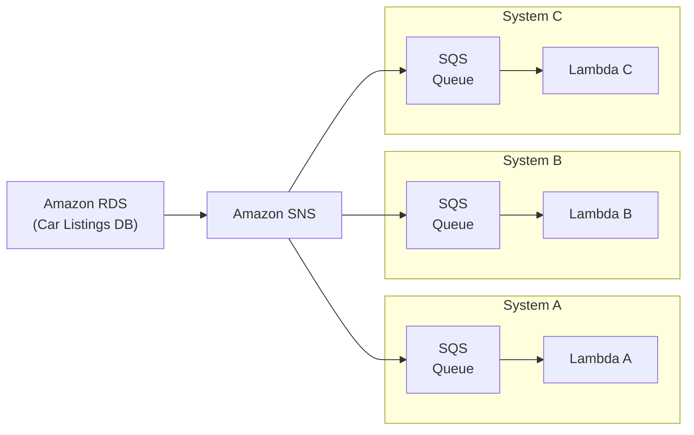
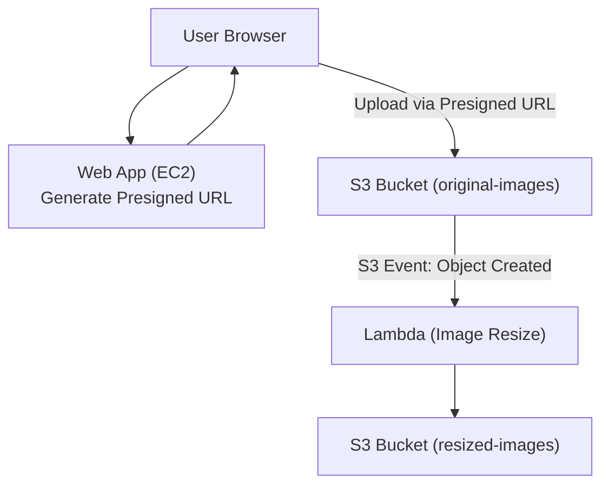
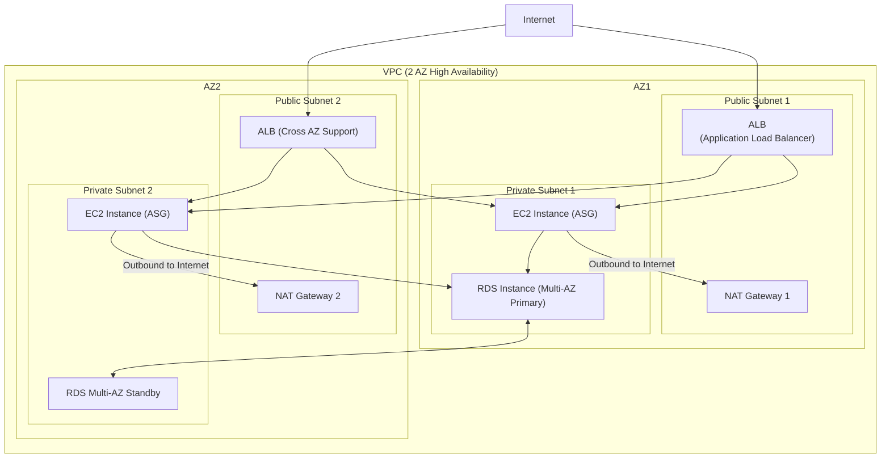
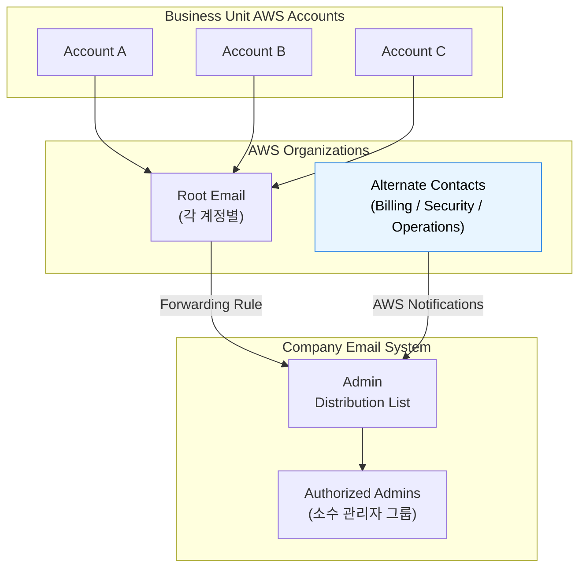
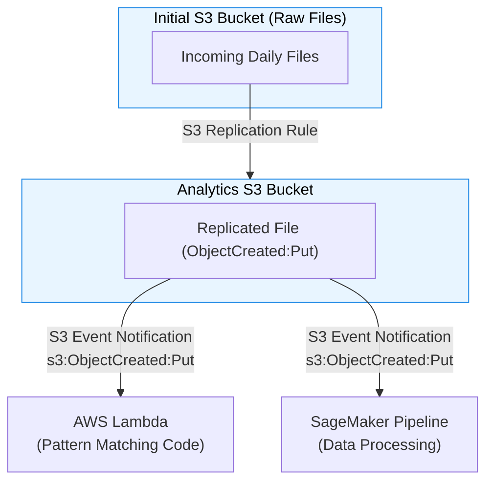

# AWS 덤프 2 답안 (Q101-Q200)

# Q101
**정답: A**

**문제 분석:**
- 3개 AZ에 퍼블릭/프라이빗 서브넷이 있는 VPC 구성
- 프라이빗 서브넷의 EC2 인스턴스가 소프트웨어 업데이트를 위해 인터넷 액세스 필요

**비 VPC 트래픽** - *VPC 내부가 아닌 외부(인터넷 또는 다른 AWS 서비스)로 나가는 트래픽*
즉, **로컬 VPC 안에서 해결되지 못하고 VPC 바깥으로 나가는 모든 아웃바운드 트래픽**을 의미함.

**선택지 분석:**

| 번호  | 방식                                                    | 평가                                        |
| --- | ----------------------------------------------------- | ----------------------------------------- |
| ✅ A | 각 AZ의 퍼블릭 서브넷에 NAT 게이트웨이 3개 생성, 각 AZ별 프라이빗 라우팅 테이블 구성 | ✅ 고가용성을 위한 최적 구성, 각 AZ별 NAT GW로 단일 장애점 제거 |
| B   | 각 AZ의 프라이빗 서브넷에 NAT 인스턴스 3개 생성                        | ❌ NAT 인스턴스는 관리 오버헤드가 크고, 프라이빗 서브넷에 생성 불가  |
| C   | 프라이빗 서브넷에 두 번째 인터넷 게이트웨이 생성                           | ❌ VPC당 하나의 IGW만 가능, 프라이빗 서브넷에는 IGW 연결 불가  |
| D   | 퍼블릭 서브넷에 송신 전용 인터넷 게이트웨이 생성                           | ❌ Egress-only IGW는 IPv6 전용, 문제는 IPv4 요구   |

---

# Q102
**정답: B, E**

**문제 분석:**
- 온프레미스 NFS 기반 SFTP 서버를 AWS로 마이그레이션
- 200GB 데이터를 EFS로 이동
- 작업 자동화 필요

**선택지 분석:**

| 번호 | 방식 | 평가 |
|------|------|------|
| A | EFS와 동일 AZ에 EC2 시작 | ⚠️ EFS는 멀티 AZ 서비스로 AZ 제한 불필요 |
| ✅ B | 온프레미스에 AWS DataSync 에이전트 설치 | ✅ 온프레미스 데이터를 AWS로 자동 전송하는 최적 방법 |
| C | EC2에 보조 EBS 볼륨 생성 | ❌ EFS 사용이 요구사항, EBS는 부적합 |
| D | 수동 OS 복사 명령 사용 | ❌ 자동화 요구사항 미충족 |
| ✅ E | AWS DataSync로 온프레미스 위치 구성 | ✅ DataSync로 NFS를 EFS로 자동 마이그레이션 |

---

# Q103
**정답: A**

**문제 분석:**
- AWS Glue ETL 작업이 S3의 XML 데이터 처리
- 매일 새 데이터 추가되지만 모든 데이터를 재처리하는 문제
- 오래된 데이터 재처리 방지 필요

**선택지 분석:**

| 번호  | 방식                       | 평가                                                                  |
| --- | ------------------------ | ------------------------------------------------------------------- |
| ✅ A | 작업 북마크(Job Bookmark) 활성화 | ✅ Glue가 이미 처리한 데이터를 추적하여 새 데이터만 처리                                  |
| B   | 처리 후 데이터 삭제              | ❌ 데이터 보존이 필요할 수 있어 부적합                                              |
| C   | NumberOfWorkers를 1로 설정   | ❌ 성능 저하, 문제 해결 안됨<br>NumberOfWorkers는 **병렬 처리량/리소스 크기(성능)**와 관련된 설정 |
| D   | FindMatches ML 변환 사용     | ❌ 중복 제거용, 재처리 방지와 무관                                                |

---

# Q104
**정답: A, C**

**문제 분석:**
- DDoS 공격을 완화해야 함 (수천 개 IP)
- 웹 서버는 Windows EC2 (즉, 자체적으로 방어 어려움)
- 다운타임 허용 불가
- 고가용성 인프라 필요

 **네트워크/전세계 Edge 레벨에서 방어해야만** High Availability가 유지

**선택지 분석:**

| 번호  | 방식                              | 평가                               |
| --- | ------------------------------- | -------------------------------- |
| ✅ A | AWS Shield Advanced 사용          | ✅ 대규모 DDoS 공격에 대한 고급 보호 및 비용 보호  |
| B   | GuardDuty로 공격자 자동 차단            | ❌ GuardDuty는 위협 탐지 서비스, 차단 기능 없음 |
| ✅ C | CloudFront로 정적/동적 콘텐츠 제공        | ✅ 엣지에서 DDoS 완화, 오리진 보호           |
| D   | Lambda로 VPC NACL에 IP 추가         | ❌ 수천 개 IP에는 비효율적, 확장성 부족         |
| E   | 80% CPU로 Spot 인스턴스 Auto Scaling | ❌ Spot 인스턴스는 중단 가능, 다운타임 위험      |

### **Why CloudFront?**

 **1) CloudFront는 글로벌 Edge 로케이션에서 트래픽을 먼저 받는다**
	- DDoS 공격은 서버까지 직접 오면 이미 늦음.  
	- CloudFront를 사용하면 공격이 **전 세계 Edge에서 먼저 분산 처리됨**.
	- **EC2까지 공격이 도달하기도 전에 완화됨.**

**2) CloudFront 자체적으로 기본적인 DDoS 완화 기능 제공**
	
	SYN flood
	UDP flood
	HTTP flood
	
	같은 기본적인 L3·L4·L7 공격은 **CloudFront가 EC2까지 전달시키지 않음**.
	따라서 애플리케이션이 안 죽음 → **고가용성 유지**.

**3) CloudFront는 Shield Standard 기본 포함**
	- CloudFront를 사용하면 **자동으로 Shield Standard 보호**가 적용됨.
		`웹 기반 공격 (L7) 자동 방어`
		`L3/L4 대규모 공격 흡수`
		`글로벌 Anycast 네트워크 사용`
	- 즉, CloudFront만 사용해도 **상당량의 DDoS가 자연 완화됨**.

**4) CloudFront가 없다면 EC2가 직접 공격을 받아 죽는다**
	EC2가 직접 요청을 받아버리면:
		`CPU 100%`    
		`네트워크 포화`
		`인스턴스 다운`
		`Auto Scaling으로도 감당 불가`
		
	 다운타임 발생 → 문제 조건 위배

따라서 **Edge 레이어에서 먼저 방어하는 CloudFront는 필수**.


시험에서 DDoS + 고가용성이 나오면:

- **CloudFront**
- **AWS Shield Advanced(또는 Standard 포함)**

---

# Q105
**정답: D**

**문제 분석:**
- Lambda 함수 실행 권한 구성
- EventBridge 규칙이 Lambda 호출
- 최소 권한 원칙 적용

**선택지 분석:**

| 번호 | 방식 | 평가 |
|------|------|------|
| A | 실행 역할에 * 보안 주체 사용 | ❌ 모든 서비스 허용, 최소 권한 위반 |
| B | 실행 역할에 lambda.amazonaws.com 사용 | ❌ Lambda가 자신을 호출하는 것은 부적합 |
| C | 리소스 기반 정책에 lambda:* 사용 | ❌ 모든 Lambda 작업 허용, 최소 권한 위반 |
| ✅ D | 리소스 기반 정책에 lambda:InvokeFunction, events.amazonaws.com | ✅ EventBridge만 Lambda 호출 허용, 최소 권한 준수 |

---

# Q106
**정답: D**

**문제 분석:**
- S3에 기밀 데이터 저장
- 미사용 데이터 암호화
- 키 사용 감사 필요
- 매년 키 순환

**선택지 분석:**

| 번호 | 방식 | 평가 |
|------|------|------|
| A | SSE-C (고객 제공 키) | ❌ 고객이 키 관리 및 순환 책임, 운영 오버헤드 큼 |
| B | SSE-S3 (S3 관리형 키) | ❌ 키 사용 감사 불가, 순환 제어 불가 |
| C | SSE-KMS 수동 순환 | ⚠️ 수동 순환은 운영 오버헤드 발생 |
| ✅ D | SSE-KMS 자동 순환 | ✅ CloudTrail로 감사 가능, 자동 순환으로 운영 효율성 최고 |

---

# Q107
**정답: B**

**문제 분석:**
- 자전거 위치 데이터 저장 및 검색
- REST API를 통한 액세스
- 다층 아키텍처

**선택지 분석:**

| 번호 | 방식 | 평가 |
|------|------|------|
| A | Athena + S3 | ❌ 일회성 쿼리용, 실시간 REST API에 부적합 |
| ✅ B | API Gateway + Lambda | ✅ 서버리스로 REST API 구현, 확장성 및 실시간 데이터 액세스 |
| C | QuickSight + Redshift | ❌ BI 도구, REST API가 아님 |
| D | API Gateway + Kinesis Data Analytics | ❌ 스트림 분석용, 위치 데이터 저장/검색과 맞지 않음 |

---

# Q108
**정답: D**

**문제 분석:**
- 자동차 판매 시 RDS에서 목록 제거
- 데이터를 여러 대상 시스템으로 전송

**선택지 분석:**

| 번호  | 방식                        | 평가                              |
| --- | ------------------------- | ------------------------------- |
| A   | Lambda + SQS 표준           | ❌ SQS는 여러 대상에 팬아웃 불가            |
| B   | Lambda + SQS FIFO         | ❌ SQS FIFO도 여러 대상 팬아웃 불가        |
| C   | RDS 이벤트 알림 + 여러 SNS로 팬아웃  | ❌ SQS에서 SNS로 팬아웃은 역방향           |
| ✅ D | RDS 이벤트 알림 + SNS → 여러 SQS | ✅ SNS에서 여러 SQS로 팬아웃, Lambda로 처리 |
|     |                           |                                 |




---

# Q109
**정답: D**

**문제 분석:**
- S3 데이터 변경 불가 보장
- 부정기한 시간 동안 변경 불가
- 특정 사용자만 삭제 가능

**선택지 분석:**

| 번호 | 방식 | 평가 |
|------|------|------|
| A | S3 Glacier 볼트 잠금 | ❌ 부정기한 시간 설정 불가 |
| B | 객체 잠금 거버넌스 모드, 100년 보존 | ❌ 100년은 비현실적, 부정기한 아님 |
| C | CloudTrail 추적 + 복원 | ❌ 변경 방지가 아닌 감지만 가능 |
| ✅ D | 객체 잠금 + 법적 보존 (Legal Hold) | ✅ 부정기한 보호, s3:PutObjectLegalHold 권한으로 특정 사용자만 제거 가능 |

---

# Q110
**정답: C, D**

**문제 분석:**
- 사용자가 이미지 업로드
- 웹사이트가 이미지 크기 조정 후 S3 저장
- 느린 업로드 성능 개선
- 커플링 감소

**선택지 분석:**

| 번호  | 방식                           | 평가                                      |
| --- | ---------------------------- | --------------------------------------- |
| A   | S3 Glacier 업로드               | ❌ Glacier는 아카이브용, 즉시 액세스 불가             |
| B   | 웹 서버가 S3 업로드                 | ❌ 웹 서버 부하 지속, 커플링 감소 안됨                 |
| ✅ C | 미리 서명된 URL로 브라우저에서 직접 S3 업로드 | ✅ 웹 서버 부하 제거, 디커플링                      |
| ✅ D | S3 이벤트 알림 → Lambda로 크기 조정    | ✅ 비동기 처리로 성능 향상, 디커플링                   |
| E   | 일정에 따라 Lambda 크기 조정          | ❌ 스케줄링 기반 → 느린 업로드 해결 못함 + 실시간 아님 + 비효율 |



---

# Q111
**정답: D**

**문제 분석:**
- ActiveMQ + EC2 소비자 + EC2 MySQL
- 단일 AZ
- 고가용성 + 낮은 운영 복잡성

**선택지 분석:**

| 번호 | 방식 | 평가 |
|------|------|------|
| A | 수동 ActiveMQ + EC2 복제 + MySQL 복제 | ❌ 운영 복잡성 매우 높음 |
| B | Amazon MQ + EC2 복제 + MySQL 복제 | ⚠️ MySQL EC2 복제는 운영 오버헤드 여전히 높음 |
| C | Amazon MQ + EC2 추가 + RDS 다중 AZ | ⚠️ EC2 수동 추가는 확장성 부족 |
| ✅ D | Amazon MQ + Auto Scaling + RDS 다중 AZ | ✅ 모든 구성요소 자동 확장 및 HA, 운영 복잡성 최소 |

---

# Q112
**정답: A**

**문제 분석:**
- 컨테이너화된 웹 애플리케이션
- 최소 코드 변경, 최소 개발 노력
- 최소 운영 오버헤드
- 요청 수 빠르게 증가

**선택지 분석:**

| 번호 | 방식 | 평가 |
|------|------|------|
| ✅ A | ECS Fargate + Service Auto Scaling + ALB | ✅ 서버리스 컨테이너, 인프라 관리 불필요, 자동 확장 |
| B | 2개 EC2 + ALB | ❌ 확장성 부족, 고정 용량 |
| C | Lambda + API Gateway | ❌ 컨테이너를 Lambda로 변경은 코드 재작성 필요 |
| D | AWS ParallelCluster HPC | ❌ HPC는 웹 앱에 과도, 복잡도 높음 |

---

# Q113
**정답: D**

**문제 분석:**
- 50TB 데이터 이동
- 매주 데이터 변환 작업
- 네트워크 대역폭 부족
- 최소 운영 오버헤드

**선택지 분석:**

기존 온프레미스 앱이 **커스텀 애플리케이션이므로 Glue로 대체 불가**  
→ AWS에서 동일하게 **EC2로 실행하는 것이 정답**

| 번호 | 방식 | 평가 |
|------|------|------|
| A | DataSync + Glue | ❌ DataSync는 네트워크 필요, 대역폭 부족 문제 해결 안됨 |
| B | Snowcone + 장치에 앱 배포 | ❌ Snowcone은 8TB까지, 50TB에 부족 |
| C | Snowball Edge + Glue | ⚠️ 데이터 이동은 가능하나, Glue로 변환 재작업 필요 |
| ✅ D | Snowball Edge with EC2 + 장치에서 변환 후 AWS에서도 실행 | ✅ 오프라인 전송 + 장치에서 변환 시작 + AWS 전환 용이 |

---

# Q114
**정답: C**

**문제 분석:**
- 이미지 + 메타데이터 업로드
- 단일 EC2 + DynamoDB
- 사용자 증가, 동시 접속 변동
- 확장성 필요

**선택지 분석:**

| 번호 | 방식 | 평가 |
|------|------|------|
| A | Lambda 처리 + 사진/메타 DynamoDB 저장 | ❌ DynamoDB는 바이너리 저장에 비효율적 |
| B | Kinesis Firehose | ❌ 스트림 전송용, 이미지 처리에 부적합 |
| ✅ C | Lambda 처리 + S3 사진 + DynamoDB 메타 | ✅ S3는 객체 저장, DynamoDB는 메타데이터, Lambda는 자동 확장 |
| D | EC2 3개 + EBS | ❌ 고정 용량, 확장성 부족 |

---

# Q115
**정답: C**

**문제 분석:**
- 퍼블릭 서브넷 EC2가 S3 액세스
- 트래픽이 인터넷을 거치지 않고 프라이빗 경로 사용

**선택지 분석:**

| 번호 | 방식 | 평가 |
|------|------|------|
| A | NAT 게이트웨이 사용 | ❌ NAT GW도 인터넷을 통함 |
| B | 보안 그룹으로 S3 접두사 제한 | ❌ 트래픽 경로 변경 안됨, 여전히 인터넷 경유 |
| ✅ C | EC2를 프라이빗 서브넷으로 이동 + S3 VPC 엔드포인트 | ✅ AWS 내부 네트워크로만 통신 |
| D | IGW 제거 + Direct Connect | ❌ 과도하게 복잡, 비용 높음 |

---

# Q116
**정답: A, D**

**문제 분석:**
- CMS 패치/유지관리 부담
- 연 4회만 업데이트
- 동적 콘텐츠 불필요
- 고확장성 + 보안

**선택지 분석:**

| 번호 | 방식 | 평가 |
|------|------|------|
| ✅ A | CloudFront HTTPS | ✅ 글로벌 CDN, HTTPS 지원 |
| B | WAF로 HTTPS 제공 | ❌ WAF는 보안 필터링, HTTPS 제공 아님 |
| C | Lambda로 콘텐츠 관리/제공 | ❌ 정적 사이트에 Lambda는 과도 |
| ✅ D | S3 정적 웹 호스팅 | ✅ 동적 콘텐츠 불필요, 유지보수 최소, 확장성 무한 |
| E | EC2 Auto Scaling + ALB | ❌ 정적 사이트에 EC2는 과도, 유지보수 부담 |

---

# Q117
**정답: A**

**문제 분석:**
- CloudWatch Logs → OpenSearch
- 거의 실시간
- 최소 운영 오버헤드

**선택지 분석:**

| 번호 | 방식 | 평가 |
|------|------|------|
| ✅ A | CloudWatch Logs 구독 → OpenSearch 스트리밍 | ✅ 네이티브 통합, 설정만으로 실시간 스트리밍 |
| B | Lambda로 로그 기록 | ❌ 불필요한 Lambda 추가, 복잡도 증가 |
| C | Kinesis Firehose 사용 | ⚠️ 가능하나 A보다 복잡 |
| D | Kinesis Agent + Data Streams | ❌ 각 서버에 에이전트 설치, 운영 오버헤드 높음 |

---

# Q118
**정답: D**

**문제 분석:**
- 900TB 텍스트 문서
- 여러 AZ EC2에서 액세스
- 수요 변동 대응 확장
- 비용 효율성

**선택지 분석:**

| 번호 | 방식 | 평가 |
|------|------|------|
| A | EBS | ❌ 단일 AZ만 연결, 확장 제한적 |
| B | EFS | ⚠️ 가능하나 900TB에는 S3보다 비용 높음 |
| C | OpenSearch | ❌ 검색 엔진, 단순 저장소로 과도하고 비용 높음 |
| ✅ D | S3 | ✅ 무제한 확장, 다중 AZ 자동 복제, 900TB 저장에 가장 비용 효율적 |

---

# Q119
**정답: B**

**문제 분석:**
- API Gateway REST API (us-east-1, ap-southeast-2)
- SQL injection, XSS 공격 방어
- 여러 계정
- 최소 관리 노력

**선택지 분석:**

| 번호 | 방식 | 평가 |
|------|------|------|
| A | 두 리전에 WAF 설정 | ⚠️ 각 리전별 수동 구성 필요 |
| ✅ B | Firewall Manager + WAF 중앙 구성 | ✅ 여러 계정/리전 중앙 관리, 최소 관리 노력 |
| C | Shield + 웹 ACL | ❌ Shield는 DDoS 방어, SQL injection/XSS 방어 불가 |
| D | 한 리전만 Shield | ❌ 한 리전만 보호, 불충분 |

---

# Q120
**정답: B**

**문제 분석:**
- us-west-2와 eu-west-1에 NLB 뒤 EC2 인스턴스
- 자체 관리 DNS
- 성능 및 가용성 개선
- 미국/유럽 사용자

**선택지 분석:**

| 번호 | 방식 | 평가 |
|------|------|------|
| A | Route 53 지리적 위치 + CloudFront | ❌ CloudFront는 HTTP/HTTPS, DNS에 부적합 |
| ✅ B | Global Accelerator + 두 리전 NLB | ✅ UDP/TCP 최적화, 자동 장애 조치, 엣지에서 라우팅 |
| C | Elastic IP + Route 53 + CloudFront | ❌ EC2 직접 노출, NLB 우회, CloudFront 불필요 |
| D | ALB로 교체 + Route 53 + CloudFront | ❌ NLB를 ALB로 교체는 불필요한 변경 |

---

# Q121
**정답: A**

**문제 분석:**
- 암호화되지 않은 RDS 다중 AZ
- 일일 스냅샷
- 데이터베이스와 스냅샷 암호화 필요

**RDS 인스턴스는 생성 후 암호화 상태를 변경할 수 없다.**

**암호화하려면 ‘암호화된 스냅샷을 만든 뒤 → 그 스냅샷으로 새로운 암호화된 DB 인스턴스를 생성해야’ 한다.**

**선택지 분석:**

| 번호  | 방식                       | 평가                              |
| --- | ------------------------ | ------------------------------- |
| ✅ A | 스냅샷 복사 암호화 → 암호화된 스냅샷 복원 | ✅ 표준 마이그레이션 절차, 다운타임 최소화        |
| B   | 암호화 EBS 생성               | ❌ RDS는 EBS 직접 관리 불가             |
| C   | 암호화 스냅샷을 기존 인스턴스로 복원     | ❌ 기존 인스턴스 덮어쓰기 불가, 새 인스턴스 생성 필요 |
| D   | S3에 암호화 복사               | ❌ RDS 스냅샷은 S3로 옮겨서 직접 암호화할 수 없음 |

---

# Q122
**정답: B**

**문제 분석:**
- 개발자가 데이터 암호화
- 확장 가능한 키 관리
- 운영 부담 최소화

**선택지 분석:**

| 번호 | 방식 | 평가 |
|------|------|------|
| A | MFA로 키 보호 | ❌ 인증 방법일 뿐, 키 관리 솔루션 아님 |
| ✅ B | AWS KMS | ✅ 완전 관리형 키 관리 서비스, 자동 순환, 감사 |
| C | ACM으로 키 관리 | ❌ ACM은 인증서 관리, 데이터 암호화 키 아님 |
| D | IAM 정책으로 키 보호 | ❌ 액세스 제어일 뿐, 키 관리 인프라 아님 |

---

# Q123
**정답: D**

**문제 분석:**
- 2개 EC2에서 SSL 종료
- SSL 암호화/복호화로 CPU 한계
- 성능 향상 필요

**선택지 분석:**

| 번호 | 방식 | 평가 |
|------|------|------|
| A | ACM 인증서를 EC2에 설치 | ❌ 여전히 EC2에서 SSL 처리, 문제 해결 안됨 |
| B | S3에 인증서 저장 | ❌ S3는 SSL 종료 불가 |
| C | 프록시 EC2 생성 | ❌ 여전히 EC2 사용, 운영 오버헤드 증가 |
| ✅ D | ALB + ACM 인증서로 SSL 종료 | ✅ ALB에서 SSL 처리, EC2 CPU 부하 제거 |

---

# Q124
**정답: A**

**문제 분석:**
- 동적 배치 처리 작업
- 상태 비저장
- 시작/중지 가능
- 60분 이상 소요
- 확장 가능하고 비용 효율적

**선택지 분석:**

| 번호 | 방식 | 평가 |
|------|------|------|
| ✅ A | Spot 인스턴스 | ✅ 최대 90% 비용 절감, 중단 가능한 워크로드에 최적 |
| B | 예약 인스턴스 | ❌ 동적 워크로드에 부적합, 유연성 부족 |
| C | 온디맨드 인스턴스 | ❌ Spot보다 비용 높음 |
| D | Lambda | ❌ 최대 15분 제한, 60분 이상 작업 불가 |

---

# Q125
**정답: A, E**

**문제 분석:**
- 2계층 전자상거래 (웹 + DB)
- EC2와 RDS는 인터넷 비노출
- EC2는 인터넷 액세스 필요 (결제)
- 고가용성

**선택지 분석:**

| 번호 | 방식 | 평가 |
|------|------|------|
| ✅ A | 프라이빗 서브넷 EC2 Auto Scaling + 프라이빗 RDS 다중 AZ | ✅ EC2와 RDS 모두 인터넷 비노출 |
| B | 프라이빗 서브넷 ALB | ❌ ALB는 퍼블릭 서브넷 필요 |
| C | 퍼블릭 서브넷 EC2 | ❌ 요구사항 위반, EC2 인터넷 노출 |
| D | 1개 퍼블릭, 1개 프라이빗 서브넷 | ❌ 단일 AZ, 고가용성 불충족 |
| ✅ E | 2 AZ에 2 퍼블릭, 2 프라이빗 서브넷 + 2 NAT GW + 퍼블릭 ALB | ✅ 고가용성, ALB는 퍼블릭, EC2는 NAT GW로 아웃바운드 |

---

# Q126
**정답: B**

**문제 분석:**
- 모든 데이터 S3 Standard
- 25년 보관
- 최근 2년 데이터만 즉시 액세스
- 비용 절감

**선택지 분석:**

| 번호 | 방식 | 평가 |
|------|------|------|
| A | 즉시 Deep Archive로 전환 | ❌ 최근 2년 데이터 즉시 액세스 불가 |
| ✅ B | 2년 후 Deep Archive로 전환 | ✅ 2년간 Standard 유지, 이후 저비용 아카이브 |
| C | S3 Intelligent-Tiering + 아카이브 | ⚠️ 가능하나 2년 임계값 명확하지 않음 |
| D | 즉시 One Zone-IA + 2년 후 Deep Archive | ❌ 즉시 IA 전환은 액세스 패턴에 비효율 |

---

# Q127
**정답: D**

**문제 분석:**
- 최대 I/O 성능 10TB (비디오 처리)
- 내구성 있는 300TB (미디어 콘텐츠)
- 900TB 아카이브

**선택지 분석:**

| 번호 | 방식 | 평가 |
|------|------|------|
| A | EBS + S3 + Glacier | ⚠️ EBS는 가능하나 EC2 인스턴스 스토어가 더 빠름 |
| B | EBS + EFS + Glacier | ❌ EFS는 300TB에 비용 높음 |
| C | EC2 인스턴스 스토어 + EFS + S3 | ❌ EFS 비용 높고, Glacier가 아카이브에 최적 |
| ✅ D | EC2 인스턴스 스토어 + S3 + Glacier | ✅ 인스턴스 스토어 최고 I/O, S3 내구성, Glacier 저비용 아카이브 |

---

# Q128
**정답: B**

**문제 분석:**
- 컨테이너 애플리케이션
- 상태 비저장
- 중단 허용
- 비용 및 운영 오버헤드 최소화

**선택지 분석:**

| 번호 | 방식 | 평가 |
|------|------|------|
| A | EC2 Auto Scaling Spot | ⚠️ 컨테이너 오케스트레이션 직접 관리 필요 |
| ✅ B | EKS 관리형 노드 그룹 + Spot | ✅ 관리형 Kubernetes + Spot 비용 절감 + 운영 최소화 |
| C | EC2 Auto Scaling 온디맨드 | ❌ 온디맨드는 비용 높음 |
| D | EKS 관리형 노드 그룹 + 온디맨드 | ❌ 온디맨드는 비용 높음 |

---

# Q129
**정답: A, E**

**문제 분석:**
- 컨테이너화 웹 앱 + PostgreSQL
- 인프라/용량 관리 오버헤드 제한
- 운영 오버헤드 개선

**선택지 분석:**

| 번호 | 방식 | 평가 |
|------|------|------|
| ✅ A | Aurora로 PostgreSQL 마이그레이션 | ✅ 관리형 DB, 자동 확장, 고가용성, 운영 최소화 |
| B | EC2로 웹 앱 마이그레이션 | ❌ 인프라 관리 오버헤드 지속 |
| C | CloudFront 배포 | ⚠️ 성능 개선이지만 운영 오버헤드 감소 아님 |
| D | ElastiCache 추가 | ⚠️ 성능 개선이지만 운영 오버헤드 증가 |
| ✅ E | ECS Fargate로 웹 앱 마이그레이션 | ✅ 서버리스 컨테이너, 인프라 관리 불필요 |

---

# Q130
**정답: B**

**문제 분석:**
- 다중 AZ EC2 Auto Scaling + ALB
- CPU 40%에서 최적 성능
- 40% 유지 필요

**선택지 분석:**

| 번호 | 방식 | 평가 |
|------|------|------|
| A | 간단한 확장 정책 | ⚠️ 단계별 조정, 목표 메트릭 유지 어려움 |
| ✅ B | 대상 추적 정책 | ✅ CPU 40% 목표 설정, 자동으로 유지 |
| C | Lambda로 용량 업데이트 | ❌ 수동 로직, 자동화 부족 |
| D | 예약된 조정 | ❌ 시간 기반, 실제 부하 반영 안됨 |

---

# Q131
**정답: D**

**문제 분석:**
- S3 + CloudFront
- S3 URL 직접 액세스 차단
- CloudFront를 통해서만 액세스

**선택지 분석:**

| 번호 | 방식 | 평가 |
|------|------|------|
| A | 버킷 정책으로 CloudFront만 허용 | ⚠️ CloudFront IP 범위로는 불충분 |
| B | IAM 사용자 생성 | ❌ CloudFront는 IAM 사용자 사용 안함 |
| C | CloudFront 배포 ID를 보안 주체로 | ❌ 배포 ID는 보안 주체로 사용 불가 |
| ✅ D | OAI (Origin Access Identity) 생성 | ✅ CloudFront만 S3 액세스하도록 제한하는 표준 방법 |

---

# Q132
**정답: A**

**문제 분석:**
- 다운로드 가능한 과거 보고서
- 전 세계 확장
- 비용 효율적
- 인프라 프로비저닝 제한
- 빠른 응답

**선택지 분석:**

| 번호 | 방식 | 평가 |
|------|------|------|
| ✅ A | CloudFront + S3 | ✅ 정적 파일 글로벌 배포, 무한 확장, 인프라 없음, 엣지 캐싱 |
| B | Lambda + DynamoDB | ❌ 정적 파일 서빙에 과도 |
| C | EC2 Auto Scaling + ALB | ❌ 인프라 관리 필요, 비용 높음 |
| D | Route 53 + 내부 ALB | ❌ 내부 ALB는 인터넷 액세스 불가 |

---

# Q133
**정답: C**

**문제 분석:**
- 온프레미스 Oracle → AWS
- 최신 버전 업그레이드
- DR 설정
- 운영 오버헤드 최소화
- OS 액세스 유지

```
RDS Custom
- RDS처럼 자동화된 관리 기능을 갖고 있지만,
- EC2처럼 OS에 직접 접근 가능 (SSH 가능)
- Oracle이나 SQL Server의 OS 레벨 구성이 필요한 상황에 특화됨.

그래서:
- OS-level 접근 필요
- Oracle의 커스텀 설정 필요
- 온프레미스 환경과 동일한 관리 경험 필요  
    → RDS Custom 사용.
```

**선택지 분석:**

| 번호 | 방식 | 평가 |
|------|------|------|
| A | EC2 + 교차 리전 복제 | ❌ 수동 복제, 운영 오버헤드 높음 |
| B | RDS for Oracle + 교차 리전 스냅샷 | ❌ RDS는 OS 액세스 불가 |
| ✅ C | RDS Custom for Oracle + 교차 리전 읽기 복제본 | ✅ OS 액세스 + 관리형 서비스 + 자동 DR |
| D | RDS for Oracle + 다중 AZ | ❌ 다른 AZ는 DR 아님, OS 액세스 불가 |

---

# Q134
**정답: A**

**문제 분석:**
- 서버리스로 이동
- SQL 쿼리
- 암호화 + 교차 리전 복제
- 최소 운영 오버헤드

**선택지 분석:**

| 번호 | 방식 | 평가 |
|------|------|------|
| ✅ A | S3 + CRR + KMS 다중 리전 키 + Athena | ✅ 서버리스 SQL, 자동 복제, 암호화, 운영 최소 |
| B | S3 + CRR + KMS + RDS | ❌ RDS는 서버리스 아님 |
| C | S3 + CRR + SSE-S3 + Athena | ⚠️ SSE-S3는 교차 리전 암호화 복잡 |
| D | S3 + CRR + SSE-S3 + RDS | ❌ RDS는 서버리스 아님 |

---

# Q135
**정답: D**

**문제 분석:**
- 외부 공급자 VPC 서비스 연결
- 프라이빗 연결
- 대상 서비스로 제한
- 회사 VPC에서만 연결 시작

**선택지 분석:**

| 번호 | 방식 | 평가 |
|------|------|------|
| A | VPC 피어링 | ❌ 전체 VPC 액세스, 특정 서비스로 제한 불가 |
| B | 가상 프라이빗 게이트웨이 | ❌ VPN/Direct Connect용, PrivateLink 아님 |
| C | NAT 게이트웨이 | ❌ 인터넷 경유, 프라이빗 아님 |
| ✅ D | 공급자가 VPC 엔드포인트 생성 + PrivateLink | ✅ 프라이빗 연결, 특정 서비스 제한, 단방향 |

---

# Q136
**정답: A, C**

**문제 분석:**
- 온프레미스 PostgreSQL → Aurora PostgreSQL
- 온프레미스 온라인 유지
- 동기화 유지

**선택지 분석:**

| 번호 | 방식 | 평가 |
|------|------|------|
| ✅ A | 지속적인 복제 작업 생성 | ✅ DMS CDC로 실시간 동기화 |
| B | 데이터베이스 백업 생성 | ⚠️ 일회성 이동, 지속 동기화 아님 |
| ✅ C | AWS DMS 복제 서버 생성 | ✅ 마이그레이션 및 복제 수행 |
| D | AWS SCT로 스키마 변환 | ❌ PostgreSQL → PostgreSQL은 변환 불필요 |
| E | EventBridge로 동기화 모니터링 | ❌ 동기화 수행이 아닌 모니터링만 |

---

# Q137
**정답: B**

**문제 분석:**
- Organizations로 계정 관리
- 루트 이메일 알림 놓침
- 향후 알림 놓치지 않기
- 계정 관리자로 제한

**선택지 분석:**

| 번호  | 방식                 | 평가                         |
| --- | ------------------ | -------------------------- |
| A   | 모든 사용자에게 전달        | ❌ 보안 위험, 관리자 제한 위반         |
| ✅ B | 배포 목록 + 대체 연락처 구성  | ✅ 관리자만 수신, 대체 연락처로 각 계정 맞춤 |
| C   | 한 명 관리자에게 전달       | ❌ 단일 장애점, 확장성 부족           |
| D   | 동일 루트 이메일 + 대체 연락처 | ❌ 계정별 독립 관리 불가             |

---

# Q138
**정답: B**

**문제 분석:**
- 단일 AZ에 RabbitMQ EC2 + 소비자 EC2 + PostgreSQL EC2
- 고가용성 + 최소 운영 오버헤드

대기열을 Amazon MQ 에서 RabbitMQ 인스턴스의 중복 쌍(활성/대기)으로 마이그레이션합니다.
***Migrate the queue to redundant pair(active/stanby) of RabbitMQ instnaces  on Amazon MQ***

**선택지 분석:**

| 번호 | 방식 | 평가 |
|------|------|------|
| A | Amazon MQ + EC2 Auto Scaling + EC2 PostgreSQL Auto Scaling | ❌ DB Auto Scaling은 복잡, 운영 오버헤드 높음 |
| ✅ B | Amazon MQ + EC2 Auto Scaling + RDS 다중 AZ | ✅ 모두 관리형/자동, 운영 최소화 |
| C | EC2 RabbitMQ Auto Scaling + EC2 Auto Scaling + RDS 다중 AZ | ❌ RabbitMQ 직접 관리, 운영 오버헤드 |
| D | EC2 RabbitMQ Auto Scaling + EC2 Auto Scaling + EC2 PostgreSQL Auto Scaling | ❌ 모두 직접 관리, 운영 오버헤드 최대 |

---

# Q139
**정답: D**

**문제 분석:**
- 초기 S3 버킷 → 분석 S3 버킷 자동 복사
- Lambda로 패턴 매칭
- SageMaker 파이프라인으로 전송
- 최소 운영 오버헤드

**선택지 분석:**

| 번호  | 방식                            | 평가                                             |
| --- | ----------------------------- | ---------------------------------------------- |
| A   | Lambda 복사 + 분석 버킷 이벤트         | ❌ Lambda 오버헤드 > S3 replication                 |
| B   | Lambda 복사 + 분석 버킷 EventBridge | ⚠️ EventBridge는 S3 이벤트에 추가 복잡도                 |
| C   | S3 복제 + 분석 버킷 S3 이벤트          | ⚠️ 가능하나 S3 이벤트는 단일 대상                          |
| ✅ D | S3 복제 + 분석 버킷 EventBridge     | ✅ 복제 자동, EventBridge로 여러 대상(Lambda, SageMaker) |



---

# Q140
**정답: A, C**

**문제 분석:**
- 데이터 수집: EC2 산발적, 중단 가능
- 프론트엔드: Fargate 예측 가능
- API: Lambda 예측 가능
- 비용 최적화

**선택지 분석:**

| 번호 | 방식 | 평가 |
|------|------|------|
| ✅ A | 데이터 수집에 Spot 인스턴스 | ✅ 중단 가능하므로 Spot으로 최대 90% 절감 |
| B | 데이터 수집에 온디맨드 | ❌ Spot보다 비용 높음 |
| ✅ C | Fargate/Lambda에 Compute Savings Plan | ✅ 예측 가능하므로 Savings Plan으로 절감, Fargate/Lambda 모두 커버 |
| D | 데이터 수집에 RI | ❌ 산발적 워크로드에 RI 비효율 |
| E | Fargate/Lambda에 EC2 Savings Plan | ❌ EC2 SP는 Fargate/Lambda 미커버 |

---

# Q141
**정답: A**

**문제 분석:**
- 글로벌 사용자
- 정적 + 동적 콘텐츠 혼합
- ALB 뒤 EC2 API 서버
- 최소 대기 시간

**선택지 분석:**

| 번호 | 방식 | 평가 |
|------|------|------|
| ✅ A | 단일 리전 + CloudFront (정적/동적 모두) | ✅ 동적도 엣지 캐싱, 글로벌 저지연, 비용 효율적 |
| B | 두 리전 + Route 53 지연 시간 | ⚠️ 가능하나 인프라 중복, 비용 높음 |
| C | 단일 리전 + CloudFront (정적만) | ❌ 동적 콘텐츠 직접 ALB 접근, 해외 지연 높음 |
| D | 두 리전 + Route 53 지리적 위치 | ⚠️ 지리적 위치는 지연 시간 최적화 아님 |

---

# Q142
**정답: C**

**문제 분석:**
- 수정 Linux 커널
- UDP만 지원
- 낮은 대기 시간
- 엣지 로케이션 라우팅
- 고정 IP

**선택지 분석:**

| 번호 | 방식 | 평가 |
|------|------|------|
| A | Route 53 + ALB | ❌ ALB는 HTTP/HTTPS만, UDP 불가 |
| B | CloudFront + NLB | ❌ CloudFront는 HTTP/HTTPS만, UDP 불가 |
| ✅ C | Global Accelerator + NLB + EC2 Auto Scaling | ✅ GA는 TCP/UDP 지원, 고정 IP 제공, 엣지 라우팅 |
| D | API Gateway + ALB | ❌ API Gateway와 ALB는 HTTP만, UDP 불가 |

---

# Q143
**정답: D**

**문제 분석:**
- 모놀리식 → 작은 애플리케이션으로 분리
- 코드 최대한 유지
- 다른 팀 관리
- 확장성 + 최소 운영 오버헤드

**선택지 분석:**

| 번호 | 방식 | 평가 |
|------|------|------|
| A | Lambda + API Gateway | ❌ Lambda는 코드 재작성 필요 (핸들러 등) |
| B | Amplify + API Gateway + Lambda | ❌ Amplify는 프론트엔드, 백엔드 재작성 필요 |
| C | EC2 + ALB | ⚠️ 인프라 관리 오버헤드 높음 |
| ✅ D | ECS + ALB | ✅ 컨테이너로 코드 유지, 마이크로서비스 분리, ALB로 라우팅, 자동 확장 |

---

# Q144
**정답: B**

**문제 분석:**
- Aurora 전자상거래 앱
- 대규모 보고서 실행 시 성능 저하
- ReadIOPS, CPU 급증
- 비용 효율적 솔루션

***Aurora는 1개의 write노드만 가지고 있다. 즉 복제본 == read node***

**선택지 분석:**

| 번호 | 방식 | 평가 |
|------|------|------|
| A | Redshift로 마이그레이션 | ❌ 전체 마이그레이션, 비용 높고 복잡 |
| ✅ B | Aurora 복제본으로 보고 마이그레이션 | ✅ 읽기 오프로드, 주 DB 영향 없음, 비용 효율적 |
| C | 더 큰 인스턴스로 마이그레이션 | ❌ 비용 증가, 일시적 급등에 비효율 |
| D | 프로비저닝 IOPS 증가 | ❌ 비용 증가, 근본 해결 아님 |

---

# Q145
**정답: D**

**문제 분석:**
- 단일 EC2 (PHP 웹 + MySQL DB)
- 바쁜 시간 성능 저하, 5xx 오류
- 원활한 확장
- 비용 효율적

**선택지 분석:**

| 번호 | 방식 | 평가 |
|------|------|------|
| A | RDS + 두 번째 EC2 온디맨드 + ALB | ⚠️ 수동 확장, 고정 용량 |
| B | RDS + 두 번째 EC2 + Route 53 가중치 | ⚠️ 수동 확장, ALB 없이 헬스체크 부족 |
| C | Aurora + Lambda로 인스턴스 타입 변경 | ❌ 수직 확장만, 다운타임 발생 |
| ✅ D | Aurora + AMI + Auto Scaling + Spot 플릿 + ALB | ✅ 자동 수평 확장, Spot으로 비용 절감, 고가용성 |

---

# Q146
**정답: B**

**문제 분석:**
- 상태 비저장 웹 앱
- 하루 8시간 사용량 많음
- 밤 보통, 주말 적음
- 가용성 유지하며 비용 최소화

**선택지 분석:**

| 번호 | 방식 | 평가 |
|------|------|------|
| A | 전체 Spot | ❌ 중단 시 가용성 영향 |
| ✅ B | RI (기준) + Spot (추가) | ✅ 기준은 안정적, 피크는 Spot으로 비용 절감 |
| C | 온디맨드 (기준) + Spot (추가) | ⚠️ 기준을 RI로 하면 더 저렴 |
| D | 전용 인스턴스 (기준) + 온디맨드 (추가) | ❌ 비용 가장 높음 |

---

# Q147
**정답: B**

**문제 분석:**
- 10년 보관
- 최근 1개월은 정기 액세스
- 1개월 이상은 거의 액세스 안함
- 월 10TB 이상
- 비용 효율적

**선택지 분석:**

| 번호 | 방식 | 평가 |
|------|------|------|
| A | S3 + Backup으로 Deep Archive 이동 | ❌ Backup은 S3 수명 주기에 불필요 |
| ✅ B | S3 + 수명 주기 정책으로 1개월 후 Deep Archive | ✅ 자동화, 비용 최소, 운영 간단 |
| C | CloudWatch Logs + Backup으로 Deep Archive | ❌ CloudWatch Logs는 대량 저장에 비용 높음 |
| D | CloudWatch Logs + S3 수명 주기 | ❌ CloudWatch Logs에 S3 수명 주기 적용 불가 |

---

# Q148
**정답: D**

**문제 분석:**
- SNS → Lambda 데이터 처리
- 네트워크 문제로 가끔 실패
- 모든 알림 최종 처리 보장

**선택지 분석:**

| 번호 | 방식 | 평가 |
|------|------|------|
| A | 다중 AZ Lambda 배포 | ❌ Lambda는 자동 다중 AZ, 네트워크 문제 해결 안됨 |
| B | Lambda CPU/메모리 증가 | ❌ 네트워크 문제 해결 안됨 |
| C | SNS 재시도 전략 구성 | ⚠️ SNS 재시도는 제한적 |
| ✅ D | SQS DLQ (Dead Letter Queue) + Lambda 처리 | ✅ 실패 메시지 보관, 재처리 가능 |

---

# Q149
**정답: A**

**문제 분석:**
- 이벤트 데이터 실시간 처리
- 순서 유지 필요
- 최소 운영 오버헤드

**선택지 분석:**

| 번호 | 방식 | 평가 |
|------|------|------|
| ✅ A | SQS FIFO + Lambda | ✅ 순서 보장, 서버리스, 자동 확장 |
| B | SNS + Lambda | ❌ SNS는 순서 보장 안됨 |
| C | SQS 표준 + Lambda | ❌ 표준은 순서 보장 안됨 |
| D | SNS + SQS | ❌ SNS는 순서 보장 안됨 |

---

# Q150
**정답: A**

**문제 분석:**
- CPU 50% 단독은 무시
- CPU 50% + 높은 디스크 IOPS 동시 발생 시 경보
- 오경보 감소

**선택지 분석:**

| 번호 | 방식 | 평가 |
|------|------|------|
| ✅ A | CloudWatch 복합 경보 | ✅ 여러 조건 AND 로직, 오경보 최소화 |
| B | CloudWatch 대시보드 | ❌ 시각화만, 자동 경보 아님 |
| C | CloudWatch Synthetics | ❌ 애플리케이션 모니터링, 인프라 메트릭 아님 |
| D | 단일 경보 여러 임계값 | ❌ AND 로직 구현 불가 |

---

# Q151
**정답: A, C**

**문제 분석:**
- ap-northeast-3만 사용
- VPC 인터넷 연결 불가
- 규정 준수

**선택지 분석:**

| 번호 | 방식 | 평가 |
|------|------|------|
| ✅ A | Control Tower 데이터 상주 가드레일 | ✅ 인터넷 차단, 리전 제한, 정책 기반 |
| B | WAF + 계정 설정 | ❌ WAF는 웹 필터, 리전 제어 불가 |
| ✅ C | Organizations SCP | ✅ 인터넷 액세스 및 리전 제한, 중앙 정책 |
| D | NACL + IAM 정책 | ⚠️ NACL은 서브넷별 수동, IAM은 사용자별 제한 |
| E | Config 규칙 | ❌ 감지만 가능, 예방 불가 |

---

# Q152
**정답: D**

**문제 분석:**
- 3계층 웹 앱 교육
- 매일 12시간만 액세스
- RDS for MySQL 비용 최소화

**선택지 분석:**

| 번호 | 방식 | 평가 |
|------|------|------|
| A | Systems Manager + IAM 정책 | ❌ RDS 시작/중지와 무관 |
| B | ElastiCache 캐싱 | ❌ DB 중지 시 앱 기능 상실 |
| C | EC2 + IAM + cron 작업 | ⚠️ 가능하나 Lambda보다 복잡 |
| ✅ D | Lambda + EventBridge 스케줄 | ✅ 서버리스 자동화, 매일 12시간 RDS 시작/중지 |

---

# Q153
**정답: D**

**문제 분석:**
- 벨소리 파일 최소 128KB
- 90일 이상은 다운로드 드뭄
- 최다 액세스 파일 즉시 사용
- 비용 절감

**선택지 분석:**

| 번호 | 방식 | 평가 |
|------|------|------|
| A | 초기 Standard-IA | ❌ 128KB 최소 크기 충족하나, 90일 미만도 IA로 비효율 |
| B | Intelligent-Tiering | ⚠️ 모니터링 비용, 90일 임계값 불명확 |
| C | S3 인벤토리로 90일 후 IA | ❌ 인벤토리는 분석용, 자동 전환 아님 |
| ✅ D | 수명 주기 정책 90일 후 Standard-IA | ✅ 자동화, 128KB 최소 충족, 90일 명확한 구분 |

---

# Q154
**정답: B**

**문제 분석:**
- 의료 시험 결과 S3 저장
- 일부만 추가 가능
- 모두 읽기 전용
- 수정/삭제 불가
- 생성일로부터 최소 1년

**선택지 분석:**

| 번호 | 방식 | 평가 |
|------|------|------|
| A | 거버넌스 모드 1년 법적 보유 | ❌ 법적 보유는 기간 없음, 거버넌스는 권한으로 해제 가능 |
| ✅ B | 규정 준수 모드 365일 보존 | ✅ 어떤 사용자도 삭제/수정 불가, 1년 보증 |
| C | IAM 역할 제한 | ❌ 권한으로는 진정한 불변성 보장 안됨 |
| D | Lambda로 해시 추적 | ❌ 감지만 가능, 방지 불가 |

---

# Q155
**정답: C**

**문제 분석:**
- S3의 기밀 미디어 파일
- 전 세계 사용자 안정적 액세스
- 지리적 위치 무관하게 신속 제공

**선택지 분석:**

| 번호 | 방식 | 평가 |
|------|------|------|
| A | DataSync | ❌ 데이터 동기화 도구, CDN 아님 |
| B | Global Accelerator | ❌ 애플리케이션 가속, 정적 파일 캐싱 불가 |
| ✅ C | CloudFront + S3 | ✅ 엣지 로케이션 캐싱, 전 세계 저지연 배포 |
| D | SQS | ❌ 메시지 큐, 파일 배포 아님 |

---

# Q156
**정답: A, E**

**문제 분석:**
- 배치 + 실시간 스트림 데이터
- 한 곳 통합
- S3 처리 후 준비
- 일회성 쿼리
- BI 도구로 KPI
- 최소 운영 오버헤드

**선택지 분석:**

| 번호 | 방식 | 평가 |
|------|------|------|
| ✅ A | Athena (일회성 쿼리) + QuickSight (KPI) | ✅ 서버리스 SQL + BI, 운영 최소 |
| B | Kinesis Data Analytics + QuickSight | ❌ 실시간 분석용, 배치에 부적합 |
| C | Lambda로 Redshift 이동 | ❌ 개별 레코드 비효율, Redshift는 운영 오버헤드 |
| D | Glue ETL JSON + OpenSearch | ❌ OpenSearch는 검색용, 분석 과도 |
| ✅ E | Lake Formation + Glue + Parquet | ✅ 데이터 레이크 통합, Glue로 ETL, Parquet로 쿼리 최적화 |

---

# Q157
**정답: D, E**

**문제 분석:**
- Aurora PostgreSQL
- 5년 데이터 보관
- 감사 로그 무기한 보관
- 자동 백업 사용 중

**선택지 분석:**

| 번호 | 방식 | 평가 |
|------|------|------|
| A | 수동 스냅샷 | ⚠️ 자동화 부족, 운영 오버헤드 |
| B | 자동 백업 수명 주기 | ❌ 자동 백업은 35일 최대 |
| C | 5년 자동 백업 보존 | ❌ 자동 백업은 35일 최대 |
| ✅ D | CloudWatch Logs 내보내기 구성 | ✅ 감사 로그 무기한 보관 |
| ✅ E | AWS Backup으로 5년 보관 | ✅ 장기 백업 자동화, 5년 설정 가능 |

---

# Q158
**정답: A**

**문제 분석:**
- 실시간 + 온디맨드 스트리밍
- 전 세계 청중
- 성능 향상

**선택지 분석:**

| 번호 | 방식 | 평가 |
|------|------|------|
| ✅ A | CloudFront | ✅ 실시간 + VOD 모두 지원, 엣지 캐싱, 글로벌 배포 |
| B | Global Accelerator | ❌ TCP/UDP 최적화, 스트리밍 캐싱 불가 |
| C | Route 53 | ❌ DNS만, 콘텐츠 배포 아님 |
| D | S3 Transfer Acceleration | ❌ 업로드 가속, 다운로드 배포 아님 |

---

# Q159
**정답: A, C**

**문제 분석:**
- API Gateway + Lambda 서버리스
- 봇넷 사기 요청
- 승인되지 않은 사용자 차단

**선택지 분석:**

| 번호 | 방식 | 평가 |
|------|------|------|
| ✅ A | API 키로 사용량 계획 | ✅ 정품 사용자만 액세스, 간단한 인증 |
| B | Lambda 내 IP 필터링 | ❌ Lambda 실행 후 체크, 비용 낭비 |
| ✅ C | AWS WAF 규칙 | ✅ API Gateway 앞에서 차단, 악성 트래픽 사전 필터 |
| D | 프라이빗 API로 전환 | ❌ 공개 액세스 필요, VPN 등 추가 인프라 |
| E | 각 사용자 IAM 역할 | ❌ 확장 불가, 관리 복잡 |

---

# Q160
**정답: C**

**문제 분석:**
- 월 300MB JSON 데이터
- 밀리초 액세스
- 30일 보관
- 비용 효율적

**선택지 분석:**

| 번호 | 방식 | 평가 |
|------|------|------|
| A | OpenSearch | ❌ 검색 엔진, 단순 저장에 과도하고 비용 높음 |
| B | S3 Glacier | ❌ 밀리초 액세스 불가 (시간 단위) |
| ✅ C | S3 Standard | ✅ 밀리초 액세스, 300MB는 소량으로 비용 낮음 |
| D | RDS for PostgreSQL | ⚠️ 가능하나 S3보다 비용 높고 관리 필요 |

---

# Q161
**정답: B**

**문제 분석:**
- 작은 Python 앱
- JSON 처리 → SQL DB 출력
- 매일 수천 번 실행
- 고가용성 + 최대 확장성 + 최소 운영 오버헤드

**선택지 분석:**

| 번호 | 방식 | 평가 |
|------|------|------|
| A | S3 + 여러 EC2 + Aurora | ❌ EC2 관리 오버헤드 높음 |
| ✅ B | S3 + S3 이벤트 → Lambda + Aurora | ✅ 서버리스, 자동 확장, 고가용성, 운영 최소 |
| C | EBS 다중 연결 + EC2 + RDS | ❌ 복잡, EBS 다중 연결 제한적 |
| D | SQS + ECS + RDS | ⚠️ 가능하나 Lambda보다 복잡 |

---

# Q162
**정답: A**

**문제 분석:**
- HPC Linux 워크로드
- 수백 개 Spot 인스턴스
- 온프레미스 데이터 복사 + 장기 저장
- 고성능 파일 시스템

**선택지 분석:**

| 번호 | 방식 | 평가 |
|------|------|------|
| ✅ A | FSx for Lustre + S3 통합 | ✅ HPC 최적화, 수백 GB/s 처리량, S3 자동 연동 |
| B | FSx for Windows + S3 | ❌ Windows 파일 서버, Linux HPC에 부적합 |
| C | S3 Glacier + EBS | ❌ Glacier는 즉시 액세스 불가, EBS는 단일 인스턴스 |
| D | S3 + gp2 EBS | ❌ EBS는 공유 파일 시스템 아님 |

---

# Q163
**정답: A**

**문제 분석:**
- 컨테이너 앱
- 수천 명 사용자
- 규모 관리 확신 없음
- 고가용성 + 최소 운영 오버헤드

**선택지 분석:**

| 번호 | 방식 | 평가 |
|------|------|------|
| ✅ A | ECR + ECS Fargate + 대상 추적 Auto Scaling | ✅ 서버리스 컨테이너, 자동 확장, 운영 최소 |
| B | ECR + ECS EC2 + 대상 추적 | ⚠️ EC2 관리 필요 |
| C | EC2의 리포지토리 + 수동 확장 | ❌ 수동 관리, 운영 오버헤드 최대 |
| D | EC2 AMI + Auto Scaling | ❌ 컨테이너 미활용, 확장 느림 |

---

# Q164
**정답: C**

**문제 분석:**
- 발신자 → 처리 애플리케이션
- 시간당 1000개 메시지
- 처리에 최대 2일
- 실패 메시지 보관
- 운영 효율성

**선택지 분석:**

| 번호 | 방식 | 평가 |
|------|------|------|
| A | EC2 Redis | ❌ 직접 관리, 운영 오버헤드 높음 |
| B | Kinesis Data Streams + KCL | ⚠️ 실시간 스트리밍, 메시지 보관 제한 |
| ✅ C | SQS + DLQ | ✅ 관리형 큐, 14일 보존, DLQ로 실패 격리, 운영 최소 |
| D | SNS + Lambda | ❌ SNS는 메시지 지속성 없음, 처리 실패 시 손실 |

---

# Q165
**정답: D**

**문제 분석:**
- CloudFront + S3 정적 웹사이트
- AWS WAF 검사 필수

**선택지 분석:**

| 번호 | 방식 | 평가 |
|------|------|------|
| A | S3 정책에 WAF ARN | ❌ S3 정책은 WAF ARN 지원 안함 |
| B | CloudFront가 WAF로 먼저 전달 | ❌ CloudFront는 WAF 통과 후 오리진 요청 |
| C | 보안 그룹 + WAF | ❌ S3는 보안 그룹 미지원 |
| ✅ D | OAI + WAF를 CloudFront에 연결 | ✅ OAI로 S3 직접 액세스 차단, WAF로 CloudFront 검사 |

---

# Q166
**정답: D**

**문제 분석:**
- 일일 보고서 정적 HTML
- S3 저장
- 수백만 조회수
- 전 세계 사용자

**선택지 분석:**

| 번호 | 방식 | 평가 |
|------|------|------|
| A | 미리 서명된 URL | ❌ 일시적 액세스용, 공개 콘텐츠에 부적합 |
| B | 모든 리전 CRR | ❌ 복제만, CDN 아님, 비용 높음 |
| C | Route 53 지리적 근접성 | ❌ DNS만, 콘텐츠 캐싱 없음 |
| ✅ D | CloudFront + S3 오리진 | ✅ 엣지 캐싱, 글로벌 배포, 수백만 조회 처리 |

---

# Q167
**정답: C**

**문제 분석:**
- EC2 플릿이 SQS 처리
- 병렬 처리
- 예측 불가, 간헐적 트래픽
- 다운타임 없음
- 비용 효율적

**선택지 분석:**

| 번호 | 방식 | 평가 |
|------|------|------|
| A | 전체 Spot | ❌ 중단 시 다운타임 발생 |
| B | 전체 RI | ❌ 간헐적 트래픽에 RI 비효율 |
| ✅ C | RI (기준) + Spot (추가) | ✅ 기준 용량 안정, 버스트는 Spot으로 절감 |
| D | RI (기준) + 온디맨드 (추가) | ⚠️ 온디맨드보다 Spot이 더 저렴 |

---

# Q168
**정답: D**

**문제 분석:**
- 모든 AWS 계정에서 서비스/작업 제한
- Organizations의 대규모 조직
- 확장 가능 + 단일 관리 지점

**선택지 분석:**

| 번호 | 방식 | 평가 |
|------|------|------|
| A | ACL | ❌ 네트워크 ACL은 서비스 액세스 제어 불가 |
| B | 보안 그룹 | ❌ 보안 그룹은 사용자 그룹 연결 불가 |
| C | 교차 계정 역할 | ❌ 각 계정별 수동 관리, 확장성 부족 |
| ✅ D | 루트 OU에 SCP (Service Control Policy) | ✅ 조직 전체 중앙 정책, 서비스 액세스 제어 |

---

# Q169
**정답: C**

**문제 분석:**
- 공개 웹 앱 + ALB
- DDoS 공격 위험 감소

**선택지 분석:**

| 번호 | 방식 | 평가 |
|------|------|------|
| A | Inspector 에이전트 | ❌ 취약점 스캔, DDoS 방어 아님 |
| B | Macie | ❌ 데이터 보안, DDoS 방어 아님 |
| ✅ C | Shield Advanced | ✅ DDoS 고급 보호, ALB 지원, 비용 보호 |
| D | GuardDuty | ❌ 위협 탐지, DDoS 방어 아님 |

---

# Q170
**정답: C**

**문제 분석:**
- ALB 뒤 EC2 웹 앱
- 특정 국가만 액세스

**선택지 분석:**

| 번호 | 방식 | 평가 |
|------|------|------|
| A | EC2 보안 그룹 | ❌ 보안 그룹은 지리적 필터링 불가 |
| B | ALB 보안 그룹 | ❌ 보안 그룹은 지리적 필터링 불가 |
| ✅ C | ALB에 AWS WAF 지리적 일치 규칙 | ✅ 국가별 필터링 가능 |
| D | 서브넷 NACL | ❌ NACL은 지리적 필터링 불가 |

---

# Q171
**정답: B**

**문제 분석:**
- 세금 계산 조회 API
- 연휴 기간 문의 급증
- 확장 가능하고 탄력적

**선택지 분석:**

| 번호 | 방식 | 평가 |
|------|------|------|
| A | EC2 API | ❌ 수동 확장 필요 |
| ✅ B | API Gateway + Lambda | ✅ 서버리스 자동 확장, 탄력적 |
| C | 두 개 EC2 + ALB | ❌ 고정 용량, 급증 처리 부족 |
| D | API Gateway + EC2 | ⚠️ EC2 확장 필요, Lambda보다 복잡 |

---

# Q172
**정답: C**

**문제 분석:**
- CloudFront 새 배포
- 민감 정보 제출
- HTTPS 사용 중
- 추가 보안 계층
- 전체 스택 보호
- 특정 앱으로 액세스 제한

**선택지 분석:**

| 번호 | 방식 | 평가 |
|------|------|------|
| A | 서명 URL | ⚠️ 콘텐츠 액세스 제어, 데이터 암호화 아님 |
| B | 서명 쿠키 | ⚠️ 콘텐츠 액세스 제어, 데이터 암호화 아님 |
| ✅ C | 필드 수준 암호화 프로필 | ✅ 특정 필드 엔드투엔드 암호화, 특정 앱만 복호화 |
| D | HTTPS 전용 정책 | ⚠️ 전송 암호화만, 추가 보안 아님 |

---

# Q173
**정답: B**

**문제 분석:**
- S3 비디오/이미지
- 모든 사용자 동일 콘텐츠
- 인기 증가
- 전 세계 수백만 사용자
- 원본 부하 감소
- 비용 효율적

**선택지 분석:**

| 번호 | 방식 | 평가 |
|------|------|------|
| A | Global Accelerator | ❌ 가속만, 캐싱 없음 |
| ✅ B | CloudFront 웹 배포 | ✅ 엣지 캐싱으로 원본 부하 감소, 비용 효율적 |
| C | ElastiCache Redis | ❌ 애플리케이션 캐시, S3 콘텐츠에 부적합 |
| D | ElastiCache Memcached | ❌ 애플리케이션 캐시, S3 콘텐츠에 부적합 |

---

# Q174
**정답: B**

**문제 분석:**
- 단일 AZ Auto Scaling + ALB
- 6개 프런트엔드 웹 서버
- 앱 수정 없이 고가용성

**선택지 분석:**

| 번호 | 방식 | 평가 |
|------|------|------|
| A | 두 리전 Auto Scaling | ❌ 교차 리전 ALB 불가, 복잡도 높음 |
| ✅ B | 2 AZ에 각 3개 인스턴스 Auto Scaling | ✅ 다중 AZ로 고가용성, 앱 수정 불필요 |
| C | 다른 리전 템플릿 생성 | ❌ 예방만, 자동 복구 아님 |
| D | ALB 라운드 로빈 변경 | ❌ ALB는 기본 라운드 로빈, 단일 AZ 문제 해결 안됨 |

---

# Q175
**정답: B**

**문제 분석:**
- API Gateway + Lambda + Aurora PostgreSQL
- 판매 급증 시 타임아웃
- 많은 열린 연결로 CPU/메모리 높음
- 최소 앱 변경

**선택지 분석:**

| 번호 | 방식 | 평가 |
|------|------|------|
| A | 프로비저닝 동시성 + 글로벌 DB | ❌ 연결 풀링 문제 해결 안됨 |
| ✅ B | RDS 프록시 + Lambda 수정 | ✅ 연결 풀링으로 DB 연결 재사용, CPU/메모리 감소 |
| C | 읽기 복제본 + 쿼리 문자열 라우팅 | ❌ 쓰기 워크로드 해결 안됨 |
| D | DynamoDB로 마이그레이션 | ❌ 대규모 코드 변경 필요 |

---

# Q176
**정답: A**

**문제 분석:**
- 프라이빗 서브넷 EC2
- DynamoDB 액세스
- AWS 네트워크 내부만

**선택지 분석:**

| 번호 | 방식 | 평가 |
|------|------|------|
| ✅ A | DynamoDB VPC 엔드포인트 | ✅ 프라이빗 연결, AWS 내부 네트워크만 |
| B | 퍼블릭 NAT 게이트웨이 | ❌ 인터넷 경유 |
| C | 프라이빗 NAT 인스턴스 | ❌ NAT는 퍼블릭 서브넷 필요 |
| D | 인터넷 게이트웨이 | ❌ 인터넷 경유 |

---

# Q177
**정답: B**

**문제 분석:**
- DynamoDB 읽기 집약적
- 지연 발생
- 추가 운영 오버헤드 불가
- 앱 재구성 불가
- 성능 개선

**선택지 분석:**

| 번호 | 방식 | 평가 |
|------|------|------|
| A | ElastiCache Redis | ⚠️ 수동 캐시 로직, 앱 재구성 필요 |
| ✅ B | DynamoDB Accelerator (DAX) | ✅ 인메모리 캐시, 완전 관리형, 앱 수정 최소 |
| C | 글로벌 테이블 | ❌ 복제만, 읽기 성능 개선 제한적 |
| D | ElastiCache Memcached | ⚠️ 수동 캐시 로직, 앱 재구성 필요 |

---

# Q178
**정답: A**

**문제 분석:**
- 단일 리전 EC2 + RDS
- 별도 리전에 백업
- 최소 운영 오버헤드

**선택지 분석:**

| 번호 | 방식 | 평가 |
|------|------|------|
| ✅ A | AWS Backup으로 교차 리전 복사 | ✅ EC2와 RDS 모두 지원, 중앙 관리, 자동화 |
| B | Data Lifecycle Manager로 교차 리전 | ❌ DLM은 EBS만, RDS 미지원 |
| C | AMI 복사 + 읽기 복제본 | ⚠️ 수동 프로세스, 운영 오버헤드 |
| D | EBS 스냅샷 + RDS S3 내보내기 + CRR | ⚠️ 복잡, 수동 단계 많음 |

---

# Q179
**정답: A**

**문제 분석:**
- EC2가 RDS 액세스
- 자격 증명을 Parameter Store 보안 매개변수로 저장
- 안전하게 저장

**선택지 분석:**

| 번호 | 방식 | 평가 |
|------|------|------|
| ✅ A | IAM 역할 + Parameter Store 읽기 + KMS Decrypt | ✅ EC2 인스턴스 역할로 안전한 액세스 |
| B | IAM 정책 할당 | ❌ 정책은 인스턴스가 아닌 역할/사용자/그룹에 할당 |
| C | 신뢰 관계 + RDS 보안 주체 | ❌ Parameter Store 액세스와 무관 |
| D | 신뢰 관계 + Systems Manager 보안 주체 | ❌ 불필요한 복잡도 |

---

# Q180
**정답: B, C**

**문제 분석:**
- API Gateway + NLB + EC2
- SQL 인젝션, 대규모 DDoS 방어
- 최대 보호

**선택지 분석:**

| 번호 | 방식 | 평가 |
|------|------|------|
| A | WAF + NLB | ❌ NLB는 WAF 미지원 |
| ✅ B | Shield Advanced + NLB | ✅ 대규모 DDoS 방어, NLB 보호 |
| ✅ C | WAF + API Gateway | ✅ SQL 인젝션/XSS 방어, API Gateway 지원 |
| D | GuardDuty + Shield Standard | ❌ GuardDuty는 탐지만, 방어 불가 |
| E | Shield Standard + API Gateway | ⚠️ Standard는 기본 보호만 |

---

# Q181
**정답: A**

**문제 분석:**
- 레거시 데이터 처리
- 순차 처리, 결과 순서 무관
- 모놀리식 → ECS 마이크로서비스
- 마이크로서비스 간 통신

**선택지 분석:**

| 번호 | 방식 | 평가 |
|------|------|------|
| ✅ A | SQS 대기열 | ✅ 생산자/소비자 디커플링, 비동기 처리 |
| B | SNS 주제 | ❌ Pub/Sub, 메시지 지속성 없음 |
| C | Lambda로 메시지 전달 | ❌ 동기 호출, 디커플링 부족 |
| D | DynamoDB + Streams | ⚠️ 과도하게 복잡, 단순 메시지 큐로 충분 |

---

# Q182
**정답: B**

**문제 분석:**
- 온프레미스 MySQL → AWS
- 데이터 손실 최소화
- 최소 2개 노드에 트랜잭션 저장
- 안정적인 솔루션

**선택지 분석:**

| 번호 | 방식 | 평가 |
|------|------|------|
| A | RDS 3 AZ 3 노드 동기 복제 | ❌ RDS는 3 AZ 동기 복제 미지원 |
| ✅ B | RDS 다중 AZ | ✅ 2개 AZ 동기 복제, 자동 장애 조치 |
| C | RDS + 교차 리전 읽기 복제본 | ❌ 읽기 복제본은 비동기, 요구사항 미충족 |
| D | EC2 MySQL + Lambda | ❌ 복잡하고 비관리형 |

---

# Q183
**정답: A**

**문제 분석:**
- 동적 주문 웹사이트
- 서버 유지/패치 최소화
- 고가용성
- 읽기/쓰기 빠른 확장

**선택지 분석:**

| 번호 | 방식 | 평가 |
|------|------|------|
| ✅ A | S3 (정적) + API Gateway + Lambda (동적) + DynamoDB 온디맨드 + CloudFront | ✅ 완전 서버리스, 자동 확장, 유지보수 최소 |
| B | S3 + API Gateway + Lambda + Aurora Auto Scaling + CloudFront | ⚠️ Aurora는 관리형이나 DynamoDB 온디맨드보다 운영 필요 |
| C | EC2 + ALB + DynamoDB 프로비저닝 | ❌ EC2는 서버 유지 필요 |
| D | EC2 + ALB + Aurora Auto Scaling | ❌ EC2는 서버 유지 필요 |

---

# Q184
**정답: A**

**문제 분석:**
- Lambda 함수
- Direct Connect로 온프레미스 DB 액세스
- VPC 외부 트래픽은 가상 프라이빗 게이트웨이로 라우팅

**선택지 분석:**

| 번호 | 방식 | 평가 |
|------|------|------|
| ✅ A | Lambda를 VPC + 보안 그룹으로 구성 | ✅ VPC Lambda는 Direct Connect 사용 가능 |
| B | VPN 연결 설정 | ⚠️ 이미 Direct Connect 있음, 불필요 |
| C | VPC 라우팅 테이블 업데이트 | ❌ Lambda가 VPC에 없으면 라우팅 무의미 |
| D | Elastic IP + ENI 없이 | ❌ Lambda는 이런 구성 불가 |

---

# Q185
**정답: B**

**문제 분석:**
- ECS 애플리케이션
- 이미지 처리 후 S3 저장
- S3 액세스 권한 확인

**선택지 분석:**

| 번호 | 방식 | 평가 |
|------|------|------|
| A | IAM S3 역할 + ECS에서 읽기/쓰기 | ❌ IAM 역할은 ECS에 직접 적용 불가 |
| ✅ B | IAM 역할 + 작업 정의 taskRoleArn | ✅ ECS Task Role로 S3 액세스 |
| C | 보안 그룹 | ❌ 보안 그룹은 네트워크, S3 액세스 권한 아님 |
| D | IAM 사용자 + EC2 재시작 | ❌ 사용자 로그인 불가, 역할 사용 필요 |

---

# Q186
**정답: B**

**문제 분석:**
- Windows 기반 앱
- 다중 AZ EC2
- 공유 Windows 파일 시스템

**선택지 분석:**

| 번호 | 방식 | 평가 |
|------|------|------|
| A | Storage Gateway 볼륨 게이트웨이 | ❌ 온프레미스 연결용, 다중 EC2 공유 제한적 |
| ✅ B | FSx for Windows File Server | ✅ 완전 관리형 Windows 파일 시스템, 다중 AZ, SMB 지원 |
| C | EFS | ❌ Linux/POSIX 파일 시스템, Windows 미지원 |
| D | EBS 볼륨 | ❌ 단일 EC2만 연결, 공유 불가 |

---

# Q187
**정답: A, D**

**문제 분석:**
- 로드 밸런싱 프론트엔드 + 컨테이너 앱 + 관계형 DB
- 고가용성
- 최소 수동 개입

**선택지 분석:**

| 번호 | 방식 | 평가 |
|------|------|------|
| ✅ A | RDS 다중 AZ | ✅ 자동 장애 조치, 고가용성 |
| B | RDS + 복제본 여러 AZ | ⚠️ 수동 장애 조치, 다중 AZ보다 복잡 |
| C | EC2 기반 Docker 클러스터 | ❌ 인프라 관리 필요 |
| ✅ D | ECS Fargate 클러스터 | ✅ 서버리스 컨테이너, 자동 확장, 수동 개입 최소 |
| E | ECS EC2 클러스터 | ⚠️ EC2 관리 필요 |

---

# Q188
**정답: A**

**문제 분석:**
- S3 데이터 레이크
- 파트너가 SFTP 업로드
- 고가용성 + 최소 운영 오버헤드

**선택지 분석:**

| 번호 | 방식 | 평가 |
|------|------|------|
| ✅ A | Transfer Family SFTP 서버 + S3 대상 | ✅ 완전 관리형 SFTP, 고가용성, S3 직접 통합 |
| B | S3 파일 게이트웨이 | ❌ 파일 게이트웨이는 NFS/SMB, SFTP 아님 |
| C | VPC 프라이빗 EC2 + VPN | ❌ 운영 오버헤드 높음, 수동 업로드 |
| D | VPC 프라이빗 EC2 + NLB + cron | ❌ 가장 복잡, 운영 오버헤드 최대 |

---

# Q189
**정답: B, D**

**문제 분석:**
- 계약 문서 5년
- 5년간 덮어쓰기/삭제 불가
- 암호화 + 매년 키 순환
- 최소 운영 오버헤드

**선택지 분석:**

| 번호 | 방식 | 평가 |
|------|------|------|
| A | S3 + 거버넌스 모드 | ❌ 권한 있으면 해제 가능 |
| ✅ B | S3 + 규정 준수 모드 | ✅ 절대 불변, 어떤 사용자도 삭제/수정 불가 |
| C | SSE-S3 + 키 순환 | ❌ SSE-S3는 자동 순환, 매년 명시적 순환 불가 |
| ✅ D | KMS 고객 관리형 키 + 자동 순환 | ✅ 매년 자동 순환, 감사 로그 |
| E | KMS 고객 제공(가져온) 키 | ❌ 가져온 키는 자동 순환 불가 |

---

# Q190
**정답: B**

**문제 분석:**
- Java + PHP 웹 앱
- 온프레미스 → AWS
- 새 기능 자주 테스트
- 고가용성 + 관리형 + 최소 운영 오버헤드

**선택지 분석:**

| 번호 | 방식 | 평가 |
|------|------|------|
| A | S3 정적 호스팅 + Lambda | ❌ Java/PHP 앱을 Lambda로 재작성 필요 |
| ✅ B | Elastic Beanstalk + URL 스와핑 | ✅ 관리형 플랫폼, Java/PHP 지원, URL 스와핑으로 쉬운 테스트 |
| C | EC2 + Auto Scaling + ALB | ⚠️ 인프라 관리 필요, Beanstalk보다 복잡 |
| D | 컨테이너화 + EC2 + 로드 밸런서 컨트롤러 | ❌ 복잡, 컨테이너화 재작업 필요 |

---

# Q191
**정답: A**

**문제 분석:**
- RDS for MySQL 주문 앱
- 정규 시간 일회성 보고 쿼리
- 쿼리로 주문 처리 타임아웃
- 쿼리 차단하지 않고 타임아웃 제거

**선택지 분석:**

| 번호 | 방식 | 평가 |
|------|------|------|
| ✅ A | 읽기 전용 복제본 + 보고 쿼리 분리 | ✅ 주 DB 부하 제거, 읽기 오프로드 |
| B | 읽기 복제본 + 앱 분산 배포 | ❌ 주문 앱은 쓰기 필요, 복제본 사용 불가 |
| C | DynamoDB로 마이그레이션 | ❌ 대규모 재설계 필요 |
| D | 사용량 적은 시간 예약 | ❌ 정규 시간 쿼리 요구사항 미충족 |

---

# Q192
**정답: B, E**

**문제 분석:**
- 병원 기록 디지털화
- 매일 수백 개 문서
- 분석 + 의료 정보 추출
- SQL 쿼리
- 최대 확장성 + 운영 효율성

**선택지 분석:**

| 번호 | 방식 | 평가 |
|------|------|------|
| A | EC2 MySQL | ❌ 관리 오버헤드, 확장성 제한 |
| ✅ B | S3 + Athena | ✅ 서버리스 SQL, 무한 확장 |
| C | EC2 Auto Scaling 사용자 지정 앱 | ❌ 관리 오버헤드 높음 |
| D | Lambda + Rekognition + Transcribe Medical | ❌ Rekognition은 이미지 인식, 문서 텍스트 추출 아님 |
| ✅ E | Lambda + Textract + Comprehend Medical | ✅ 문서 OCR + 의료 정보 NLP, 자동화 |

---

# Q193
**정답: B**

**문제 분석:**
- EC2 배치 앱 + 여러 RDS
- 많은 읽기
- 고가용성 유지하며 읽기 감소

**선택지 분석:**

| 번호 | 방식 | 평가 |
|------|------|------|
| A | RDS 읽기 전용 복제본 | ⚠️ 읽기 오프로드 가능하나 캐시보다 효율 낮음 |
| ✅ B | ElastiCache Redis | ✅ 인메모리 캐시로 DB 읽기 대폭 감소, 고가용성 |
| C | Route 53 DNS 캐싱 | ❌ DNS 캐싱은 DB 읽기 감소 무관 |
| D | ElastiCache Memcached | ⚠️ 가능하나 Redis가 더 다기능 |

---

# Q194
**정답: A**

**문제 분석:**
- EC2에서 DB 실행
- 고가용성
- 중단 시 자동 장애 조치

**선택지 분석:**

| 번호 | 방식 | 평가 |
|------|------|------|
| ✅ A | 다른 AZ 2개 EC2 + 클러스터 + DB 복제 | ✅ 고가용성, 자동 장애 조치 |
| B | 단일 AZ EC2 + AMI 백업 + CloudFormation | ❌ 수동 복구, 자동 장애 조치 아님 |
| C | 다른 리전 2개 EC2 + 복제 | ⚠️ 교차 리전은 과도, 지연 시간 높음 |
| D | 단일 AZ EC2 + AMI 백업 + EC2 자동 복구 | ⚠️ 자동 복구는 제한적, 데이터 복제 없음 |

---

# Q195
**정답: C**

**문제 분석:**
- EC2 주문 처리 → RDS
- 시스템 실패 시 주문 재처리 필요
- 탄력적 + 자동 처리

**선택지 분석:**

| 번호 | 방식 | 평가 |
|------|------|------|
| A | Auto Scaling + EventBridge + ECS 작업 | ❌ ECS 작업은 주문 큐와 무관 |
| B | Auto Scaling + ALB | ❌ ALB는 HTTP 로드 밸런싱, 주문 지속성 없음 |
| ✅ C | Auto Scaling + SQS + EC2 소비 | ✅ SQS로 주문 지속성, 실패 시 재시도, 탄력적 |
| D | SNS + Lambda + Run Command | ❌ 복잡, EC2 Run Command는 부적합 |

---

# Q196
**정답: D**

**문제 분석:**
- EC2 플릿 + DynamoDB
- 테이블 크기 증가
- 앱은 최근 30일만 필요
- 비용/개발 최소화

**선택지 분석:**

| 번호 | 방식 | 평가 |
|------|------|------|
| A | CloudFormation 30일마다 재배포 | ❌ 데이터 손실, 비현실적 |
| B | EC2 모니터링 앱 + DynamoDB Streams + 스크립트 삭제 | ❌ 복잡, 개발 노력 높음 |
| C | DynamoDB Streams + Lambda 삭제 | ⚠️ 매 생성마다 Lambda 호출, 비효율 |
| ✅ D | 앱에 TTL 속성 추가 + DynamoDB TTL 구성 | ✅ 자동 만료, 비용 없음, 개발 최소 |

---

# Q197
**정답: B, E**

**문제 분석:**
- 온프레미스 .NET + Oracle Standard
- AWS로 마이그레이션
- 개발 변경 최소화
- 고가용성

**선택지 분석:**

| 번호 | 방식 | 평가 |
|------|------|------|
| A | Lambda로 .NET Core 리팩터링 | ❌ 대규모 재작성 필요 |
| ✅ B | Elastic Beanstalk .NET 다중 AZ | ✅ .NET 네이티브 지원, 관리형, 고가용성 |
| C | Amazon Linux AMI로 플랫폼 변경 | ❌ .NET은 Windows 필요 |
| D | Oracle → DynamoDB | ❌ 대규모 재설계 필요 |
| ✅ E | DMS로 Oracle → RDS Oracle 다중 AZ | ✅ 동일 DB 엔진, 최소 변경, 고가용성 |

---

# Q198
**정답: D**

**문제 분석:**
- 온프레미스 Kubernetes + MongoDB
- AWS로 마이그레이션
- 코드/배포 방법 변경 불가
- 최소 운영 오버헤드

**선택지 분석:**

| 번호 | 방식 | 평가 |
|------|------|------|
| A | ECS + EC2 + EC2 MongoDB | ❌ Kubernetes 변경, MongoDB 관리 필요 |
| B | ECS + Fargate + DynamoDB | ❌ Kubernetes 변경, DB 마이그레이션 필요 |
| C | EKS + EC2 + DynamoDB | ⚠️ DB 마이그레이션 필요 |
| ✅ D | EKS + Fargate + DocumentDB (MongoDB 호환) | ✅ Kubernetes 유지, 관리형 MongoDB 호환 DB, 서버리스 |

---

# Q199
**정답: B**

**문제 분석:**
- 콜 센터 기능
- 여러 화자 인식 + 대본 생성
- 대본 쿼리
- 7년 보관

**선택지 분석:**

| 번호  | 방식                               | 평가                             |
| --- | -------------------------------- | ------------------------------ |
| A   | Rekognition (화자 인식)              | ❌ Rekognition은 이미지/비디오, 오디오 아님 |
| ✅ B | Transcribe (화자 인식) + Athena (쿼리) | ✅ 오디오 전사 + 화자 식별 + S3 SQL 쿼리   |
| C   | Translate (화자 인식)                | ❌ Translate는 번역, 전사 아님         |
| D   | Rekognition + Textract           | ❌ 둘 다 오디오 미지원                  |

---

# Q200
**정답: D**

**문제 분석:**
- Cognito 사용자 관리
- API Gateway REST API + DynamoDB
- API 액세스 제어
- AWS 관리형 솔루션
- 최소 운영 오버헤드

**선택지 분석:**

| 번호 | 방식 | 평가 |
|------|------|------|
| A | Lambda 권한 부여자 | ⚠️ 사용자 지정 로직, AWS 관리형 아님 |
| B | API 키 + Lambda 검증 | ⚠️ 각 사용자 키 관리 복잡, 완전 관리형 아님 |
| C | 이메일 헤더 + Lambda 검증 | ❌ 사용자 지정 로직, 보안 취약 |
| ✅ D | API Gateway Cognito 사용자 풀 권한 부여자 | ✅ 네이티브 통합, AWS 관리형, 최소 운영 |

---
